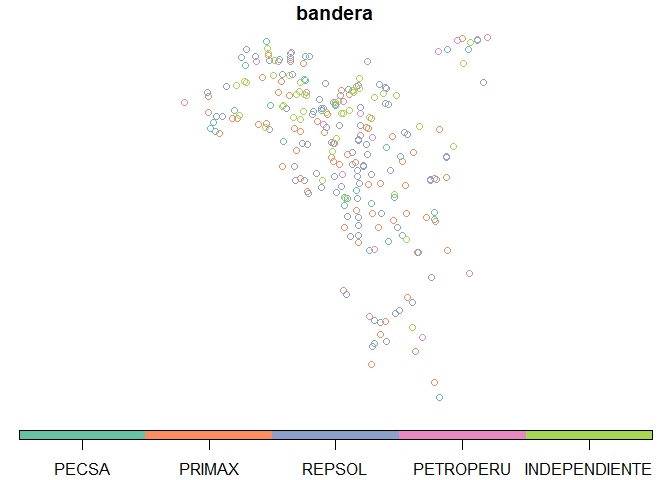
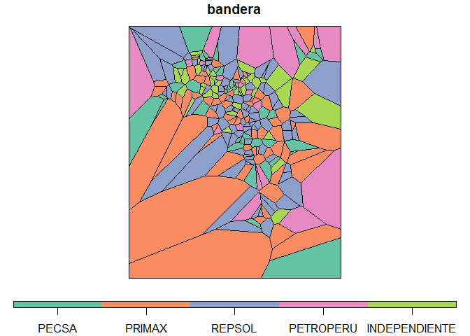
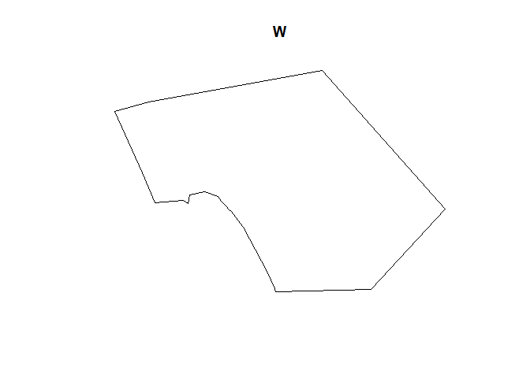
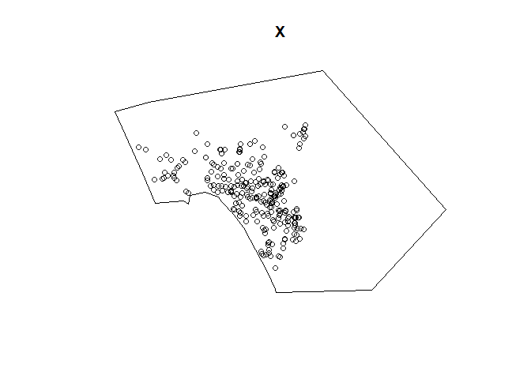
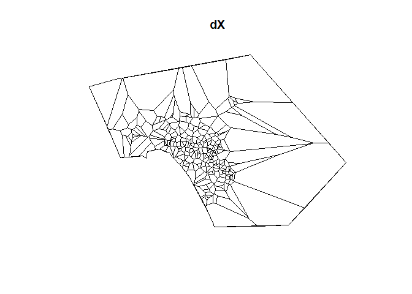
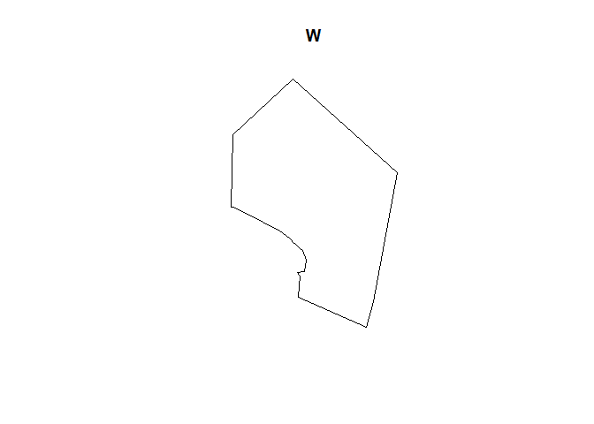
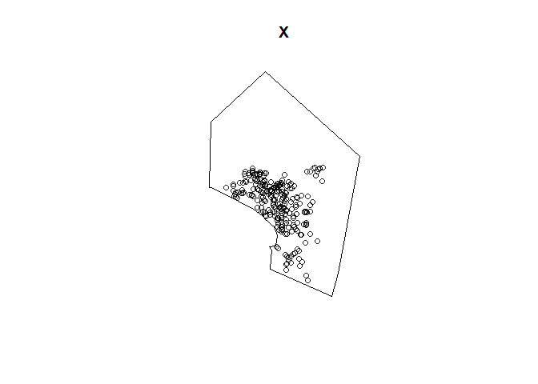
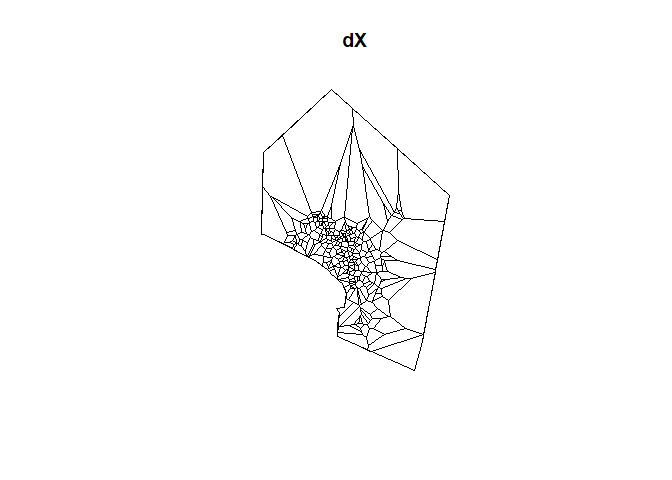

```r
library(sf)
```

```
## Warning: package 'sf' was built under R version 3.5.3
```

```
## Linking to GEOS 3.6.1, GDAL 2.2.3, PROJ 4.9.3
```

```r
library(dismo)
```

```
## Warning: package 'dismo' was built under R version 3.5.3
```

```
## Loading required package: raster
```

```
## Loading required package: sp
```

```r
suppressMessages(library(tidyverse))
```

```
## Warning: package 'tibble' was built under R version 3.5.3
```

```
## Warning: package 'tidyr' was built under R version 3.5.3
```

```
## Warning: package 'dplyr' was built under R version 3.5.3
```

```
## Warning: package 'stringr' was built under R version 3.5.3
```

```r
suppressMessages(library(spatstat))
```

```
## Warning: package 'spatstat' was built under R version 3.5.3
```

```
## Warning: package 'spatstat.data' was built under R version 3.5.3
```

```r
suppressMessages(library(deldir))
library(sp)
library(leaflet)
source(here::here("R","2.4_funcion-thiessen.R"))
```


Se construirán los polígonos de Thiesen para todo el dataset, así como se identificarán los vecinos y de que dueño y bandera son. Además, se construirán gráficos de los vecinos

Cargamos la base de datos con grifos y ubicaciones:


```r
grifos <- readRDS(here::here("data","processed","grifo_coding_clean.rds"))
glimpse(grifos)
```

```
## Observations: 281
## Variables: 28
## $ codificador          <chr> "DU", "VM", "VM", "MC", "MC", "MC", "MC",...
## $ codigo_de_osinergmin <dbl> 34770, 9464, 18440, 9515, 18824, 18401, 8...
## $ razon_social         <chr> "REPSOL COMERCIAL S.A.C.", "COESTI S.A.",...
## $ ruc                  <chr> "20503840121", "20127765279", "2043085786...
## $ direccion            <chr> "ESQ. AV. LOS INGENIEROS Y AV. SEPARADORA...
## $ distrito             <chr> "ATE", "LA VICTORIA", "LA VICTORIA", "LIM...
## $ n                    <dbl> 4212, 3911, 3541, 3526, 3436, 3350, 3247,...
## $ bandera              <fct> REPSOL, PRIMAX, INDEPENDIENTE, PETROPERU,...
## $ glp                  <chr> "3", "2", "2", "2", "0", "4", "2", "2", "...
## $ gnv                  <chr> "4", "6", "12", "8", "0", "6", "6", "6", ...
## $ llanteria            <chr> "1", "1", "1", "0", "1", "0", "1", "0", "...
## $ islas_comb_liq       <chr> "3", "8", "4", "6", "8", "6", "10", "8", ...
## $ mecanico             <chr> "0", "0", "0", "1", "0", "0", "0", "0", "...
## $ aceite               <chr> "0", "0", "0", "0", "1", "0", "1", "1", "...
## $ lavado               <chr> "0", "1", "1", "0", "1", "0", "1", "0", "...
## $ tienda               <chr> "1", "1", "1", "0", "1", "1", "1", "1", "...
## $ cajero               <chr> "1", "1", "0", "1", "1", "1", "1", "1", "...
## $ en_avenida_principal <chr> "si (interseccion de 2 avenidas)", "1", "...
## $ lat                  <dbl> -12.05982, -12.08373, -12.07467, -12.0493...
## $ lon                  <dbl> -76.95135, -77.01255, -77.02222, -77.0598...
## $ revisar              <chr> "tiene banco de la nacion", "se señala 2 ...
## $ tipo                 <chr> "PROPIA", "PROPIA", "INDEPENDIENTE", "ABA...
## $ con_glp              <dbl> 1, 1, 1, 1, 1, 1, 1, 1, 1, 1, 1, 1, 1, 1,...
## $ con_gnv              <dbl> 1, 1, 1, 1, 1, 1, 1, 1, 1, 1, 1, 1, 1, 1,...
## $ grifo_mas_cercano    <chr> "8069", "100155", "V228", "19945", "19957...
## $ distancia_min        <dbl> 1.5546464675, 0.1378951206, 0.3956201270,...
## $ distancia_avg        <dbl> 2.431272, 2.109143, 1.747807, 1.566990, 1...
## $ num_grifos_cerc      <int> 9, 80, 74, 45, 53, 74, 15, 70, 18, 65, 62...
```
# Primer intento de sacar los vecinos de manera programática

Usamos la función definida previamente para hallar los vecinos

```r
grifos_1 <- grifos %>% 
    select(x = lat, 
           y = lon, 
           codigo_de_osinergmin,
           razon_social,
           ruc,
           direccion,
           distrito,
           bandera)
vec_thiessen <- vecinos_thiessen(grifos_1)
```

```
## 
##      PLEASE NOTE:  The components "delsgs" and "summary" of the
##  object returned by deldir() are now DATA FRAMES rather than
##  matrices (as they were prior to release 0.0-18).
##  See help("deldir").
##  
##      PLEASE NOTE: The process that deldir() uses for determining
##  duplicated points has changed from that used in version
##  0.0-9 of this package (and previously). See help("deldir").
```


Hacemos el join para tener los datos de los grifos, me parece está mal

```r
grifos_to_join <- grifos %>% 
    rownames_to_column() %>%
    select(rowname, 
           codigo_de_osinergmin,
           razon_social,
           ruc,
           direccion,
           distrito,
           bandera) %>%
    mutate(rowname = as.integer(rowname))


grifos_con_vecinos <- left_join(
    vec_thiessen,
    grifos_to_join,
    suffix = c(".princ", ".vec"),
    by = c("ind2" = "rowname")
)
```


Revisamos un grifo cercano para ver si está bien codificado:


```r
grifos_con_vecinos %>% 
  filter(razon_social.princ == "INVERSIONES MAVU S.A.C.") %>%
  select(ends_with("vec"))
```

```
##   codigo_de_osinergmin.vec        razon_social.vec     ruc.vec
## 1                     9484        ENERGIGAS S.A.C. 20506151547
## 2                    16640 REPSOL COMERCIAL S.A.C. 20503840121
## 3                    37610 REPSOL COMERCIAL S.A.C. 20503840121
## 4                    15215  REPSOL COMERCIAL S.A.C 20503840121
## 5                    18567 REPSOL COMERCIAL S.A.C. 20503840121
## 6                    18881         ENERGIGAS S.A.C 20506151547
##                                                direccion.vec distrito.vec
## 1 AV. MANCO CAPAC N° 993, ESQUINA CON AV. ISABEL LA CATOLICA  LA VICTORIA
## 2             AV. DEL PARQUE SUR 285 ESQ. AV.  GUARDIA CIVIL   SAN ISIDRO
## 3                                AV. COLONIAL N° 1817 - 1821         LIMA
## 4                                     AV. 28 DE JULIO N° 904   MIRAFLORES
## 5                             JOSE GALVEZ BARRENECHEA Nº 520   SAN ISIDRO
## 6               AV. VENEZUELA N° 2180 ESQ. CON EL JR. YUNGAY         LIMA
##     bandera.vec
## 1 INDEPENDIENTE
## 2        REPSOL
## 3        REPSOL
## 4        REPSOL
## 5        REPSOL
## 6 INDEPENDIENTE
```

Este grifo está ubicado en Cercado en la avenida Venezuela, por lo que la función está haciendo cualquier cosa.

Creo que el error está en los grifos duplicados (que cambiaron de dueño en algún momento). Como trabajo preliminar, 
solo quedarnos con el primero. Luego habrá que limpiar manualmente y definir fechas.


```r
grifos_to_join_2 <- grifos %>% 
    distinct(lat,lon, .keep_all = TRUE) %>%
    rownames_to_column() %>%
    select(rowname, 
           codigo_de_osinergmin,
           razon_social,
           ruc,
           direccion,
           distrito,
           bandera) %>%
    mutate(rowname = as.integer(rowname))


grifos_con_vecinos_2 <- left_join(
    vec_thiessen,
    grifos_to_join_2,
    suffix = c(".princ", ".vec"),
    by = c("ind2" = "rowname")
)

grifos_con_vecinos_2 %>% 
  filter(razon_social.princ == "INVERSIONES MAVU S.A.C.") 
```

```
##   ind1 ind2         x         y codigo_de_osinergmin.princ
## 1  105  142 -12.05967 -77.07818                      14665
## 2  105   18 -12.05967 -77.07818                      14665
## 3  105   97 -12.05967 -77.07818                      14665
## 4  105  139 -12.05967 -77.07818                      14665
## 5  105  100 -12.05967 -77.07818                      14665
## 6  105   82 -12.05967 -77.07818                      14665
##        razon_social.princ   ruc.princ       direccion.princ distrito.princ
## 1 INVERSIONES MAVU S.A.C. 20536616960 AV. VENEZUELA N° 3300           LIMA
## 2 INVERSIONES MAVU S.A.C. 20536616960 AV. VENEZUELA N° 3300           LIMA
## 3 INVERSIONES MAVU S.A.C. 20536616960 AV. VENEZUELA N° 3300           LIMA
## 4 INVERSIONES MAVU S.A.C. 20536616960 AV. VENEZUELA N° 3300           LIMA
## 5 INVERSIONES MAVU S.A.C. 20536616960 AV. VENEZUELA N° 3300           LIMA
## 6 INVERSIONES MAVU S.A.C. 20536616960 AV. VENEZUELA N° 3300           LIMA
##   bandera.princ codigo_de_osinergmin.vec                  razon_social.vec
## 1 INDEPENDIENTE                    16617           REPSOL COMERCIAL S.A.C.
## 2 INDEPENDIENTE                    16640           REPSOL COMERCIAL S.A.C.
## 3 INDEPENDIENTE                    18567           REPSOL COMERCIAL S.A.C.
## 4 INDEPENDIENTE                    21001                          KRE S.A.
## 5 INDEPENDIENTE                     9584 INMOBILIARIA SOL INVEST PERU S.A.
## 6 INDEPENDIENTE                    14754                     KEMALU S.A.C.
##       ruc.vec
## 1 20503840121
## 2 20503840121
## 3 20503840121
## 4 20298506581
## 5 20509496219
## 6 20265988777
##                                                                                     direccion.vec
## 1 AV. JOSE GÁLVEZ BARRENECHEA N° 1146 (ANTES AV. PRINCIPAL) ESQ. CON CALLE 32 URB. VILLA VICTORIA
## 2                                                  AV. DEL PARQUE SUR 285 ESQ. AV.  GUARDIA CIVIL
## 3                                                                  JOSE GALVEZ BARRENECHEA Nº 520
## 4                                    AV. GUARDIA CIVIL N° 1109 ESQ. CON AV. DEL PARQUE SUR N° 314
## 5                                                                                AVIACION Nº 3401
## 6                                               AV. ANGAMOS ESTE 2398 URB. LA CALERA DE LA MERCED
##   distrito.vec bandera.vec
## 1    SURQUILLO      REPSOL
## 2   SAN ISIDRO      REPSOL
## 3   SAN ISIDRO      REPSOL
## 4   SAN ISIDRO      REPSOL
## 5    SAN BORJA      REPSOL
## 6    SURQUILLO      PRIMAX
```
Noup, sigue hasta el queso la función, por más que ahora 


# Mapa en google maps
Usamos los siguientes recursos:
- https://stackoverflow.com/questions/43055894/how-to-assign-the-data-of-a-centroid-marker-to-the-voronoi-thiessen-polygon-it
- https://rpubs.com/walkerke/rstudio_gis

Replicando para mi data con el primer link:


```r
grifos_puntos <- grifos %>%
  st_as_sf(crs = 4326, coords = c("lon", "lat"))

plot(grifos_puntos["bandera"], key.pos = 1, axes = FALSE,key.width = lcm(1.3), key.length = 1.0)
```

<!-- -->

Siguiente:


```r
polys <- grifos_puntos %>%
  as("Spatial") %>%
  voronoi() %>%
  st_as_sf() %>%
  st_set_crs(., 4326)

plot(polys["bandera"],key.pos = 1, axes = FALSE,key.width = lcm(1.3), key.length = 1.0)
```

<!-- -->


Now, visualize it with Leaflet using your desired colors:


```r
pal <- colorFactor("plasma", polys$bandera)


polys %>%
  leaflet() %>%
  addProviderTiles(providers$CartoDB.Positron) %>%
  addPolygons(fillColor = ~pal(bandera), weight = 0.5, color = "grey") %>%
  addCircleMarkers(data = grifos_puntos, label = ~bandera, color = ~pal(bandera))
```

<!--html_preserve--><div id="htmlwidget-c3daa8314bdcaa0ea737" style="width:672px;height:480px;" class="leaflet html-widget"></div>
<script type="application/json" data-for="htmlwidget-c3daa8314bdcaa0ea737">{"x":{"options":{"crs":{"crsClass":"L.CRS.EPSG3857","code":null,"proj4def":null,"projectedBounds":null,"options":{}}},"calls":[{"method":"addProviderTiles","args":["CartoDB.Positron",null,null,{"errorTileUrl":"","noWrap":false,"detectRetina":false}]},{"method":"addPolygons","args":[[[[{"lng":[-76.9335,-76.9335,-76.957176,-76.96794,-76.951707,-76.94911,-76.94844,-76.9335],"lat":[-12.049547,-12.088787,-12.077577,-12.067412,-12.049717,-12.048472,-12.048368,-12.049547]}]],[[{"lng":[-77.006081,-77.013066,-77.014169,-77.012054,-77.006081],"lat":[-12.083492,-12.087047,-12.085813,-12.081087,-12.083492]}]],[[{"lng":[-77.01924,-77.020142,-77.022044,-77.024774,-77.021227,-77.020432,-77.01924],"lat":[-12.074615,-12.079017,-12.080482,-12.072928,-12.070385,-12.070353,-12.074615]}]],[[{"lng":[-77.056754,-77.056745,-77.056981,-77.060474,-77.062117,-77.06101,-77.056754],"lat":[-12.049205,-12.052036,-12.052104,-12.053109,-12.052496,-12.04829,-12.049205]}]],[[{"lng":[-77.055572,-77.056268,-77.058384,-77.056981,-77.056745,-77.055572],"lat":[-12.052793,-12.058199,-12.057715,-12.052104,-12.052036,-12.052793]}]],[[{"lng":[-77.039696,-77.041543,-77.045316,-77.046867,-77.046677,-77.046093,-77.040596,-77.039696],"lat":[-12.063444,-12.066747,-12.06587,-12.064591,-12.062512,-12.06213,-12.061539,-12.063444]}]],[[{"lng":[-76.957176,-76.974592,-76.979071,-76.981114,-76.977123,-76.976371,-76.96794,-76.957176],"lat":[-12.077577,-12.09191,-12.093028,-12.090628,-12.064278,-12.06426,-12.067412,-12.077577]}]],[[{"lng":[-77.039731,-77.040596,-77.046093,-77.04688,-77.042119,-77.039731],"lat":[-12.053653,-12.061539,-12.06213,-12.059822,-12.054019,-12.053653]}]],[[{"lng":[-77.091959,-77.096084,-77.100412,-77.106478,-77.102779,-77.091869,-77.091959],"lat":[-12.071508,-12.078097,-12.08003,-12.080633,-12.071289,-12.071214,-12.071508]}]],[[{"lng":[-77.056306,-77.058104,-77.061133,-77.067692,-77.064708,-77.063336,-77.056306],"lat":[-12.063001,-12.068176,-12.069273,-12.065081,-12.061609,-12.061231,-12.063001]}]],[[{"lng":[-77.056642,-77.059613,-77.059651,-77.061536,-77.06112,-77.056642],"lat":[-12.072499,-12.07942,-12.079398,-12.077528,-12.071109,-12.072499]}]],[[{"lng":[-77.036017,-77.036864,-77.037285,-77.038877,-77.03944,-77.039713,-77.036733,-77.036017],"lat":[-12.074983,-12.077156,-12.077762,-12.077209,-12.075881,-12.073586,-12.074101,-12.074983]}]],[[{"lng":[-77.036614,-77.039395,-77.041967,-77.044267,-77.044132,-77.038877,-77.037285,-77.036614],"lat":[-12.078701,-12.084415,-12.086086,-12.081911,-12.080844,-12.077209,-12.077762,-12.078701]}]],[[{"lng":[-77.021081,-77.022264,-77.035174,-77.037166,-77.036315,-77.02964,-77.026249,-77.023989,-77.02114,-77.021081],"lat":[-12.123096,-12.125991,-12.129048,-12.12902,-12.126304,-12.121743,-12.121523,-12.121808,-12.122971,-12.123096]}]],[[{"lng":[-77.066331,-77.064708,-77.067692,-77.07082,-77.073947,-77.073201,-77.068353,-77.066331],"lat":[-12.053453,-12.061609,-12.065081,-12.065983,-12.055379,-12.054305,-12.052614,-12.053453]}]],[[{"lng":[-77.01263,-77.011166,-77.012715,-77.013051,-77.019986,-77.020114,-77.01263],"lat":[-12.136383,-12.140351,-12.141491,-12.141453,-12.137853,-12.13668,-12.136383]}]],[[{"lng":[-77.017403,-77.015242,-77.022216,-77.022464,-77.019182,-77.017403],"lat":[-12.103427,-12.107012,-12.107247,-12.106223,-12.103712,-12.103427]}]],[[{"lng":[-77.009071,-77.010293,-77.017374,-77.016183,-77.009071],"lat":[-12.101735,-12.102827,-12.103369,-12.099277,-12.101735]}]],[[{"lng":[-77.028882,-77.027133,-77.028004,-77.030549,-77.030375,-77.028882],"lat":[-12.070968,-12.072819,-12.073456,-12.071051,-12.070865,-12.070968]}]],[[{"lng":[-77.005302,-77.004706,-77.007752,-77.010396,-77.014252,-77.015294,-77.013654,-77.013639,-77.008694,-77.005302],"lat":[-12.119018,-12.121614,-12.124719,-12.125055,-12.125504,-12.123299,-12.117929,-12.117913,-12.117269,-12.119018]}]],[[{"lng":[-77.013442,-77.008324,-77.008447,-77.016711,-77.017226,-77.01472,-77.013442],"lat":[-12.088766,-12.093631,-12.094363,-12.095003,-12.094043,-12.089532,-12.088766]}]],[[{"lng":[-77.059361,-77.061131,-77.069383,-77.071179,-77.058993,-77.059361],"lat":[-12.041274,-12.043267,-12.044069,-12.041204,-12.039492,-12.041274]}]],[[{"lng":[-76.97459,-76.971444,-76.976989,-76.977874,-76.97459],"lat":[-12.105619,-12.119215,-12.118839,-12.112058,-12.105619]}]],[[{"lng":[-76.955562,-76.951904,-76.956649,-76.958361,-76.957143,-76.955562],"lat":[-12.017953,-12.038102,-12.037834,-12.034407,-12.017953,-12.017953]}]],[[{"lng":[-77.014169,-77.013066,-77.013442,-77.01472,-77.016892,-77.022473,-77.022028,-77.01586,-77.014169],"lat":[-12.085813,-12.087047,-12.088766,-12.089532,-12.088566,-12.085759,-12.084717,-12.084656,-12.085813]}]],[[{"lng":[-77.068451,-77.068353,-77.073201,-77.075326,-77.068965,-77.068451],"lat":[-12.047731,-12.052614,-12.054305,-12.04874,-12.046669,-12.047731]}]],[[{"lng":[-77.049729,-77.04961,-77.050025,-77.0566,-77.056672,-77.052289,-77.049729],"lat":[-12.046185,-12.047238,-12.048148,-12.047039,-12.046302,-12.04584,-12.046185]}]],[[{"lng":[-77.082947,-77.083983,-77.087842,-77.086753,-77.082968,-77.082947],"lat":[-12.076633,-12.086065,-12.082599,-12.075814,-12.076567,-12.076633]}]],[[{"lng":[-77.047127,-77.04417,-77.054841,-77.056681,-77.052603,-77.047127],"lat":[-12.094573,-12.100228,-12.098647,-12.096917,-12.090379,-12.094573]}]],[[{"lng":[-77.002087,-77.00522,-77.006081,-77.012054,-77.012507,-77.00831,-77.004027,-77.002087],"lat":[-12.079711,-12.083448,-12.083492,-12.081087,-12.080764,-12.073647,-12.077511,-12.079711]}]],[[{"lng":[-77.018498,-77.018079,-77.018663,-77.018908,-77.019481,-77.021529,-77.02308,-77.01924,-77.018498],"lat":[-12.061202,-12.062667,-12.063734,-12.063625,-12.063202,-12.06151,-12.057631,-12.059297,-12.061202]}]],[[{"lng":[-77.01472,-77.017226,-77.019531,-77.016892,-77.01472],"lat":[-12.089532,-12.094043,-12.092832,-12.088566,-12.089532]}]],[[{"lng":[-77.025566,-77.028293,-77.039374,-77.044691,-77.045344,-77.042267,-77.025566],"lat":[-12.017953,-12.046381,-12.053231,-12.048836,-12.031504,-12.017953,-12.017953]}]],[[{"lng":[-77.01226,-77.012294,-77.021427,-77.021631,-77.020832,-77.012959,-77.01226],"lat":[-12.132967,-12.133256,-12.13456,-12.132973,-12.13195,-12.132159,-12.132967]}]],[[{"lng":[-77.00574,-77.015389,-77.020817,-77.033634,-77.00755,-77.007067,-77.006342,-77.005666,-77.00574],"lat":[-12.175549,-12.18908,-12.190155,-12.191723,-12.164837,-12.165822,-12.169242,-12.175283,-12.175549]}]],[[{"lng":[-77.031512,-77.032621,-77.038605,-77.041984,-77.041967,-77.039395,-77.037546,-77.031512],"lat":[-12.085606,-12.087877,-12.091567,-12.086371,-12.086086,-12.084415,-12.084131,-12.085606]}]],[[{"lng":[-77.028167,-77.036193,-77.040353,-77.038688,-77.028167],"lat":[-12.098045,-12.102691,-12.098918,-12.095696,-12.098045]}]],[[{"lng":[-77.045344,-77.044691,-77.04961,-77.049729,-77.045344],"lat":[-12.031504,-12.048836,-12.047238,-12.046185,-12.031504]}]],[[{"lng":[-76.987713,-76.996902,-76.998786,-76.991036,-76.988188,-76.987713],"lat":[-12.135079,-12.143347,-12.139146,-12.133846,-12.13441,-12.135079]}]],[[{"lng":[-77.045316,-77.048376,-77.048293,-77.046867,-77.045316],"lat":[-12.06587,-12.070212,-12.066768,-12.064591,-12.06587]}]],[[{"lng":[-77.000863,-77.006098,-77.013111,-77.008743,-77.003931,-77.000863],"lat":[-12.188882,-12.193844,-12.189137,-12.187331,-12.187444,-12.188882]}]],[[{"lng":[-77.031658,-77.030974,-77.031512,-77.037546,-77.03249,-77.031658],"lat":[-12.080291,-12.085076,-12.085606,-12.084131,-12.080221,-12.080291]}]],[[{"lng":[-76.977123,-76.981114,-76.985424,-76.990028,-76.992939,-76.992818,-76.977704,-76.977123],"lat":[-12.064278,-12.090628,-12.089729,-12.082726,-12.075881,-12.075711,-12.064128,-12.064278]}]],[[{"lng":[-77.044267,-77.041967,-77.041984,-77.045104,-77.051528,-77.049228,-77.044267],"lat":[-12.081911,-12.086086,-12.086371,-12.087917,-12.088735,-12.082167,-12.081911]}]],[[{"lng":[-77.061133,-77.06112,-77.061536,-77.068862,-77.073143,-77.074314,-77.07082,-77.067692,-77.061133],"lat":[-12.069273,-12.071109,-12.077528,-12.075945,-12.073202,-12.069655,-12.065983,-12.065081,-12.069273]}]],[[{"lng":[-77.019716,-77.029284,-77.044947,-77.021295,-77.020114,-77.019986,-77.019716],"lat":[-12.14076,-12.153108,-12.151103,-12.135739,-12.13668,-12.137853,-12.14076]}]],[[{"lng":[-77.034813,-77.033035,-77.036017,-77.036733,-77.036067,-77.034813],"lat":[-12.070206,-12.072952,-12.074983,-12.074101,-12.070742,-12.070206]}]],[[{"lng":[-76.97459,-76.977874,-76.978493,-76.979128,-76.974803,-76.97459],"lat":[-12.105619,-12.112058,-12.110377,-12.101514,-12.103965,-12.105619]}]],[[{"lng":[-77.022216,-77.02258,-77.027637,-77.029098,-77.024288,-77.022464,-77.022216],"lat":[-12.107247,-12.110896,-12.110693,-12.105746,-12.104377,-12.106223,-12.107247]}]],[[{"lng":[-76.994197,-76.998338,-77.004439,-77.005624,-77.006098,-77.000863,-76.99701,-76.994197],"lat":[-12.193868,-12.206094,-12.20175,-12.19798,-12.193844,-12.188882,-12.188657,-12.193868]}]],[[{"lng":[-76.991036,-76.998786,-77.00209,-77.002114,-76.99452,-76.991036],"lat":[-12.133846,-12.139146,-12.137022,-12.13553,-12.13148,-12.133846]}]],[[{"lng":[-77.032788,-77.031477,-77.036864,-77.036017,-77.033035,-77.032788],"lat":[-12.073127,-12.074763,-12.077156,-12.074983,-12.072952,-12.073127]}]],[[{"lng":[-76.997817,-76.99452,-77.002114,-77.00356,-76.999897,-76.997817],"lat":[-12.125669,-12.13148,-12.13553,-12.132242,-12.125608,-12.125669]}]],[[{"lng":[-76.977874,-76.976989,-76.984845,-76.986544,-76.978493,-76.977874],"lat":[-12.112058,-12.118839,-12.119853,-12.110456,-12.110377,-12.112058]}]],[[{"lng":[-77.0566,-77.050025,-77.050155,-77.056611,-77.0566],"lat":[-12.047039,-12.048148,-12.048517,-12.048625,-12.047039]}]],[[{"lng":[-77.013111,-77.006098,-77.005624,-77.020817,-77.015389,-77.013111],"lat":[-12.189137,-12.193844,-12.19798,-12.190155,-12.18908,-12.189137]}]],[[{"lng":[-77.002114,-77.00209,-77.007471,-77.011007,-77.011166,-77.01263,-77.012294,-77.01226,-77.010531,-77.008182,-77.00356,-77.002114],"lat":[-12.13553,-12.137022,-12.141052,-12.140415,-12.140351,-12.136383,-12.133256,-12.132967,-12.132207,-12.13119,-12.132242,-12.13553]}]],[[{"lng":[-77.012835,-77.015101,-77.020142,-77.01924,-77.012835],"lat":[-12.074287,-12.078971,-12.079017,-12.074615,-12.074287]}]],[[{"lng":[-77.009195,-77.008694,-77.013639,-77.014811,-77.014418,-77.014386,-77.009195],"lat":[-12.110836,-12.117269,-12.117913,-12.115633,-12.10936,-12.109316,-12.110836]}]],[[{"lng":[-76.978692,-76.989909,-76.994197,-76.99701,-76.996608,-76.993223,-76.990153,-76.978692],"lat":[-12.180663,-12.193322,-12.193868,-12.188657,-12.186934,-12.182868,-12.18055,-12.180663]}]],[[{"lng":[-77.014626,-77.014386,-77.014418,-77.021872,-77.02258,-77.022216,-77.015242,-77.014626],"lat":[-12.107454,-12.109316,-12.10936,-12.111978,-12.110896,-12.107247,-12.107012,-12.107454]}]],[[{"lng":[-76.98331,-76.996089,-76.996902,-76.987713,-76.98331],"lat":[-12.139251,-12.150346,-12.143347,-12.135079,-12.139251]}]],[[{"lng":[-77.012715,-77.021904,-77.029284,-77.019716,-77.013051,-77.012715],"lat":[-12.141491,-12.155383,-12.153108,-12.14076,-12.141453,-12.141491]}]],[[{"lng":[-76.971444,-76.952537,-76.972839,-76.979336,-76.985053,-76.985064,-76.984845,-76.976989,-76.971444],"lat":[-12.119215,-12.126124,-12.128973,-12.129249,-12.120508,-12.120089,-12.119853,-12.118839,-12.119215]}]],[[{"lng":[-77.014252,-77.014602,-77.020474,-77.022264,-77.021081,-77.015294,-77.014252],"lat":[-12.125504,-12.127285,-12.128617,-12.125991,-12.123096,-12.123299,-12.125504]}]],[[{"lng":[-77.021366,-77.019182,-77.022464,-77.024288,-77.024384,-77.021467,-77.021366],"lat":[-12.099277,-12.103712,-12.106223,-12.104377,-12.100813,-12.099276,-12.099277]}]],[[{"lng":[-77.077313,-77.105504,-77.116364,-77.12576,-77.12576,-77.105068,-77.090313,-77.087842,-77.083983,-77.079204,-77.077313],"lat":[-12.09973,-12.155664,-12.173886,-12.181475,-12.142406,-12.10528,-12.082139,-12.082599,-12.086065,-12.091925,-12.09973]}]],[[{"lng":[-76.986368,-76.990608,-76.991282,-76.998492,-76.998447,-76.996089,-76.98331,-76.983089,-76.986368],"lat":[-12.148158,-12.158776,-12.159162,-12.157584,-12.156803,-12.150346,-12.139251,-12.139311,-12.148158]}]],[[{"lng":[-77.045104,-77.047127,-77.052603,-77.052503,-77.051528,-77.045104],"lat":[-12.087917,-12.094573,-12.090379,-12.0893,-12.088735,-12.087917]}]],[[{"lng":[-77.073947,-77.07082,-77.074314,-77.075174,-77.077765,-77.078986,-77.076012,-77.073947],"lat":[-12.055379,-12.065983,-12.069655,-12.069475,-12.068312,-12.063402,-12.05555,-12.055379]}]],[[{"lng":[-77.044397,-77.04442,-77.045091,-77.049646,-77.051285,-77.050844,-77.048416,-77.044397],"lat":[-12.071306,-12.075762,-12.078233,-12.076313,-12.073576,-12.07147,-12.070546,-12.071306]}]],[[{"lng":[-76.938884,-76.969377,-76.977988,-76.978367,-76.978906,-76.946196,-76.938884],"lat":[-12.127781,-12.157207,-12.151983,-12.147658,-12.141426,-12.127812,-12.127781]}]],[[{"lng":[-76.992939,-76.990028,-76.995328,-76.998685,-76.992939],"lat":[-12.075881,-12.082726,-12.090781,-12.079275,-12.075881]}]],[[{"lng":[-76.969377,-76.967375,-76.97006,-76.984505,-76.991282,-76.990608,-76.977988,-76.969377],"lat":[-12.157207,-12.178434,-12.178044,-12.16722,-12.159162,-12.158776,-12.151983,-12.157207]}]],[[{"lng":[-77.086753,-77.087842,-77.090313,-77.090447,-77.091357,-77.091959,-77.091869,-77.089858,-77.086753],"lat":[-12.075814,-12.082599,-12.082139,-12.08207,-12.08063,-12.071508,-12.071214,-12.069823,-12.075814]}]],[[{"lng":[-77.030648,-77.030271,-77.031658,-77.03249,-77.036614,-77.037285,-77.036864,-77.031477,-77.030648],"lat":[-12.075488,-12.078679,-12.080291,-12.080221,-12.078701,-12.077762,-12.077156,-12.074763,-12.075488]}]],[[{"lng":[-77.027102,-77.031933,-77.032583,-77.033749,-77.039696,-77.040596,-77.039731,-77.039374,-77.028293,-77.02766,-77.026865,-77.027102],"lat":[-12.054414,-12.064367,-12.06513,-12.065589,-12.063444,-12.061539,-12.053653,-12.053231,-12.046381,-12.047646,-12.053565,-12.054414]}]],[[{"lng":[-76.978367,-76.977988,-76.990608,-76.986368,-76.978367],"lat":[-12.147658,-12.151983,-12.158776,-12.148158,-12.147658]}]],[[{"lng":[-77.041591,-77.041604,-77.041741,-77.049034,-77.048942,-77.044676,-77.041591],"lat":[-12.111519,-12.112189,-12.112547,-12.114497,-12.112682,-12.105976,-12.111519]}]],[[{"lng":[-77.060474,-77.060153,-77.063336,-77.064708,-77.066331,-77.063517,-77.062117,-77.060474],"lat":[-12.053109,-12.057313,-12.061231,-12.061609,-12.053453,-12.052491,-12.052496,-12.053109]}]],[[{"lng":[-77.124364,-77.097764,-77.091983,-77.103848,-77.124705,-77.124364],"lat":[-12.020155,-12.046731,-12.065138,-12.06716,-12.019844,-12.020155]}]],[[{"lng":[-76.999438,-77.004426,-77.005302,-77.008694,-77.009195,-77.008523,-77.005605,-76.999438],"lat":[-12.111613,-12.118163,-12.119018,-12.117269,-12.110836,-12.110134,-12.107162,-12.111613]}]],[[{"lng":[-77.0141,-77.01586,-77.022028,-77.022119,-77.022044,-77.020142,-77.015101,-77.0141],"lat":[-12.080155,-12.084656,-12.084717,-12.080592,-12.080482,-12.079017,-12.078971,-12.080155]}]],[[{"lng":[-77.007752,-77.008182,-77.010531,-77.010396,-77.007752],"lat":[-12.124719,-12.13119,-12.132207,-12.125055,-12.124719]}]],[[{"lng":[-77.056268,-77.05405,-77.056306,-77.063336,-77.060153,-77.058384,-77.056268],"lat":[-12.058199,-12.061738,-12.063001,-12.061231,-12.057313,-12.057715,-12.058199]}]],[[{"lng":[-77.025131,-77.027306,-77.029996,-77.031147,-77.025131],"lat":[-12.092044,-12.094499,-12.093765,-12.089638,-12.092044]}]],[[{"lng":[-77.016892,-77.019531,-77.02363,-77.023384,-77.022473,-77.016892],"lat":[-12.088566,-12.092832,-12.090781,-12.08699,-12.085759,-12.088566]}]],[[{"lng":[-77.04415,-77.045265,-77.050823,-77.055003,-77.054841,-77.04417,-77.04415],"lat":[-12.10024,-12.103896,-12.106952,-12.107127,-12.098647,-12.100228,-12.10024]}]],[[{"lng":[-77.091959,-77.091357,-77.096084,-77.091959],"lat":[-12.071508,-12.08063,-12.078097,-12.071508]}]],[[{"lng":[-76.9335,-76.9335,-76.958199,-76.965779,-76.974592,-76.957176,-76.9335],"lat":[-12.088787,-12.109468,-12.103714,-12.098406,-12.09191,-12.077577,-12.088787]}]],[[{"lng":[-77.055325,-77.051598,-77.053281,-77.053314,-77.05405,-77.056268,-77.055572,-77.055325],"lat":[-12.052809,-12.058971,-12.061758,-12.06177,-12.061738,-12.058199,-12.052793,-12.052809]}]],[[{"lng":[-77.051285,-77.05907,-77.059613,-77.056642,-77.054918,-77.051735,-77.050844,-77.051285],"lat":[-12.073576,-12.079847,-12.07942,-12.072499,-12.070153,-12.070789,-12.07147,-12.073576]}]],[[{"lng":[-77.029098,-77.027637,-77.030373,-77.032558,-77.032635,-77.034761,-77.034538,-77.030727,-77.029098],"lat":[-12.105746,-12.110693,-12.112873,-12.11312,-12.113024,-12.10635,-12.105202,-12.10504,-12.105746]}]],[[{"lng":[-77.063906,-77.063517,-77.066331,-77.068353,-77.068451,-77.063906],"lat":[-12.047193,-12.052491,-12.053453,-12.052614,-12.047731,-12.047193]}]],[[{"lng":[-77.042119,-77.04688,-77.049416,-77.048328,-77.042119],"lat":[-12.054019,-12.059822,-12.056808,-12.054458,-12.054019]}]],[[{"lng":[-77.124364,-77.076082,-77.075941,-77.0872,-77.097764,-77.124364],"lat":[-12.020155,-12.046139,-12.048064,-12.052434,-12.046731,-12.020155]}]],[[{"lng":[-77.008447,-77.006355,-77.006839,-77.009071,-77.016183,-77.017153,-77.016711,-77.008447],"lat":[-12.094363,-12.100482,-12.101219,-12.101735,-12.099277,-12.097873,-12.095003,-12.094363]}]],[[{"lng":[-77.053314,-77.051735,-77.054918,-77.058104,-77.056306,-77.05405,-77.053314],"lat":[-12.06177,-12.070789,-12.070153,-12.068176,-12.063001,-12.061738,-12.06177]}]],[[{"lng":[-77.058273,-77.068668,-77.074515,-77.065374,-77.059651,-77.059613,-77.05907,-77.058392,-77.058273],"lat":[-12.083968,-12.096433,-12.098449,-12.082777,-12.079398,-12.07942,-12.079847,-12.081175,-12.083968]}]],[[{"lng":[-76.999452,-76.994777,-76.999039,-76.999438,-77.005605,-77.006839,-77.006355,-77.000979,-76.999452],"lat":[-12.100673,-12.107146,-12.111536,-12.111613,-12.107162,-12.101219,-12.100482,-12.099462,-12.100673]}]],[[{"lng":[-77.076012,-77.078986,-77.082346,-77.076012],"lat":[-12.05555,-12.063402,-12.055298,-12.05555]}]],[[{"lng":[-77.027306,-77.027928,-77.028167,-77.038688,-77.038405,-77.032004,-77.029996,-77.027306],"lat":[-12.094499,-12.098013,-12.098045,-12.095696,-12.094631,-12.093534,-12.093765,-12.094499]}]],[[{"lng":[-77.041195,-77.064867,-77.049034,-77.041741,-77.041195],"lat":[-12.114561,-12.131998,-12.114497,-12.112547,-12.114561]}]],[[{"lng":[-76.991282,-76.984505,-76.993115,-77.007067,-77.00755,-77.007513,-77.004654,-76.998492,-76.991282],"lat":[-12.159162,-12.16722,-12.175183,-12.165822,-12.164837,-12.163995,-12.161945,-12.157584,-12.159162]}]],[[{"lng":[-77.006839,-77.005605,-77.008523,-77.012569,-77.010293,-77.009071,-77.006839],"lat":[-12.101219,-12.107162,-12.110134,-12.105294,-12.102827,-12.101735,-12.101219]}]],[[{"lng":[-77.080325,-77.071838,-77.076082,-77.124364,-77.124705,-77.12576,-77.12576,-77.080325],"lat":[-12.017953,-12.040674,-12.046139,-12.020155,-12.019844,-12.018601,-12.017953,-12.017953]}]],[[{"lng":[-76.9335,-76.9335,-76.946578,-76.967375,-76.969377,-76.938884,-76.9335],"lat":[-12.126502,-12.198201,-12.193992,-12.178434,-12.157207,-12.127781,-12.126502]}]],[[{"lng":[-77.025027,-77.024842,-77.026935,-77.029214,-77.030993,-77.032583,-77.031933,-77.025027],"lat":[-12.066143,-12.067441,-12.068664,-12.068089,-12.066818,-12.06513,-12.064367,-12.066143]}]],[[{"lng":[-77.059361,-77.056672,-77.0566,-77.056611,-77.056754,-77.06101,-77.061909,-77.061894,-77.061131,-77.059361],"lat":[-12.041274,-12.046302,-12.047039,-12.048625,-12.049205,-12.04829,-12.045037,-12.04499,-12.043267,-12.041274]}]],[[{"lng":[-76.980102,-76.982409,-76.983089,-76.98331,-76.987713,-76.988188,-76.985053,-76.979336,-76.980102],"lat":[-12.133034,-12.139472,-12.139311,-12.139251,-12.135079,-12.13441,-12.120508,-12.129249,-12.133034]}]],[[{"lng":[-77.012054,-77.014169,-77.01586,-77.0141,-77.012507,-77.012054],"lat":[-12.081087,-12.085813,-12.084656,-12.080155,-12.080764,-12.081087]}]],[[{"lng":[-77.026569,-77.02964,-77.036315,-77.036384,-77.032558,-77.030373,-77.026569],"lat":[-12.116785,-12.121743,-12.126304,-12.124948,-12.11312,-12.112873,-12.116785]}]],[[{"lng":[-76.976561,-76.965069,-76.965089,-76.970955,-76.976561],"lat":[-12.029503,-12.044147,-12.045127,-12.052249,-12.029503]}]],[[{"lng":[-77.061131,-77.061894,-77.069015,-77.069383,-77.061131],"lat":[-12.043267,-12.04499,-12.046059,-12.044069,-12.043267]}]],[[{"lng":[-76.972839,-76.980102,-76.979336,-76.972839],"lat":[-12.128973,-12.133034,-12.129249,-12.128973]}]],[[{"lng":[-77.012294,-77.01263,-77.020114,-77.021295,-77.021427,-77.012294],"lat":[-12.133256,-12.136383,-12.13668,-12.135739,-12.13456,-12.133256]}]],[[{"lng":[-77.024384,-77.024288,-77.029098,-77.030727,-77.027629,-77.024384],"lat":[-12.100813,-12.104377,-12.105746,-12.10504,-12.098521,-12.100813]}]],[[{"lng":[-77.058508,-77.052289,-77.056672,-77.059361,-77.058993,-77.058508],"lat":[-12.038481,-12.04584,-12.046302,-12.041274,-12.039492,-12.038481]}]],[[{"lng":[-77.021227,-77.024774,-77.025941,-77.026818,-77.026935,-77.024842,-77.021227],"lat":[-12.070385,-12.072928,-12.072924,-12.072744,-12.068664,-12.067441,-12.070385]}]],[[{"lng":[-77.014602,-77.012959,-77.020832,-77.020474,-77.014602],"lat":[-12.127285,-12.132159,-12.13195,-12.128617,-12.127285]}]],[[{"lng":[-77.001938,-77.004027,-77.00831,-77.008649,-77.005928,-77.001938],"lat":[-12.067781,-12.077511,-12.073647,-12.073258,-12.068531,-12.067781]}]],[[{"lng":[-77.068648,-77.077049,-77.077313,-77.079204,-77.07681,-77.073143,-77.068862,-77.068648],"lat":[-12.081568,-12.09958,-12.09973,-12.091925,-12.082031,-12.073202,-12.075945,-12.081568]}]],[[{"lng":[-77.075174,-77.082968,-77.086753,-77.089858,-77.089641,-77.08428,-77.077765,-77.075174],"lat":[-12.069475,-12.076567,-12.075814,-12.069823,-12.06941,-12.067661,-12.068312,-12.069475]}]],[[{"lng":[-77.069383,-77.069015,-77.068965,-77.075326,-77.075941,-77.076082,-77.071838,-77.071179,-77.069383],"lat":[-12.044069,-12.046059,-12.046669,-12.04874,-12.048064,-12.046139,-12.040674,-12.041204,-12.044069]}]],[[{"lng":[-77.059651,-77.065374,-77.068648,-77.068862,-77.061536,-77.059651],"lat":[-12.079398,-12.082777,-12.081568,-12.075945,-12.077528,-12.079398]}]],[[{"lng":[-76.9335,-76.998374,-76.995513,-76.974313,-76.946578,-76.9335,-76.9335],"lat":[-12.205643,-12.226336,-12.215902,-12.201846,-12.193992,-12.198201,-12.205643]}]],[[{"lng":[-77.031296,-77.032004,-77.038405,-77.038605,-77.032621,-77.031296],"lat":[-12.089541,-12.093534,-12.094631,-12.091567,-12.087877,-12.089541]}]],[[{"lng":[-77.030993,-77.030375,-77.030549,-77.032788,-77.033035,-77.034813,-77.033749,-77.032583,-77.030993],"lat":[-12.066818,-12.070865,-12.071051,-12.073127,-12.072952,-12.070206,-12.065589,-12.06513,-12.066818]}]],[[{"lng":[-77.038605,-77.038405,-77.038688,-77.040353,-77.04415,-77.04417,-77.047127,-77.045104,-77.041984,-77.038605],"lat":[-12.091567,-12.094631,-12.095696,-12.098918,-12.10024,-12.100228,-12.094573,-12.087917,-12.086371,-12.091567]}]],[[{"lng":[-76.984505,-76.97006,-76.978692,-76.990153,-76.993115,-76.984505],"lat":[-12.16722,-12.178044,-12.180663,-12.18055,-12.175183,-12.16722]}]],[[{"lng":[-76.955481,-76.94911,-76.951707,-76.965089,-76.965069,-76.96206,-76.961419,-76.955481],"lat":[-12.042248,-12.048472,-12.049717,-12.045127,-12.044147,-12.040615,-12.040289,-12.042248]}]],[[{"lng":[-77.010396,-77.010531,-77.01226,-77.012959,-77.014602,-77.014252,-77.010396],"lat":[-12.125055,-12.132207,-12.132967,-12.132159,-12.127285,-12.125504,-12.125055]}]],[[{"lng":[-77.036193,-77.034538,-77.034761,-77.041591,-77.044676,-77.045265,-77.04415,-77.040353,-77.036193],"lat":[-12.102691,-12.105202,-12.10635,-12.111519,-12.105976,-12.103896,-12.10024,-12.098918,-12.102691]}]],[[{"lng":[-77.007067,-76.993115,-76.990153,-76.993223,-77.006342,-77.007067],"lat":[-12.165822,-12.175183,-12.18055,-12.182868,-12.169242,-12.165822]}]],[[{"lng":[-77.020474,-77.020832,-77.021631,-77.035174,-77.022264,-77.020474],"lat":[-12.128617,-12.13195,-12.132973,-12.129048,-12.125991,-12.128617]}]],[[{"lng":[-76.99016,-77.001,-77.003485,-76.999113,-76.99639,-76.994389,-76.99016],"lat":[-12.051983,-12.065868,-12.064227,-12.052194,-12.04739,-12.04588,-12.051983]}]],[[{"lng":[-77.026935,-77.026818,-77.027133,-77.028882,-77.029214,-77.026935],"lat":[-12.068664,-12.072744,-12.072819,-12.070968,-12.068089,-12.068664]}]],[[{"lng":[-77.005906,-77.003931,-77.008743,-77.005906],"lat":[-12.178675,-12.187444,-12.187331,-12.178675]}]],[[{"lng":[-77.010293,-77.012569,-77.014626,-77.015242,-77.017403,-77.017374,-77.010293],"lat":[-12.102827,-12.105294,-12.107454,-12.107012,-12.103427,-12.103369,-12.102827]}]],[[{"lng":[-77.014418,-77.014811,-77.021828,-77.021872,-77.014418],"lat":[-12.10936,-12.115633,-12.112307,-12.111978,-12.10936]}]],[[{"lng":[-77.015352,-77.059617,-77.12576,-77.12576,-77.116364,-77.096374,-77.057319,-77.044947,-77.029284,-77.021904,-77.015352],"lat":[-12.159681,-12.203077,-12.228873,-12.181475,-12.173886,-12.164992,-12.150869,-12.151103,-12.153108,-12.155383,-12.159681]}]],[[{"lng":[-77.012569,-77.008523,-77.009195,-77.014386,-77.014626,-77.012569],"lat":[-12.105294,-12.110134,-12.110836,-12.109316,-12.107454,-12.105294]}]],[[{"lng":[-76.991251,-76.986683,-76.987564,-76.994777,-76.999452,-76.991251],"lat":[-12.098716,-12.1047,-12.106126,-12.107146,-12.100673,-12.098716]}]],[[{"lng":[-77.011555,-77.014747,-77.015991,-77.018663,-77.018079,-77.01699,-77.014377,-77.012024,-77.011555],"lat":[-12.062611,-12.067924,-12.067959,-12.063734,-12.062667,-12.061886,-12.060273,-12.060199,-12.062611]}]],[[{"lng":[-77.022119,-77.022028,-77.022473,-77.023384,-77.030974,-77.031658,-77.030271,-77.026598,-77.022964,-77.022119],"lat":[-12.080592,-12.084717,-12.085759,-12.08699,-12.085076,-12.080291,-12.078679,-12.079174,-12.080322,-12.080592]}]],[[{"lng":[-76.977704,-76.992818,-77.001346,-77.001,-76.99016,-76.977704],"lat":[-12.064128,-12.075711,-12.067523,-12.065868,-12.051983,-12.064128]}]],[[{"lng":[-77.016183,-77.017374,-77.017403,-77.019182,-77.021366,-77.017153,-77.016183],"lat":[-12.099277,-12.103369,-12.103427,-12.103712,-12.099277,-12.097873,-12.099277]}]],[[{"lng":[-77.006342,-76.993223,-76.996608,-77.005666,-77.006342],"lat":[-12.169242,-12.182868,-12.186934,-12.175283,-12.169242]}]],[[{"lng":[-77.031147,-77.029996,-77.032004,-77.031296,-77.031147],"lat":[-12.089638,-12.093765,-12.093534,-12.089541,-12.089638]}]],[[{"lng":[-77.061909,-77.063906,-77.068451,-77.068965,-77.069015,-77.061894,-77.061909],"lat":[-12.045037,-12.047193,-12.047731,-12.046669,-12.046059,-12.04499,-12.045037]}]],[[{"lng":[-77.01699,-77.018079,-77.018498,-77.01699],"lat":[-12.061886,-12.062667,-12.061202,-12.061886]}]],[[{"lng":[-76.9335,-76.9335,-76.938884,-76.946196,-76.952537,-76.971444,-76.97459,-76.974803,-76.958199,-76.9335],"lat":[-12.109468,-12.126502,-12.127781,-12.127812,-12.126124,-12.119215,-12.105619,-12.103965,-12.103714,-12.109468]}]],[[{"lng":[-76.997376,-77.000979,-77.006355,-77.008447,-77.008324,-77.004865,-76.997376],"lat":[-12.093065,-12.099462,-12.100482,-12.094363,-12.093631,-12.089012,-12.093065]}]],[[{"lng":[-77.016711,-77.017153,-77.021366,-77.021467,-77.024085,-77.02363,-77.019531,-77.017226,-77.016711],"lat":[-12.095003,-12.097873,-12.099277,-12.099276,-12.091322,-12.090781,-12.092832,-12.094043,-12.095003]}]],[[{"lng":[-77.054841,-77.055003,-77.105504,-77.077313,-77.077049,-77.074515,-77.068668,-77.056681,-77.054841],"lat":[-12.098647,-12.107127,-12.155664,-12.09973,-12.09958,-12.098449,-12.096433,-12.096917,-12.098647]}]],[[{"lng":[-77.020817,-77.005624,-77.004439,-77.046985,-77.033634,-77.020817],"lat":[-12.190155,-12.19798,-12.20175,-12.198541,-12.191723,-12.190155]}]],[[{"lng":[-77.064867,-77.096374,-77.116364,-77.105504,-77.055003,-77.050823,-77.048942,-77.049034,-77.064867],"lat":[-12.131998,-12.164992,-12.173886,-12.155664,-12.107127,-12.106952,-12.112682,-12.114497,-12.131998]}]],[[{"lng":[-77.124705,-77.103848,-77.102779,-77.106478,-77.12576,-77.12576,-77.124705],"lat":[-12.019844,-12.06716,-12.071289,-12.080633,-12.099847,-12.018601,-12.019844]}]],[[{"lng":[-76.967375,-76.946578,-76.974313,-76.989909,-76.978692,-76.97006,-76.967375],"lat":[-12.178434,-12.193992,-12.201846,-12.193322,-12.180663,-12.178044,-12.178434]}]],[[{"lng":[-77.010947,-77.009663,-77.015352,-77.021904,-77.012715,-77.011166,-77.011007,-77.010947],"lat":[-12.141189,-12.162651,-12.159681,-12.155383,-12.141491,-12.140351,-12.140415,-12.141189]}]],[[{"lng":[-76.985053,-76.988188,-76.991036,-76.99452,-76.997817,-76.991163,-76.985064,-76.985053],"lat":[-12.120508,-12.13441,-12.133846,-12.13148,-12.125669,-12.120377,-12.120089,-12.120508]}]],[[{"lng":[-77.052603,-77.056681,-77.068668,-77.058273,-77.052503,-77.052603],"lat":[-12.090379,-12.096917,-12.096433,-12.083968,-12.0893,-12.090379]}]],[[{"lng":[-77.041543,-77.042566,-77.044397,-77.048416,-77.048376,-77.045316,-77.041543],"lat":[-12.066747,-12.070503,-12.071306,-12.070546,-12.070212,-12.06587,-12.066747]}]],[[{"lng":[-76.965779,-76.958199,-76.974803,-76.979128,-76.980178,-76.979923,-76.965779],"lat":[-12.098406,-12.103714,-12.103965,-12.101514,-12.100702,-12.099069,-12.098406]}]],[[{"lng":[-77.048328,-77.049416,-77.051598,-77.055325,-77.050646,-77.048328],"lat":[-12.054458,-12.056808,-12.058971,-12.052809,-12.052071,-12.054458]}]],[[{"lng":[-76.974592,-76.965779,-76.979923,-76.979071,-76.974592],"lat":[-12.09191,-12.098406,-12.099069,-12.093028,-12.09191]}]],[[{"lng":[-77.044691,-77.039374,-77.039731,-77.042119,-77.048328,-77.050646,-77.050155,-77.050025,-77.04961,-77.044691],"lat":[-12.048836,-12.053231,-12.053653,-12.054019,-12.054458,-12.052071,-12.048517,-12.048148,-12.047238,-12.048836]}]],[[{"lng":[-77.085625,-77.08428,-77.089641,-77.091983,-77.097764,-77.0872,-77.085625],"lat":[-12.053878,-12.067661,-12.06941,-12.065138,-12.046731,-12.052434,-12.053878]}]],[[{"lng":[-77.050058,-77.058508,-77.058993,-77.071179,-77.071838,-77.080325,-77.050058],"lat":[-12.017953,-12.038481,-12.039492,-12.041204,-12.040674,-12.017953,-12.017953]}]],[[{"lng":[-77.045091,-77.044132,-77.044267,-77.049228,-77.051057,-77.049646,-77.045091],"lat":[-12.078233,-12.080844,-12.081911,-12.082167,-12.081019,-12.076313,-12.078233]}]],[[{"lng":[-76.9335,-76.9335,-77.005665,-76.998374,-76.9335],"lat":[-12.205643,-12.241764,-12.241764,-12.226336,-12.205643]}]],[[{"lng":[-77.07681,-77.079204,-77.083983,-77.082947,-77.07681],"lat":[-12.082031,-12.091925,-12.086065,-12.076633,-12.082031]}]],[[{"lng":[-77.065374,-77.074515,-77.077049,-77.068648,-77.065374],"lat":[-12.082777,-12.098449,-12.09958,-12.081568,-12.082777]}]],[[{"lng":[-77.024085,-77.021467,-77.024384,-77.027629,-77.027928,-77.027306,-77.025131,-77.024085],"lat":[-12.091322,-12.099276,-12.100813,-12.098521,-12.098013,-12.094499,-12.092044,-12.091322]}]],[[{"lng":[-76.951707,-76.96794,-76.976371,-76.970955,-76.965089,-76.951707],"lat":[-12.049717,-12.067412,-12.06426,-12.052249,-12.045127,-12.049717]}]],[[{"lng":[-77.027629,-77.030727,-77.034538,-77.036193,-77.028167,-77.027928,-77.027629],"lat":[-12.098521,-12.10504,-12.105202,-12.102691,-12.098045,-12.098013,-12.098521]}]],[[{"lng":[-77.034761,-77.032635,-77.041604,-77.041591,-77.034761],"lat":[-12.10635,-12.113024,-12.112189,-12.111519,-12.10635]}]],[[{"lng":[-77.021828,-77.02278,-77.023261,-77.026569,-77.030373,-77.027637,-77.02258,-77.021872,-77.021828],"lat":[-12.112307,-12.115789,-12.116023,-12.116785,-12.112873,-12.110693,-12.110896,-12.111978,-12.112307]}]],[[{"lng":[-76.998239,-76.994389,-76.99639,-77.010754,-77.02766,-77.028293,-77.025566,-76.998239],"lat":[-12.017953,-12.04588,-12.04739,-12.055586,-12.047646,-12.046381,-12.017953,-12.017953]}]],[[{"lng":[-77.036067,-77.036733,-77.039713,-77.040379,-77.036067],"lat":[-12.070742,-12.074101,-12.073586,-12.071746,-12.070742]}]],[[{"lng":[-77.049646,-77.051057,-77.058392,-77.05907,-77.051285,-77.049646],"lat":[-12.076313,-12.081019,-12.081175,-12.079847,-12.073576,-12.076313]}]],[[{"lng":[-76.951904,-76.94844,-76.94911,-76.955481,-76.956649,-76.951904],"lat":[-12.038102,-12.048368,-12.048472,-12.042248,-12.037834,-12.038102]}]],[[{"lng":[-77.023384,-77.02363,-77.024085,-77.025131,-77.031147,-77.031296,-77.032621,-77.031512,-77.030974,-77.023384],"lat":[-12.08699,-12.090781,-12.091322,-12.092044,-12.089638,-12.089541,-12.087877,-12.085606,-12.085076,-12.08699]}]],[[{"lng":[-77.056981,-77.058384,-77.060153,-77.060474,-77.056981],"lat":[-12.052104,-12.057715,-12.057313,-12.053109,-12.052104]}]],[[{"lng":[-76.993183,-76.991251,-76.999452,-77.000979,-76.997376,-76.995157,-76.993183],"lat":[-12.092672,-12.098716,-12.100673,-12.099462,-12.093065,-12.092087,-12.092672]}]],[[{"lng":[-77.025941,-77.026144,-77.026598,-77.030271,-77.030648,-77.028004,-77.027133,-77.026818,-77.025941],"lat":[-12.072924,-12.075084,-12.079174,-12.078679,-12.075488,-12.073456,-12.072819,-12.072744,-12.072924]}]],[[{"lng":[-76.986544,-76.984845,-76.985064,-76.991163,-76.992226,-76.999039,-76.994777,-76.987564,-76.986544],"lat":[-12.110456,-12.119853,-12.120089,-12.120377,-12.119444,-12.111536,-12.107146,-12.106126,-12.110456]}]],[[{"lng":[-76.999039,-76.992226,-77.004426,-76.999438,-76.999039],"lat":[-12.111536,-12.119444,-12.118163,-12.111613,-12.111536]}]],[[{"lng":[-77.03249,-77.037546,-77.039395,-77.036614,-77.03249],"lat":[-12.080221,-12.084131,-12.084415,-12.078701,-12.080221]}]],[[{"lng":[-77.044676,-77.048942,-77.050823,-77.045265,-77.044676],"lat":[-12.105976,-12.112682,-12.106952,-12.103896,-12.105976]}]],[[{"lng":[-77.014747,-77.011168,-77.012835,-77.01924,-77.020432,-77.019262,-77.015991,-77.014747],"lat":[-12.067924,-12.072658,-12.074287,-12.074615,-12.070353,-12.069362,-12.067959,-12.067924]}]],[[{"lng":[-77.038877,-77.044132,-77.045091,-77.04442,-77.03944,-77.038877],"lat":[-12.077209,-12.080844,-12.078233,-12.075762,-12.075881,-12.077209]}]],[[{"lng":[-76.979071,-76.979923,-76.980178,-76.986683,-76.991251,-76.993183,-76.985424,-76.981114,-76.979071],"lat":[-12.093028,-12.099069,-12.100702,-12.1047,-12.098716,-12.092672,-12.089729,-12.090628,-12.093028]}]],[[{"lng":[-77.091983,-77.089641,-77.089858,-77.091869,-77.102779,-77.103848,-77.091983],"lat":[-12.065138,-12.06941,-12.069823,-12.071214,-12.071289,-12.06716,-12.065138]}]],[[{"lng":[-77.033749,-77.034813,-77.036067,-77.040379,-77.042566,-77.041543,-77.039696,-77.033749],"lat":[-12.065589,-12.070206,-12.070742,-12.071746,-12.070503,-12.066747,-12.063444,-12.065589]}]],[[{"lng":[-77.040379,-77.039713,-77.03944,-77.04442,-77.044397,-77.042566,-77.040379],"lat":[-12.071746,-12.073586,-12.075881,-12.075762,-12.071306,-12.070503,-12.071746]}]],[[{"lng":[-77.090313,-77.105068,-77.094203,-77.090447,-77.090313],"lat":[-12.082139,-12.10528,-12.082874,-12.08207,-12.082139]}]],[[{"lng":[-77.054918,-77.056642,-77.06112,-77.061133,-77.058104,-77.054918],"lat":[-12.070153,-12.072499,-12.071109,-12.069273,-12.068176,-12.070153]}]],[[{"lng":[-77.024044,-77.026249,-77.02964,-77.026569,-77.023261,-77.024044],"lat":[-12.118607,-12.121523,-12.121743,-12.116785,-12.116023,-12.118607]}]],[[{"lng":[-77.021525,-77.019262,-77.020432,-77.021227,-77.024842,-77.025027,-77.024699,-77.022148,-77.021743,-77.021525],"lat":[-12.06526,-12.069362,-12.070353,-12.070385,-12.067441,-12.066143,-12.06539,-12.064688,-12.065044,-12.06526]}]],[[{"lng":[-76.956649,-76.955481,-76.961419,-76.958361,-76.956649],"lat":[-12.037834,-12.042248,-12.040289,-12.034407,-12.037834]}]],[[{"lng":[-77.026144,-77.022964,-77.026598,-77.026144],"lat":[-12.075084,-12.080322,-12.079174,-12.075084]}]],[[{"lng":[-77.018908,-77.021525,-77.021743,-77.019481,-77.018908],"lat":[-12.063625,-12.06526,-12.065044,-12.063202,-12.063625]}]],[[{"lng":[-77.007787,-77.005928,-77.008649,-77.011168,-77.014747,-77.011555,-77.007787],"lat":[-12.064171,-12.068531,-12.073258,-12.072658,-12.067924,-12.062611,-12.064171]}]],[[{"lng":[-76.995513,-76.998374,-77.005665,-77.12576,-77.12576,-77.059617,-77.046985,-77.004439,-76.998338,-76.995513],"lat":[-12.215902,-12.226336,-12.241764,-12.241764,-12.228873,-12.203077,-12.198541,-12.20175,-12.206094,-12.215902]}]],[[{"lng":[-77.021529,-77.019481,-77.021743,-77.022148,-77.021532,-77.021529],"lat":[-12.06151,-12.063202,-12.065044,-12.064688,-12.061524,-12.06151]}]],[[{"lng":[-77.013654,-77.015294,-77.021081,-77.02114,-77.020816,-77.013654],"lat":[-12.117929,-12.123299,-12.123096,-12.122971,-12.118251,-12.117929]}]],[[{"lng":[-77.020816,-77.02114,-77.023989,-77.024044,-77.023261,-77.02278,-77.020816],"lat":[-12.118251,-12.122971,-12.121808,-12.118607,-12.116023,-12.115789,-12.118251]}]],[[{"lng":[-77.02308,-77.021529,-77.021532,-77.02471,-77.027102,-77.026865,-77.02308],"lat":[-12.057631,-12.06151,-12.061524,-12.065338,-12.054414,-12.053565,-12.057631]}]],[[{"lng":[-77.032558,-77.036384,-77.041195,-77.041741,-77.041604,-77.032635,-77.032558],"lat":[-12.11312,-12.124948,-12.114561,-12.112547,-12.112189,-12.113024,-12.11312]}]],[[{"lng":[-77.091357,-77.090447,-77.094203,-77.100412,-77.096084,-77.091357],"lat":[-12.08063,-12.08207,-12.082874,-12.08003,-12.078097,-12.08063]}]],[[{"lng":[-77.00755,-77.033634,-77.046985,-77.059617,-77.015352,-77.009663,-77.007513,-77.00755],"lat":[-12.164837,-12.191723,-12.198541,-12.203077,-12.159681,-12.162651,-12.163995,-12.164837]}]],[[{"lng":[-77.050155,-77.050646,-77.055325,-77.055572,-77.056745,-77.056754,-77.056611,-77.050155],"lat":[-12.048517,-12.052071,-12.052809,-12.052793,-12.052036,-12.049205,-12.048625,-12.048517]}]],[[{"lng":[-77.005666,-76.996608,-76.99701,-77.000863,-77.003931,-77.005906,-77.00574,-77.005666],"lat":[-12.175283,-12.186934,-12.188657,-12.188882,-12.187444,-12.178675,-12.175549,-12.175283]}]],[[{"lng":[-77.007471,-76.998447,-76.998492,-77.004654,-77.010947,-77.011007,-77.007471],"lat":[-12.141052,-12.156803,-12.157584,-12.161945,-12.141189,-12.140415,-12.141052]}]],[[{"lng":[-77.014811,-77.013639,-77.013654,-77.020816,-77.02278,-77.021828,-77.014811],"lat":[-12.115633,-12.117913,-12.117929,-12.118251,-12.115789,-12.112307,-12.115633]}]],[[{"lng":[-76.978906,-76.978367,-76.986368,-76.983089,-76.982409,-76.978906],"lat":[-12.141426,-12.147658,-12.148158,-12.139311,-12.139472,-12.141426]}]],[[{"lng":[-77.001,-77.001346,-77.001938,-77.005928,-77.007787,-77.005723,-77.003485,-77.001],"lat":[-12.065868,-12.067523,-12.067781,-12.068531,-12.064171,-12.063253,-12.064227,-12.065868]}]],[[{"lng":[-76.957143,-76.958361,-76.961419,-76.96206,-76.97475,-76.957143],"lat":[-12.017953,-12.034407,-12.040289,-12.040615,-12.017953,-12.017953]}]],[[{"lng":[-77.018663,-77.015991,-77.019262,-77.021525,-77.018908,-77.018663],"lat":[-12.063734,-12.067959,-12.069362,-12.06526,-12.063625,-12.063734]}]],[[{"lng":[-76.976561,-76.970955,-76.976371,-76.977123,-76.977704,-76.99016,-76.994389,-76.998239,-76.98281,-76.976561],"lat":[-12.029503,-12.052249,-12.06426,-12.064278,-12.064128,-12.051983,-12.04588,-12.017953,-12.017953,-12.029503]}]],[[{"lng":[-77.029214,-77.028882,-77.030375,-77.030993,-77.029214],"lat":[-12.068089,-12.070968,-12.070865,-12.066818,-12.068089]}]],[[{"lng":[-76.979128,-76.978493,-76.986544,-76.987564,-76.986683,-76.980178,-76.979128],"lat":[-12.101514,-12.110377,-12.110456,-12.106126,-12.1047,-12.100702,-12.101514]}]],[[{"lng":[-77.082346,-77.078986,-77.077765,-77.08428,-77.085625,-77.082346],"lat":[-12.055298,-12.063402,-12.068312,-12.067661,-12.053878,-12.055298]}]],[[{"lng":[-77.021532,-77.022148,-77.024699,-77.02471,-77.021532],"lat":[-12.061524,-12.064688,-12.06539,-12.065338,-12.061524]}]],[[{"lng":[-77.001346,-76.992818,-76.992939,-76.998685,-77.002087,-77.004027,-77.001938,-77.001346],"lat":[-12.067523,-12.075711,-12.075881,-12.079275,-12.079711,-12.077511,-12.067781,-12.067523]}]],[[{"lng":[-77.024774,-77.022044,-77.022119,-77.022964,-77.026144,-77.025941,-77.024774],"lat":[-12.072928,-12.080482,-12.080592,-12.080322,-12.075084,-12.072924,-12.072928]}]],[[{"lng":[-76.999897,-77.00356,-77.008182,-77.007752,-77.004706,-76.999897],"lat":[-12.125608,-12.132242,-12.13119,-12.124719,-12.121614,-12.125608]}]],[[{"lng":[-76.991163,-76.997817,-76.999897,-77.004706,-77.005302,-77.004426,-76.992226,-76.991163],"lat":[-12.120377,-12.125669,-12.125608,-12.121614,-12.119018,-12.118163,-12.119444,-12.120377]}]],[[{"lng":[-76.998685,-76.995328,-76.995157,-76.997376,-77.004865,-77.00522,-77.002087,-76.998685],"lat":[-12.079275,-12.090781,-12.092087,-12.093065,-12.089012,-12.083448,-12.079711,-12.079275]}]],[[{"lng":[-77.00522,-77.004865,-77.008324,-77.013442,-77.013066,-77.006081,-77.00522],"lat":[-12.083448,-12.089012,-12.093631,-12.088766,-12.087047,-12.083492,-12.083448]}]],[[{"lng":[-76.9335,-76.9335,-76.94844,-76.951904,-76.955562,-76.9335],"lat":[-12.017953,-12.049547,-12.048368,-12.038102,-12.017953,-12.017953]}]],[[{"lng":[-77.046677,-77.046867,-77.048293,-77.05296,-77.046677],"lat":[-12.062512,-12.064591,-12.066768,-12.061869,-12.062512]}]],[[{"lng":[-77.010947,-77.004654,-77.007513,-77.009663,-77.010947],"lat":[-12.141189,-12.161945,-12.163995,-12.162651,-12.141189]}]],[[{"lng":[-76.97475,-76.96206,-76.965069,-76.976561,-76.98281,-76.97475],"lat":[-12.017953,-12.040615,-12.044147,-12.029503,-12.017953,-12.017953]}]],[[{"lng":[-76.996902,-76.996089,-76.998447,-77.007471,-77.00209,-76.998786,-76.996902],"lat":[-12.143347,-12.150346,-12.156803,-12.141052,-12.137022,-12.139146,-12.143347]}]],[[{"lng":[-77.028004,-77.030648,-77.031477,-77.032788,-77.030549,-77.028004],"lat":[-12.073456,-12.075488,-12.074763,-12.073127,-12.071051,-12.073456]}]],[[{"lng":[-77.045344,-77.049729,-77.052289,-77.058508,-77.050058,-77.042267,-77.045344],"lat":[-12.031504,-12.046185,-12.04584,-12.038481,-12.017953,-12.017953,-12.031504]}]],[[{"lng":[-77.019986,-77.013051,-77.019716,-77.019986],"lat":[-12.137853,-12.141453,-12.14076,-12.137853]}]],[[{"lng":[-76.999113,-77.005723,-77.007787,-77.011555,-77.012024,-77.010754,-76.99639,-76.999113],"lat":[-12.052194,-12.063253,-12.064171,-12.062611,-12.060199,-12.055586,-12.04739,-12.052194]}]],[[{"lng":[-77.024044,-77.023989,-77.026249,-77.024044],"lat":[-12.118607,-12.121808,-12.121523,-12.118607]}]],[[{"lng":[-77.00831,-77.012507,-77.0141,-77.015101,-77.012835,-77.011168,-77.008649,-77.00831],"lat":[-12.073647,-12.080764,-12.080155,-12.078971,-12.074287,-12.072658,-12.073258,-12.073647]}]],[[{"lng":[-77.005906,-77.008743,-77.013111,-77.015389,-77.00574,-77.005906],"lat":[-12.178675,-12.187331,-12.189137,-12.18908,-12.175549,-12.178675]}]],[[{"lng":[-77.094203,-77.105068,-77.12576,-77.12576,-77.106478,-77.100412,-77.094203],"lat":[-12.082874,-12.10528,-12.142406,-12.099847,-12.080633,-12.08003,-12.082874]}]],[[{"lng":[-77.027102,-77.02471,-77.024699,-77.025027,-77.031933,-77.027102],"lat":[-12.054414,-12.065338,-12.06539,-12.066143,-12.064367,-12.054414]}]],[[{"lng":[-77.06101,-77.062117,-77.063517,-77.063906,-77.061909,-77.06101],"lat":[-12.04829,-12.052496,-12.052491,-12.047193,-12.045037,-12.04829]}]],[[{"lng":[-77.049228,-77.051528,-77.052503,-77.058273,-77.058392,-77.051057,-77.049228],"lat":[-12.082167,-12.088735,-12.0893,-12.083968,-12.081175,-12.081019,-12.082167]}]],[[{"lng":[-76.974313,-76.995513,-76.998338,-76.994197,-76.989909,-76.974313],"lat":[-12.201846,-12.215902,-12.206094,-12.193868,-12.193322,-12.201846]}]],[[{"lng":[-76.999113,-77.003485,-77.005723,-76.999113],"lat":[-12.052194,-12.064227,-12.063253,-12.052194]}]],[[{"lng":[-77.014377,-77.01699,-77.018498,-77.01924,-77.014377],"lat":[-12.060273,-12.061886,-12.061202,-12.059297,-12.060273]}]],[[{"lng":[-76.946196,-76.978906,-76.982409,-76.980102,-76.972839,-76.952537,-76.946196],"lat":[-12.127812,-12.141426,-12.139472,-12.133034,-12.128973,-12.126124,-12.127812]}]],[[{"lng":[-77.04688,-77.046093,-77.046677,-77.05296,-77.053281,-77.051598,-77.049416,-77.04688],"lat":[-12.059822,-12.06213,-12.062512,-12.061869,-12.061758,-12.058971,-12.056808,-12.059822]}]],[[{"lng":[-76.990028,-76.985424,-76.993183,-76.995157,-76.995328,-76.990028],"lat":[-12.082726,-12.089729,-12.092672,-12.092087,-12.090781,-12.082726]}]],[[{"lng":[-77.073143,-77.07681,-77.082947,-77.082968,-77.075174,-77.074314,-77.073143],"lat":[-12.073202,-12.082031,-12.076633,-12.076567,-12.069475,-12.069655,-12.073202]}]],[[{"lng":[-77.048293,-77.048376,-77.048416,-77.050844,-77.051735,-77.053314,-77.053281,-77.05296,-77.048293],"lat":[-12.066768,-12.070212,-12.070546,-12.07147,-12.070789,-12.06177,-12.061758,-12.061869,-12.066768]}]],[[{"lng":[-77.010754,-77.012024,-77.014377,-77.01924,-77.02308,-77.026865,-77.02766,-77.010754],"lat":[-12.055586,-12.060199,-12.060273,-12.059297,-12.057631,-12.053565,-12.047646,-12.055586]}]],[[{"lng":[-77.037166,-77.057319,-77.096374,-77.064867,-77.041195,-77.036384,-77.036315,-77.037166],"lat":[-12.12902,-12.150869,-12.164992,-12.131998,-12.114561,-12.124948,-12.126304,-12.12902]}]],[[{"lng":[-77.075326,-77.073201,-77.073947,-77.076012,-77.082346,-77.085625,-77.0872,-77.075941,-77.075326],"lat":[-12.04874,-12.054305,-12.055379,-12.05555,-12.055298,-12.053878,-12.052434,-12.048064,-12.04874]}]],[[{"lng":[-77.021295,-77.044947,-77.057319,-77.037166,-77.035174,-77.021631,-77.021427,-77.021295],"lat":[-12.135739,-12.151103,-12.150869,-12.12902,-12.129048,-12.132973,-12.13456,-12.135739]}]]],null,null,{"interactive":true,"className":"","stroke":true,"color":"grey","weight":0.5,"opacity":0.5,"fill":true,"fillColor":["#CC4779","#7E03A8","#F0F921","#F89441","#CC4779","#F89441","#7E03A8","#0D0887","#7E03A8","#7E03A8","#F0F921","#0D0887","#7E03A8","#0D0887","#7E03A8","#CC4779","#CC4779","#CC4779","#0D0887","#0D0887","#CC4779","#F0F921","#CC4779","#F89441","#7E03A8","#F89441","#CC4779","#7E03A8","#7E03A8","#7E03A8","#7E03A8","#CC4779","#CC4779","#CC4779","#F89441","#7E03A8","#7E03A8","#0D0887","#0D0887","#F0F921","#7E03A8","#0D0887","#F0F921","#7E03A8","#0D0887","#CC4779","#CC4779","#7E03A8","#F89441","#CC4779","#CC4779","#F0F921","#7E03A8","#CC4779","#7E03A8","#0D0887","#7E03A8","#F89441","#7E03A8","#F0F921","#CC4779","#F0F921","#7E03A8","#0D0887","#7E03A8","#CC4779","#7E03A8","#7E03A8","#CC4779","#F0F921","#F0F921","#7E03A8","#CC4779","#CC4779","#CC4779","#7E03A8","#CC4779","#CC4779","#F89441","#F0F921","#CC4779","#7E03A8","#CC4779","#7E03A8","#7E03A8","#CC4779","#CC4779","#CC4779","#CC4779","#F0F921","#F0F921","#CC4779","#CC4779","#CC4779","#0D0887","#CC4779","#CC4779","#7E03A8","#CC4779","#CC4779","#F0F921","#F0F921","#7E03A8","#7E03A8","#CC4779","#CC4779","#F89441","#CC4779","#0D0887","#7E03A8","#7E03A8","#CC4779","#0D0887","#F0F921","#0D0887","#CC4779","#7E03A8","#0D0887","#F89441","#CC4779","#CC4779","#7E03A8","#0D0887","#CC4779","#7E03A8","#7E03A8","#CC4779","#0D0887","#CC4779","#CC4779","#0D0887","#7E03A8","#CC4779","#CC4779","#CC4779","#CC4779","#F0F921","#CC4779","#CC4779","#CC4779","#7E03A8","#CC4779","#7E03A8","#F0F921","#CC4779","#F0F921","#7E03A8","#CC4779","#7E03A8","#7E03A8","#CC4779","#7E03A8","#0D0887","#CC4779","#7E03A8","#CC4779","#CC4779","#F89441","#F89441","#0D0887","#7E03A8","#0D0887","#F0F921","#CC4779","#CC4779","#CC4779","#7E03A8","#CC4779","#0D0887","#F0F921","#0D0887","#7E03A8","#F0F921","#7E03A8","#F0F921","#7E03A8","#F0F921","#CC4779","#F89441","#CC4779","#F0F921","#0D0887","#F0F921","#CC4779","#0D0887","#F0F921","#7E03A8","#F0F921","#F89441","#7E03A8","#CC4779","#CC4779","#7E03A8","#7E03A8","#CC4779","#CC4779","#0D0887","#F0F921","#0D0887","#7E03A8","#F0F921","#F0F921","#F0F921","#F0F921","#7E03A8","#F0F921","#CC4779","#0D0887","#CC4779","#CC4779","#0D0887","#CC4779","#CC4779","#7E03A8","#F89441","#0D0887","#CC4779","#F0F921","#7E03A8","#F0F921","#F89441","#7E03A8","#CC4779","#F0F921","#CC4779","#CC4779","#F0F921","#CC4779","#0D0887","#7E03A8","#F89441","#F89441","#F0F921","#F89441","#F89441","#0D0887","#0D0887","#F89441","#CC4779","#CC4779","#F0F921","#F0F921","#CC4779","#0D0887","#7E03A8","#F0F921","#7E03A8","#7E03A8","#CC4779","#CC4779","#7E03A8","#F0F921","#CC4779","#F0F921","#F0F921","#F0F921","#CC4779","#0D0887","#7E03A8"],"fillOpacity":0.2,"smoothFactor":1,"noClip":false},null,null,null,{"interactive":false,"permanent":false,"direction":"auto","opacity":1,"offset":[0,0],"textsize":"10px","textOnly":false,"className":"","sticky":true},null]},{"method":"addCircleMarkers","args":[[-12.059816,-12.08373,-12.074673,-12.049312,-12.056015,-12.064965,-12.084406,-12.059134,-12.075387,-12.064993,-12.072416,-12.074599,-12.080224,-12.123463,-12.0576,-12.139069,-12.105772,-12.102734,-12.105772,-12.071606,-12.071606,-12.12253,-12.092135,-12.04225,-12.110315,-12.037537,-12.087193,-12.048951,-12.047235,-12.078484,-12.094975,-12.078842,-12.061821,-12.089836,-12.046282,-12.133976,-12.18133,-12.086005,-12.098737,-12.046357,-12.139049,-12.066321,-12.190336,-12.083405,-12.082749,-12.085233,-12.071974,-12.139568,-12.073633,-12.109859,-12.107672,-12.194219,-12.135067,-12.07558,-12.13162,-12.110746,-12.047858,-12.194999,-12.135232,-12.075838,-12.112792,-12.187033,-12.108463,-12.141283,-12.142775,-12.127361,-12.126073,-12.102437,-12.086534,-12.147928,-12.091332,-12.060069,-12.075106,-12.146804,-12.085991,-12.160823,-12.077591,-12.076681,-12.060288,-12.148146,-12.110759,-12.056362,-12.110759,-12.064982,-12.112282,-12.08213,-12.127668,-12.059432,-12.091323,-12.089763,-12.103456,-12.07781,-12.093337,-12.056514,-12.073267,-12.108901,-12.048818,-12.05849,-12.046978,-12.097336,-12.06694,-12.08457,-12.123463,-12.105377,-12.059666,-12.095718,-12.11639,-12.171327,-12.107437,-12.042814,-12.158918,-12.066877,-12.047819,-12.130102,-12.083214,-12.116757,-12.042876,-12.045171,-12.130982,-12.134095,-12.102618,-12.044736,-12.069944,-12.13009,-12.070859,-12.081477,-12.074275,-12.046469,-12.081322,-12.215216,-12.091303,-12.070411,-12.092135,-12.174085,-12.043114,-12.127667,-12.107085,-12.177943,-12.12946,-12.062916,-12.062916,-12.070018,-12.184444,-12.103623,-12.112506,-12.168021,-12.107493,-12.10087,-12.062844,-12.082378,-12.066831,-12.101517,-12.179755,-12.091523,-12.045891,-12.061551,-12.061551,-12.109033,-12.093893,-12.096127,-12.10333,-12.196624,-12.110504,-12.070376,-12.19195,-12.146824,-12.127764,-12.0904,-12.066808,-12.098781,-12.055631,-12.110504,-12.098525,-12.050201,-12.061855,-12.038727,-12.079029,-12.223113,-12.07874,-12.083074,-12.055631,-12.09708,-12.050234,-12.101167,-12.110938,-12.113814,-12.04923,-12.073437,-12.078051,-12.038353,-12.089008,-12.056014,-12.098289,-12.075795,-12.113116,-12.11791,-12.081732,-12.109508,-12.073122,-12.076514,-12.09609,-12.067113,-12.068787,-12.075134,-12.085121,-12.071923,-12.119433,-12.066186,-12.039246,-12.075923,-12.075923,-12.064229,-12.067493,-12.205946,-12.0641,-12.107085,-12.120302,-12.119947,-12.063595,-12.114301,-12.080649,-12.169908,-12.049292,-12.183783,-12.14662,-12.14662,-12.115989,-12.049292,-12.14813,-12.065435,-12.036958,-12.06489,-12.044053,-12.092135,-12.070201,-12.114301,-12.110032,-12.061333,-12.063605,-12.130102,-12.071178,-12.075906,-12.075906,-12.127995,-12.119663,-12.087919,-12.088578,-12.036604,-12.064626,-12.146677,-12.146677,-12.038344,-12.142378,-12.071697,-12.071697,-12.113116,-12.044163,-12.139148,-12.060805,-12.119964,-12.078145,-12.183468,-12.083928,-12.064357,-12.048627,-12.084023,-12.050234,-12.199256,-12.062738,-12.062738,-12.061432,-12.061432,-12.131828,-12.060024,-12.086876,-12.077304,-12.066218,-12.05787,-12.117491,-12.051275,-12.134922],[-76.951354,-77.012545,-77.022215,-77.059888,-77.057957,-77.045032,-76.974575,-77.045659,-77.097081,-77.060138,-77.05778,-77.037316,-77.039271,-77.024959,-77.068741,-77.017547,-77.01842,-77.014922,-77.01842,-77.02987,-77.02987,-77.011071,-77.013459,-77.065836,-76.976422,-76.95466,-77.016421,-77.071758,-77.053539,-77.084329,-77.050375,-77.010577,-77.018832,-77.017596,-77.04379,-77.017761,-77.012124,-77.035515,-77.032165,-77.045781,-76.994372,-77.046151,-77.006286,-77.034879,-76.985517,-77.048362,-77.0646,-77.022104,-77.036127,-76.977316,-77.026267,-77.002605,-76.997095,-77.034801,-76.998933,-76.979725,-77.053644,-77.009416,-77.007146,-77.016528,-77.012339,-76.989289,-77.018329,-76.992362,-77.017965,-76.977579,-77.018569,-77.020971,-77.091557,-76.986593,-77.047585,-77.077115,-77.047029,-76.970719,-76.99314,-76.979223,-77.089891,-77.034312,-77.035132,-76.986047,-77.046337,-77.062517,-77.046337,-77.097501,-77.005786,-77.016471,-77.010419,-77.058738,-77.030291,-77.017714,-77.051632,-77.09321,-76.967225,-77.054081,-77.055798,-77.030428,-77.065097,-77.046444,-77.079513,-77.013056,-77.054534,-77.064701,-77.024959,-77.000802,-77.078179,-77.031491,-77.044831,-76.991712,-77.010721,-77.077272,-76.959029,-77.027397,-77.059567,-76.98177,-77.013698,-77.029541,-76.970732,-77.065552,-76.977425,-77.017744,-77.027705,-77.053803,-77.025606,-77.017658,-77.003376,-77.07069,-77.083492,-77.072566,-77.066619,-76.977151,-77.032248,-77.031148,-77.044943,-76.989161,-76.959357,-77.010472,-77.039736,-76.996151,-77.023539,-77.002731,-77.002731,-77.028189,-77.006148,-77.014854,-77.016909,-77.025747,-77.010788,-76.994562,-77.016961,-77.027693,-76.997716,-77.019102,-76.998033,-77.031008,-77.065444,-77.017887,-77.017887,-76.970882,-77.002982,-77.020899,-77.058232,-77.010253,-77.051337,-77.109738,-76.98374,-77.011843,-76.992136,-77.05771,-77.04546,-76.971037,-77.052621,-77.051337,-76.971049,-77.04703,-77.087545,-77.066331,-77.048683,-76.974632,-77.081999,-77.067266,-77.052621,-77.023794,-76.961799,-77.030758,-77.03682,-77.026514,-77.01306,-77.037115,-77.051944,-76.954706,-77.029365,-77.057961,-76.995178,-77.026806,-76.99283,-76.998395,-77.036173,-77.048304,-77.016667,-77.041838,-76.9883,-77.097138,-77.038198,-77.041805,-77.093773,-77.057627,-77.02522,-77.022546,-76.958081,-77.025654,-77.025654,-77.02061,-77.009223,-77.010956,-77.020715,-77.039736,-77.018366,-77.023523,-77.023268,-77.037133,-77.094731,-77.023897,-77.05362,-77.003214,-77.009198,-77.009198,-77.01856,-77.05362,-76.986048,-77.004395,-76.962482,-77.020197,-76.975508,-77.044943,-77.029773,-77.037133,-76.979732,-77.082199,-77.023256,-76.98177,-77.00189,-77.025626,-77.025626,-77.005498,-76.998579,-76.999749,-77.010078,-76.949522,-77.048739,-77.009386,-77.009386,-76.964957,-77.001794,-77.029956,-77.029956,-76.99283,-77.053125,-77.017588,-77.006455,-77.024518,-77.011759,-77.009126,-77.096233,-77.026749,-77.06249,-77.051817,-76.961799,-76.987733,-77.003221,-77.003221,-77.017833,-77.017833,-76.976952,-77.048268,-76.991795,-77.080736,-77.05041,-77.017118,-77.04402,-77.077845,-77.025122],10,null,null,{"interactive":true,"className":"","stroke":true,"color":["#CC4779","#7E03A8","#F0F921","#F89441","#CC4779","#F89441","#7E03A8","#0D0887","#7E03A8","#7E03A8","#F0F921","#0D0887","#7E03A8","#0D0887","#7E03A8","#CC4779","#CC4779","#CC4779","#CC4779","#0D0887","#0D0887","#0D0887","#CC4779","#F0F921","#CC4779","#F89441","#7E03A8","#F89441","#CC4779","#7E03A8","#7E03A8","#7E03A8","#7E03A8","#CC4779","#CC4779","#CC4779","#F89441","#7E03A8","#7E03A8","#0D0887","#0D0887","#F0F921","#7E03A8","#0D0887","#F0F921","#7E03A8","#0D0887","#CC4779","#CC4779","#7E03A8","#F89441","#CC4779","#CC4779","#F0F921","#7E03A8","#CC4779","#7E03A8","#0D0887","#7E03A8","#F89441","#7E03A8","#F0F921","#CC4779","#F0F921","#7E03A8","#0D0887","#7E03A8","#CC4779","#7E03A8","#7E03A8","#CC4779","#F0F921","#F0F921","#7E03A8","#CC4779","#CC4779","#CC4779","#7E03A8","#CC4779","#CC4779","#F89441","#F0F921","#CC4779","#CC4779","#7E03A8","#CC4779","#7E03A8","#7E03A8","#CC4779","#CC4779","#CC4779","#CC4779","#F0F921","#F0F921","#CC4779","#CC4779","#CC4779","#0D0887","#CC4779","#CC4779","#7E03A8","#CC4779","#0D0887","#CC4779","#F0F921","#F0F921","#7E03A8","#7E03A8","#CC4779","#CC4779","#F89441","#CC4779","#0D0887","#7E03A8","#7E03A8","#CC4779","#0D0887","#F0F921","#0D0887","#CC4779","#7E03A8","#0D0887","#F89441","#CC4779","#CC4779","#7E03A8","#0D0887","#CC4779","#7E03A8","#7E03A8","#CC4779","#0D0887","#CC4779","#CC4779","#0D0887","#7E03A8","#CC4779","#CC4779","#CC4779","#CC4779","#CC4779","#F0F921","#CC4779","#CC4779","#CC4779","#7E03A8","#CC4779","#7E03A8","#F0F921","#CC4779","#F0F921","#7E03A8","#CC4779","#7E03A8","#7E03A8","#CC4779","#CC4779","#7E03A8","#0D0887","#CC4779","#7E03A8","#CC4779","#CC4779","#F89441","#F89441","#0D0887","#7E03A8","#0D0887","#F0F921","#CC4779","#CC4779","#CC4779","#CC4779","#7E03A8","#CC4779","#0D0887","#F0F921","#0D0887","#7E03A8","#F0F921","#CC4779","#7E03A8","#F0F921","#7E03A8","#F0F921","#CC4779","#F89441","#CC4779","#F0F921","#0D0887","#F0F921","#CC4779","#0D0887","#F0F921","#7E03A8","#F0F921","#F89441","#7E03A8","#CC4779","#CC4779","#7E03A8","#7E03A8","#CC4779","#CC4779","#0D0887","#F0F921","#0D0887","#7E03A8","#F0F921","#F0F921","#F0F921","#F0F921","#F0F921","#7E03A8","#F0F921","#CC4779","#CC4779","#0D0887","#CC4779","#CC4779","#0D0887","#CC4779","#CC4779","#7E03A8","#F89441","#F89441","#0D0887","#CC4779","#CC4779","#F0F921","#7E03A8","#F0F921","#F89441","#CC4779","#7E03A8","#CC4779","#CC4779","#F0F921","#CC4779","#808080","#CC4779","#F0F921","#F0F921","#CC4779","#0D0887","#7E03A8","#F89441","#F89441","#F0F921","#F89441","#F89441","#F89441","#0D0887","#0D0887","#0D0887","#7E03A8","#F89441","#CC4779","#CC4779","#F0F921","#F0F921","#CC4779","#0D0887","#7E03A8","#F0F921","#7E03A8","#F0F921","#7E03A8","#CC4779","#CC4779","#CC4779","#CC4779","#7E03A8","#F0F921","#CC4779","#F0F921","#F0F921","#F0F921","#CC4779","#0D0887","#7E03A8"],"weight":5,"opacity":0.5,"fill":true,"fillColor":["#CC4779","#7E03A8","#F0F921","#F89441","#CC4779","#F89441","#7E03A8","#0D0887","#7E03A8","#7E03A8","#F0F921","#0D0887","#7E03A8","#0D0887","#7E03A8","#CC4779","#CC4779","#CC4779","#CC4779","#0D0887","#0D0887","#0D0887","#CC4779","#F0F921","#CC4779","#F89441","#7E03A8","#F89441","#CC4779","#7E03A8","#7E03A8","#7E03A8","#7E03A8","#CC4779","#CC4779","#CC4779","#F89441","#7E03A8","#7E03A8","#0D0887","#0D0887","#F0F921","#7E03A8","#0D0887","#F0F921","#7E03A8","#0D0887","#CC4779","#CC4779","#7E03A8","#F89441","#CC4779","#CC4779","#F0F921","#7E03A8","#CC4779","#7E03A8","#0D0887","#7E03A8","#F89441","#7E03A8","#F0F921","#CC4779","#F0F921","#7E03A8","#0D0887","#7E03A8","#CC4779","#7E03A8","#7E03A8","#CC4779","#F0F921","#F0F921","#7E03A8","#CC4779","#CC4779","#CC4779","#7E03A8","#CC4779","#CC4779","#F89441","#F0F921","#CC4779","#CC4779","#7E03A8","#CC4779","#7E03A8","#7E03A8","#CC4779","#CC4779","#CC4779","#CC4779","#F0F921","#F0F921","#CC4779","#CC4779","#CC4779","#0D0887","#CC4779","#CC4779","#7E03A8","#CC4779","#0D0887","#CC4779","#F0F921","#F0F921","#7E03A8","#7E03A8","#CC4779","#CC4779","#F89441","#CC4779","#0D0887","#7E03A8","#7E03A8","#CC4779","#0D0887","#F0F921","#0D0887","#CC4779","#7E03A8","#0D0887","#F89441","#CC4779","#CC4779","#7E03A8","#0D0887","#CC4779","#7E03A8","#7E03A8","#CC4779","#0D0887","#CC4779","#CC4779","#0D0887","#7E03A8","#CC4779","#CC4779","#CC4779","#CC4779","#CC4779","#F0F921","#CC4779","#CC4779","#CC4779","#7E03A8","#CC4779","#7E03A8","#F0F921","#CC4779","#F0F921","#7E03A8","#CC4779","#7E03A8","#7E03A8","#CC4779","#CC4779","#7E03A8","#0D0887","#CC4779","#7E03A8","#CC4779","#CC4779","#F89441","#F89441","#0D0887","#7E03A8","#0D0887","#F0F921","#CC4779","#CC4779","#CC4779","#CC4779","#7E03A8","#CC4779","#0D0887","#F0F921","#0D0887","#7E03A8","#F0F921","#CC4779","#7E03A8","#F0F921","#7E03A8","#F0F921","#CC4779","#F89441","#CC4779","#F0F921","#0D0887","#F0F921","#CC4779","#0D0887","#F0F921","#7E03A8","#F0F921","#F89441","#7E03A8","#CC4779","#CC4779","#7E03A8","#7E03A8","#CC4779","#CC4779","#0D0887","#F0F921","#0D0887","#7E03A8","#F0F921","#F0F921","#F0F921","#F0F921","#F0F921","#7E03A8","#F0F921","#CC4779","#CC4779","#0D0887","#CC4779","#CC4779","#0D0887","#CC4779","#CC4779","#7E03A8","#F89441","#F89441","#0D0887","#CC4779","#CC4779","#F0F921","#7E03A8","#F0F921","#F89441","#CC4779","#7E03A8","#CC4779","#CC4779","#F0F921","#CC4779","#808080","#CC4779","#F0F921","#F0F921","#CC4779","#0D0887","#7E03A8","#F89441","#F89441","#F0F921","#F89441","#F89441","#F89441","#0D0887","#0D0887","#0D0887","#7E03A8","#F89441","#CC4779","#CC4779","#F0F921","#F0F921","#CC4779","#0D0887","#7E03A8","#F0F921","#7E03A8","#F0F921","#7E03A8","#CC4779","#CC4779","#CC4779","#CC4779","#7E03A8","#F0F921","#CC4779","#F0F921","#F0F921","#F0F921","#CC4779","#0D0887","#7E03A8"],"fillOpacity":0.2},null,null,null,null,["REPSOL","PRIMAX","INDEPENDIENTE","PETROPERU","REPSOL","PETROPERU","PRIMAX","PECSA","PRIMAX","PRIMAX","INDEPENDIENTE","PECSA","PRIMAX","PECSA","PRIMAX","REPSOL","REPSOL","REPSOL","REPSOL","PECSA","PECSA","PECSA","REPSOL","INDEPENDIENTE","REPSOL","PETROPERU","PRIMAX","PETROPERU","REPSOL","PRIMAX","PRIMAX","PRIMAX","PRIMAX","REPSOL","REPSOL","REPSOL","PETROPERU","PRIMAX","PRIMAX","PECSA","PECSA","INDEPENDIENTE","PRIMAX","PECSA","INDEPENDIENTE","PRIMAX","PECSA","REPSOL","REPSOL","PRIMAX","PETROPERU","REPSOL","REPSOL","INDEPENDIENTE","PRIMAX","REPSOL","PRIMAX","PECSA","PRIMAX","PETROPERU","PRIMAX","INDEPENDIENTE","REPSOL","INDEPENDIENTE","PRIMAX","PECSA","PRIMAX","REPSOL","PRIMAX","PRIMAX","REPSOL","INDEPENDIENTE","INDEPENDIENTE","PRIMAX","REPSOL","REPSOL","REPSOL","PRIMAX","REPSOL","REPSOL","PETROPERU","INDEPENDIENTE","REPSOL","REPSOL","PRIMAX","REPSOL","PRIMAX","PRIMAX","REPSOL","REPSOL","REPSOL","REPSOL","INDEPENDIENTE","INDEPENDIENTE","REPSOL","REPSOL","REPSOL","PECSA","REPSOL","REPSOL","PRIMAX","REPSOL","PECSA","REPSOL","INDEPENDIENTE","INDEPENDIENTE","PRIMAX","PRIMAX","REPSOL","REPSOL","PETROPERU","REPSOL","PECSA","PRIMAX","PRIMAX","REPSOL","PECSA","INDEPENDIENTE","PECSA","REPSOL","PRIMAX","PECSA","PETROPERU","REPSOL","REPSOL","PRIMAX","PECSA","REPSOL","PRIMAX","PRIMAX","REPSOL","PECSA","REPSOL","REPSOL","PECSA","PRIMAX","REPSOL","REPSOL","REPSOL","REPSOL","REPSOL","INDEPENDIENTE","REPSOL","REPSOL","REPSOL","PRIMAX","REPSOL","PRIMAX","INDEPENDIENTE","REPSOL","INDEPENDIENTE","PRIMAX","REPSOL","PRIMAX","PRIMAX","REPSOL","REPSOL","PRIMAX","PECSA","REPSOL","PRIMAX","REPSOL","REPSOL","PETROPERU","PETROPERU","PECSA","PRIMAX","PECSA","INDEPENDIENTE","REPSOL","REPSOL","REPSOL","REPSOL","PRIMAX","REPSOL","PECSA","INDEPENDIENTE","PECSA","PRIMAX","INDEPENDIENTE","REPSOL","PRIMAX","INDEPENDIENTE","PRIMAX","INDEPENDIENTE","REPSOL","PETROPERU","REPSOL","INDEPENDIENTE","PECSA","INDEPENDIENTE","REPSOL","PECSA","INDEPENDIENTE","PRIMAX","INDEPENDIENTE","PETROPERU","PRIMAX","REPSOL","REPSOL","PRIMAX","PRIMAX","REPSOL","REPSOL","PECSA","INDEPENDIENTE","PECSA","PRIMAX","INDEPENDIENTE","INDEPENDIENTE","INDEPENDIENTE","INDEPENDIENTE","INDEPENDIENTE","PRIMAX","INDEPENDIENTE","REPSOL","REPSOL","PECSA","REPSOL","REPSOL","PECSA","REPSOL","REPSOL","PRIMAX","PETROPERU","PETROPERU","PECSA","REPSOL","REPSOL","INDEPENDIENTE","PRIMAX","INDEPENDIENTE","PETROPERU","REPSOL","PRIMAX","REPSOL","REPSOL","INDEPENDIENTE","REPSOL",null,"REPSOL","INDEPENDIENTE","INDEPENDIENTE","REPSOL","PECSA","PRIMAX","PETROPERU","PETROPERU","INDEPENDIENTE","PETROPERU","PETROPERU","PETROPERU","PECSA","PECSA","PECSA","PRIMAX","PETROPERU","REPSOL","REPSOL","INDEPENDIENTE","INDEPENDIENTE","REPSOL","PECSA","PRIMAX","INDEPENDIENTE","PRIMAX","INDEPENDIENTE","PRIMAX","REPSOL","REPSOL","REPSOL","REPSOL","PRIMAX","INDEPENDIENTE","REPSOL","INDEPENDIENTE","INDEPENDIENTE","INDEPENDIENTE","REPSOL","PECSA","PRIMAX"],{"interactive":false,"permanent":false,"direction":"auto","opacity":1,"offset":[0,0],"textsize":"10px","textOnly":false,"className":"","sticky":true},null]}],"limits":{"lat":[-12.241764,-12.017953],"lng":[-77.12576,-76.9335]}},"evals":[],"jsHooks":[]}</script><!--/html_preserve-->
Todo bien, pero al coger un rectángulo toma área del mar y no tiene sentido. Intentaré arreglar eso

# Corrigiendo los límites (para que no sea una caja y no tome el mar)

Importamos límites de la costa para área de interés (los saqué manualmente):


```r
coordenadas_costa <-
    readr::read_csv(here::here("data", "limites_costa.csv"),
                    col_types = c("cc")) %>%
    separate(
        `lat, long`,
        into = c("x", "y"),
        sep = ",",
        convert = TRUE
    )

coordenadas_costa
```

```
## # A tibble: 21 x 3
##    lugar       x     y
##    <chr>   <dbl> <dbl>
##  1 litoral -12.1 -77.1
##  2 litoral -12.1 -77.1
##  3 litoral -12.1 -77.1
##  4 litoral -12.1 -77.1
##  5 litoral -12.1 -77.1
##  6 litoral -12.1 -77.0
##  7 litoral -12.1 -77.0
##  8 litoral -12.1 -77.0
##  9 litoral -12.1 -77.0
## 10 litoral -12.1 -77.0
## # ... with 11 more rows
```


```r
require(spatstat)

W <- owin(poly=data.frame(x=rev(coordenadas_costa$x), y=rev(coordenadas_costa$y)))
plot(W)
```

<!-- -->

```r
grifos_coord <- grifos %>% 
    dplyr::select(x = lat, y = lon)

X <- as.ppp(grifos_coord,W=W) 
```

```
## Warning: data contain duplicated points
```

```r
plot(X) # Just to make sure it looks right. 
```

<!-- -->

```r
dX <- dirichlet(X) 
```

```
## Warning: 22 duplicated points were removed
```

```r
plot(dX) # Just to make sure ..... 
```

<!-- -->


Importamos límites de la costa para área de interés (los saqué manualmente):


```r
coordenadas_costa <-
    readr::read_csv(here::here("data", "limites_costa.csv"),
                    col_types = c("cc")) %>%
    separate(
        `lat, long`,
        into = c("y", "x"),
        sep = ",",
        convert = TRUE
    )

coordenadas_costa
```

```
## # A tibble: 21 x 3
##    lugar       y     x
##    <chr>   <dbl> <dbl>
##  1 litoral -12.1 -77.1
##  2 litoral -12.1 -77.1
##  3 litoral -12.1 -77.1
##  4 litoral -12.1 -77.1
##  5 litoral -12.1 -77.1
##  6 litoral -12.1 -77.0
##  7 litoral -12.1 -77.0
##  8 litoral -12.1 -77.0
##  9 litoral -12.1 -77.0
## 10 litoral -12.1 -77.0
## # ... with 11 more rows
```

Creamos un gráfico simple para ver si funciona (ojo primero va la longitud, luego latitud)


```r
require(spatstat)

coordenadas_costa[1:19,]
```

```
## # A tibble: 19 x 3
##    lugar                 y     x
##    <chr>             <dbl> <dbl>
##  1 litoral           -12.1 -77.1
##  2 litoral           -12.1 -77.1
##  3 litoral           -12.1 -77.1
##  4 litoral           -12.1 -77.1
##  5 litoral           -12.1 -77.1
##  6 litoral           -12.1 -77.0
##  7 litoral           -12.1 -77.0
##  8 litoral           -12.1 -77.0
##  9 litoral           -12.1 -77.0
## 10 litoral           -12.1 -77.0
## 11 litoral           -12.1 -77.0
## 12 litoral           -12.2 -77.0
## 13 litoral           -12.2 -77.0
## 14 litoral           -12.2 -77.0
## 15 litoral           -12.2 -77.0
## 16 litoral           -12.2 -77.0
## 17 litoral           -12.2 -76.9
## 18 villa el salvador -12.2 -76.9
## 19 ate               -12.0 -76.9
```

```r
W <- owin(poly=data.frame(x=(coordenadas_costa$x), y=(coordenadas_costa$y)))
plot(W)
```

<!-- -->

```r
grifos_coord <- grifos %>% 
    dplyr::select(x = lon, y = lat)

X <- as.ppp(grifos_coord,W=W) 
```

```
## Warning: data contain duplicated points
```

```r
plot(X) # Just to make sure it looks right. 
```

<!-- -->

```r
dX <- dirichlet(X) 
```

```
## Warning: 22 duplicated points were removed
```

```r
plot(dX) # Just to make sure ..... 
```

<!-- -->

Ahora lo hacemos en mapa interactivo usando leaflet

```r
library(maptools)
```

```
## Warning: package 'maptools' was built under R version 3.5.3
```

```
## Checking rgeos availability: TRUE
```

```r
dXsp <- as(dX, "SpatialPolygons")

dsp_df <- SpatialPolygonsDataFrame(dXsp, 
                                   data = data.frame(id = 1:length(dXsp@polygons)))

proj4string(dsp_df) <- CRS("+proj=longlat +datum=WGS84")
dsp_xy <- spTransform(dsp_df, CRS("+proj=longlat +datum=WGS84"))


#Nos quedamos solo con los distintos, y agregamos columna de datos de bandera:

grifos_filtrado <- grifos %>% 
  distinct(lat,lon, .keep_all = TRUE) %>%
  rownames_to_column("rowname")

grifos_filtrado
```

```
## # A tibble: 259 x 29
##    rowname codificador codigo_de_osine~ razon_social ruc   direccion
##    <chr>   <chr>                  <dbl> <chr>        <chr> <chr>    
##  1 1       DU                     34770 REPSOL COME~ 2050~ ESQ. AV.~
##  2 2       VM                      9464 COESTI S.A.  2012~ AV. CANA~
##  3 3       VM                     18440 GRIFOS DIAN~ 2043~ AV. MEXI~
##  4 4       MC                      9515 SERVICENTRO~ 2051~ AV. NACI~
##  5 5       MC                     18824 REPSOL COME~ 2050~ AV. TING~
##  6 6       MC                     18401 GASOLINERAS~ 2010~ AV. 28 D~
##  7 7       MC                      8063 COESTI S.A.  2012~ AV. JAVI~
##  8 8       DU                     17944 PERUANA DE ~ 2033~ AV. ARIC~
##  9 9       DU                      9526 COESTI S.A.  2012~ AV. LA M~
## 10 10      DU                      6785 ASESORIA CO~ 2010~ AV. TING~
## # ... with 249 more rows, and 23 more variables: distrito <chr>, n <dbl>,
## #   bandera <fct>, glp <chr>, gnv <chr>, llanteria <chr>,
## #   islas_comb_liq <chr>, mecanico <chr>, aceite <chr>, lavado <chr>,
## #   tienda <chr>, cajero <chr>, en_avenida_principal <chr>, lat <dbl>,
## #   lon <dbl>, revisar <chr>, tipo <chr>, con_glp <dbl>, con_gnv <dbl>,
## #   grifo_mas_cercano <chr>, distancia_min <dbl>, distancia_avg <dbl>,
## #   num_grifos_cerc <int>
```

```r
grifos_thissen <- merge(dsp_xy, grifos_filtrado, by.x="id", by.y="rowname")

pal <- colorFactor("plasma", grifos_thissen$bandera)

leaflet() %>%
  addMarkers(data = grifos, 
             lat = ~ lat, 
             lng = ~ lon, 
             popup = grifos$razon_social,
             label = grifos$bandera) %>%
  # addPolygons(data = dsp_xy, 
  #             color = "green", 
  #             fill = "green") %>%
  addPolygons(data = grifos_thissen,
              fillColor = ~pal(bandera), 
              weight = 0.5, 
              color = "grey") %>%
  addTiles()
```

<!--html_preserve--><div id="htmlwidget-9ae054aeb5ee15e9f408" style="width:672px;height:480px;" class="leaflet html-widget"></div>
<script type="application/json" data-for="htmlwidget-9ae054aeb5ee15e9f408">{"x":{"options":{"crs":{"crsClass":"L.CRS.EPSG3857","code":null,"proj4def":null,"projectedBounds":null,"options":{}}},"calls":[{"method":"addMarkers","args":[[-12.059816,-12.08373,-12.074673,-12.049312,-12.056015,-12.064965,-12.084406,-12.059134,-12.075387,-12.064993,-12.072416,-12.074599,-12.080224,-12.123463,-12.0576,-12.139069,-12.105772,-12.102734,-12.105772,-12.071606,-12.071606,-12.12253,-12.092135,-12.04225,-12.110315,-12.037537,-12.087193,-12.048951,-12.047235,-12.078484,-12.094975,-12.078842,-12.061821,-12.089836,-12.046282,-12.133976,-12.18133,-12.086005,-12.098737,-12.046357,-12.139049,-12.066321,-12.190336,-12.083405,-12.082749,-12.085233,-12.071974,-12.139568,-12.073633,-12.109859,-12.107672,-12.194219,-12.135067,-12.07558,-12.13162,-12.110746,-12.047858,-12.194999,-12.135232,-12.075838,-12.112792,-12.187033,-12.108463,-12.141283,-12.142775,-12.127361,-12.126073,-12.102437,-12.086534,-12.147928,-12.091332,-12.060069,-12.075106,-12.146804,-12.085991,-12.160823,-12.077591,-12.076681,-12.060288,-12.148146,-12.110759,-12.056362,-12.110759,-12.064982,-12.112282,-12.08213,-12.127668,-12.059432,-12.091323,-12.089763,-12.103456,-12.07781,-12.093337,-12.056514,-12.073267,-12.108901,-12.048818,-12.05849,-12.046978,-12.097336,-12.06694,-12.08457,-12.123463,-12.105377,-12.059666,-12.095718,-12.11639,-12.171327,-12.107437,-12.042814,-12.158918,-12.066877,-12.047819,-12.130102,-12.083214,-12.116757,-12.042876,-12.045171,-12.130982,-12.134095,-12.102618,-12.044736,-12.069944,-12.13009,-12.070859,-12.081477,-12.074275,-12.046469,-12.081322,-12.215216,-12.091303,-12.070411,-12.092135,-12.174085,-12.043114,-12.127667,-12.107085,-12.177943,-12.12946,-12.062916,-12.062916,-12.070018,-12.184444,-12.103623,-12.112506,-12.168021,-12.107493,-12.10087,-12.062844,-12.082378,-12.066831,-12.101517,-12.179755,-12.091523,-12.045891,-12.061551,-12.061551,-12.109033,-12.093893,-12.096127,-12.10333,-12.196624,-12.110504,-12.070376,-12.19195,-12.146824,-12.127764,-12.0904,-12.066808,-12.098781,-12.055631,-12.110504,-12.098525,-12.050201,-12.061855,-12.038727,-12.079029,-12.223113,-12.07874,-12.083074,-12.055631,-12.09708,-12.050234,-12.101167,-12.110938,-12.113814,-12.04923,-12.073437,-12.078051,-12.038353,-12.089008,-12.056014,-12.098289,-12.075795,-12.113116,-12.11791,-12.081732,-12.109508,-12.073122,-12.076514,-12.09609,-12.067113,-12.068787,-12.075134,-12.085121,-12.071923,-12.119433,-12.066186,-12.039246,-12.075923,-12.075923,-12.064229,-12.067493,-12.205946,-12.0641,-12.107085,-12.120302,-12.119947,-12.063595,-12.114301,-12.080649,-12.169908,-12.049292,-12.183783,-12.14662,-12.14662,-12.115989,-12.049292,-12.14813,-12.065435,-12.036958,-12.06489,-12.044053,-12.092135,-12.070201,-12.114301,-12.110032,-12.061333,-12.063605,-12.130102,-12.071178,-12.075906,-12.075906,-12.127995,-12.119663,-12.087919,-12.088578,-12.036604,-12.064626,-12.146677,-12.146677,-12.038344,-12.142378,-12.071697,-12.071697,-12.113116,-12.044163,-12.139148,-12.060805,-12.119964,-12.078145,-12.183468,-12.083928,-12.064357,-12.048627,-12.084023,-12.050234,-12.199256,-12.062738,-12.062738,-12.061432,-12.061432,-12.131828,-12.060024,-12.086876,-12.077304,-12.066218,-12.05787,-12.117491,-12.051275,-12.134922],[-76.951354,-77.012545,-77.022215,-77.059888,-77.057957,-77.045032,-76.974575,-77.045659,-77.097081,-77.060138,-77.05778,-77.037316,-77.039271,-77.024959,-77.068741,-77.017547,-77.01842,-77.014922,-77.01842,-77.02987,-77.02987,-77.011071,-77.013459,-77.065836,-76.976422,-76.95466,-77.016421,-77.071758,-77.053539,-77.084329,-77.050375,-77.010577,-77.018832,-77.017596,-77.04379,-77.017761,-77.012124,-77.035515,-77.032165,-77.045781,-76.994372,-77.046151,-77.006286,-77.034879,-76.985517,-77.048362,-77.0646,-77.022104,-77.036127,-76.977316,-77.026267,-77.002605,-76.997095,-77.034801,-76.998933,-76.979725,-77.053644,-77.009416,-77.007146,-77.016528,-77.012339,-76.989289,-77.018329,-76.992362,-77.017965,-76.977579,-77.018569,-77.020971,-77.091557,-76.986593,-77.047585,-77.077115,-77.047029,-76.970719,-76.99314,-76.979223,-77.089891,-77.034312,-77.035132,-76.986047,-77.046337,-77.062517,-77.046337,-77.097501,-77.005786,-77.016471,-77.010419,-77.058738,-77.030291,-77.017714,-77.051632,-77.09321,-76.967225,-77.054081,-77.055798,-77.030428,-77.065097,-77.046444,-77.079513,-77.013056,-77.054534,-77.064701,-77.024959,-77.000802,-77.078179,-77.031491,-77.044831,-76.991712,-77.010721,-77.077272,-76.959029,-77.027397,-77.059567,-76.98177,-77.013698,-77.029541,-76.970732,-77.065552,-76.977425,-77.017744,-77.027705,-77.053803,-77.025606,-77.017658,-77.003376,-77.07069,-77.083492,-77.072566,-77.066619,-76.977151,-77.032248,-77.031148,-77.044943,-76.989161,-76.959357,-77.010472,-77.039736,-76.996151,-77.023539,-77.002731,-77.002731,-77.028189,-77.006148,-77.014854,-77.016909,-77.025747,-77.010788,-76.994562,-77.016961,-77.027693,-76.997716,-77.019102,-76.998033,-77.031008,-77.065444,-77.017887,-77.017887,-76.970882,-77.002982,-77.020899,-77.058232,-77.010253,-77.051337,-77.109738,-76.98374,-77.011843,-76.992136,-77.05771,-77.04546,-76.971037,-77.052621,-77.051337,-76.971049,-77.04703,-77.087545,-77.066331,-77.048683,-76.974632,-77.081999,-77.067266,-77.052621,-77.023794,-76.961799,-77.030758,-77.03682,-77.026514,-77.01306,-77.037115,-77.051944,-76.954706,-77.029365,-77.057961,-76.995178,-77.026806,-76.99283,-76.998395,-77.036173,-77.048304,-77.016667,-77.041838,-76.9883,-77.097138,-77.038198,-77.041805,-77.093773,-77.057627,-77.02522,-77.022546,-76.958081,-77.025654,-77.025654,-77.02061,-77.009223,-77.010956,-77.020715,-77.039736,-77.018366,-77.023523,-77.023268,-77.037133,-77.094731,-77.023897,-77.05362,-77.003214,-77.009198,-77.009198,-77.01856,-77.05362,-76.986048,-77.004395,-76.962482,-77.020197,-76.975508,-77.044943,-77.029773,-77.037133,-76.979732,-77.082199,-77.023256,-76.98177,-77.00189,-77.025626,-77.025626,-77.005498,-76.998579,-76.999749,-77.010078,-76.949522,-77.048739,-77.009386,-77.009386,-76.964957,-77.001794,-77.029956,-77.029956,-76.99283,-77.053125,-77.017588,-77.006455,-77.024518,-77.011759,-77.009126,-77.096233,-77.026749,-77.06249,-77.051817,-76.961799,-76.987733,-77.003221,-77.003221,-77.017833,-77.017833,-76.976952,-77.048268,-76.991795,-77.080736,-77.05041,-77.017118,-77.04402,-77.077845,-77.025122],null,null,null,{"interactive":true,"draggable":false,"keyboard":true,"title":"","alt":"","zIndexOffset":0,"opacity":1,"riseOnHover":false,"riseOffset":250},["REPSOL COMERCIAL S.A.C.","COESTI S.A.","GRIFOS DIANA S.A.C.","SERVICENTRO SHALOM S.A.C.","REPSOL COMERCIAL  S.A.C.","GASOLINERAS  S.A.C.","COESTI S.A.","PERUANA DE ESTACIONES DE SERVICIOS S.A.C.","COESTI S.A.","ASESORIA COMERCIAL S.A.","SERVICENTRO SANTA CECILIA S.A.C.","PERUANA DE ESTACIONES DE SERVICIOS S.A.C.","LUIS RAPUZZI DE ALBERTIS S.A.C","COESTI S.A.","ESTACION SANTA MARGHERITA S.A.C.","REPSOL COMERCIAL S.A.C.","REPSOL COMERCIAL S.A.C","REPSOL COMERCIAL S.A.C.","GLOBAL FUEL S.A","OPERACIONES ARGUS SA.C.","OPERACIONES ARGUS SA.C.","PERUANA DE ESTACIONES DE SERVICIOS S.A.C.","REPSOL COMERCIAL S.A.C.","OPERACIONES ARGUS S.A.C.","REPSOL COMERCIAL S.A.C.","SERVICENTRO EL ASESOR S.A.C.","ASESORIA COMERCIAL S.A.","GRIFOSA S.A.C.","CORPORACION DE SERVICENTROS S.A.C.","COESTI S.A.","COESTI S.A.","COESTI S.A.","COESTI S.A.","COESTI S.A.","REPSOL COMERCIAL S.A.C.","SERVICENTRO GERMANICO F.H. S.A.C.","GASOLINERAS S.A.C.","ASESORIA COMERCIAL S.A.","COESTI S.A.","PERUANA DE ESTACIONES DE SERVICIOS S.A.C.","PERUANA DE ESTACIONES DE SERVICIOS S.A.C.","ESTACION DE SERVICIOS PASO DE LOS ANDES S.A.C.","COESTI S.A.","PERUANA DE ESTACIONES DE SERVICIOS S.A.C.","LMC COMBUSTIBLES S.A.","COESTI S.A.","PERUANA DE ESTACIONES DE SERVICIOS S.A.C.","ATILIO  FERRUCCI PENDOLA","GRIFOS ESPINOZA S.A.","COESTI S.A.","SERVICIOS RIGAL S.A.C.","REPSOL COMERCIAL S.A.C.","GRIFOS LA TUNA S.A.C.","ABA SINGER & CIA. S.A.C.","COESTI S.A.","REPSOL COMERCIAL S.A.C.","COESTI S.A.","SERVICENTRO LA ALAMEDA S.A.C.","COESTI S.A.","SERVICENTRO Y AFINES LAS AMERICAS E.I.R.L.","COESTI S.A.","SERVICENTRO TACALA S.R.L.","ESTACION DE SERVICIOS MASUR S.A.C.","ESTACION DE SERVICIOS BOLIVAR S.A.","ESTACION PACHACUTEC S.A.C.","PERUANA DE ESTACIONES DE SERVICIOS S.A.C.","COESTI S.A.","REPSOL COMERCIAL S.A.C","COESTI S.A.","COESTI S.A.","WO S.A.","SERVICENTRO ALASPE S.A - COOP DE SERV ESP ALAS PERUANAS","ABA SINGER  & CIA. S.A.C.","ESTACION PACHACUTEC S.A.C.","BRATA S.R.LTDA.","INVERSIONES SATELITE S.A.C.","REPSOL COMERCIAL S.A.C.","BEMCHO S.A.C.","REPSOL COMERCIAL S.A.C.","REPSOL COMERCIAL S.A.C.","A.B.G. S.A.C.","ENERGIGAS S.A.C","REPSOL COMERCIAL S.A.C.","REPSOL COMERCIAL S.A.C.","KEMALU S.A.C.","REPSOL COMERCIAL S.A.C","J.W.OLIVER S.A.C.","COESTI S.A.","REPSOL COMERCIAL S.A.C.","REPSOL COMERCIAL S.A.C.","REPSOL COMERCIAL S.A.C.","PETROCENTRO YULIA S.A.C.","REPRESENTACIONES CASASI  S.A.","ADMINISTRADORA DE SERVICIOS Y ASOCIADOS S.A.C.","REPSOL COMERCIAL S.A.C","REPSOL COMERCIAL S.A.C.","REPSOL COMERCIAL S.A.C.","DUOGAS S.A.","REPSOL COMERCIAL S.A.C.","REPSOL COMERCIAL S.A.C.","DERK S.A.C.","GRIFO SAN IGNACIO S.A.C.","PERUANA DE ESTACIONES DE SERVICIOS S.A.C.","INMOBILIARIA SOL INVEST PERU S.A.","INVERSIONES MAVU S.A.C.","ESTACIONES DE SERVICIO GASOLINAS DE AMERICA S.A.C.","ASESORIA COMERCIAL S.A.","INVERSIONES GASSURCO S.A.C","PERUANA DE ESTACIONES DE SERVICIOS S.A.C.","REPSOL COMERCIAL S.A.C.","GRIFO CRISTO SALVADOR S.A.C.","INVERSIONES OCTANO S.A.","PERUANA DE ESTACIONES DE SERVICIOS S.A.C.","COESTI S.A.","COESTI S.A.","REPSOL COMERCIAL S.A.C.","SERVICENTRO UNIVERSAL S.R.LTDA.","ENERGIGAS SAC","GASBRA S.A.C.","SERVICENTRO LOS ROSALES S.A.","COESTI S.A.","FORMAS METALICAS S.A.","IMPORTACIONES DIANA S.A","REPSOL COMERCIAL S.A.C.","SERVICENTRO TITI S.A.C.","SERVICENTRO CAMINOS DEL INCA S.A.C","INVERSIONES UCHIYAMA S.R.L. (OPERADOR DE C.L. Y GLP)","REPSOL COMERCIAL S.A.C.","ASESORIA COMERCIAL S.A.","REPSOL COMERCIAL S.A.C (operador exclusivo de CL)","KRE S.A.","GASBRA S.A.C.","A.B.G. S.A.C.","GRIFO SAN IGNACIO S.A.C.","EMPRESA DE TRANSPORTES Y SERVICIOS ALMIRANTE MIGUEL GRAU S.A.","ASESORIA COMERCIAL S.A.","REPSOL COMERCIAL S.A.C","REPSOL COMERCIAL S.A.C.","REPSOL COMERCIAL S.A.C","BAC THOR S.A.C.","BAC THOR S.A.C.","ENERGIGAS S.A.C.","BAC PETROL S.A.C.","KRE S.A.","PERUANA DE ESTACIONES DE SERVICIOS S.A.C.","COESTI S.A.","REPSOL COMERCIAL S.A.C.","COESTI S.A.","PEBSA COMBUSTIBLES S.A.","ESTACIONES DE SERVICIOS CLE S.A.C","OPERADORES DE ESTACIONES S.A.C.","ASESORIA COMERCIAL S.A.","PETRO EXPLORIUM S.A.C.","ANEGADA S.A.C.","COESTI S.A.","GAZEL PERU S.A.C","GAZEL PERU S.A.C","CORPORACION BLUE GAS S.A.C.","ESTACION DE SERVICIOS AVIACION S.A.C.","JOVEME S.A.C.","INVERSIONES BOREAL S.A.","REPSOL COMERCIAL S.A.C.","ADMINISTRADORA 6 DE AGOSTO S.A.","YAVA S.A.C.","ESTACION DE SERVICIOS EL SOL SAC.","PERUANA DE ESTACIONES DE SERVICIOS S.A.C.","AUTOSERVICIOS SAN ISIDRO S.R.L.","COESTI S.A.","ESTACIONES DE SERVICIO GASOLINAS DE AMERICA SAC","E.G.A. EMPRESARIAL S.A.C.","PETROCORP S.A.","REPSOL COMERCIAL S.A.C.","E.G.A. EMPRESARIAL S.A.C.","COESTI S.A.","GRIFO SAN IGNACIO S.A.C.","ESTACION DE SERVICIO MONACO S.R.L. (OPERADOR EXLUSIVO DE C.L. Y GLP)","ABA SINGER & CIA. S.A.C.","GRIFOS ESPINOZA S.A.","COESTI S.A.","ENERGIGAS S.A.C.","REPSOL COMERCIAL S.A.C.","ESTACION DE SERVICIOS CORPAC S.A.","ESTACION DE SERVICIO SANTA ROSA S.R.L.","GRIFO DENNIS S.A.C.","ABA SINGER & CIA. S.A.C.","REPSOL COMERCIAL S.A.C","VAL TRADING S.A.C.","GRIFO SAN IGNACIO S.A.C.","ABA SINGER  & CIA. S.A.C.","INVERSIONES GARAY S.R.L.","APOLLOS MARKET S.A.C.","EXPLORIUM S.A.C.","PERUANA DE ESTACIONES DE SERVICIOS S.A.C.","GRIFOS SOYUZ S.A.","SHENANDOA S.A.","ESTACION DE SERVICIOS MONTE EVEREST S.A.C.","AVS ASOCIADOS S.A.C.","VELDI S.A","GUIDO JAIME ARIAS VICUÑA","JAIME OLIVER S.A.C.","JLF ASOCIADOS S.A.C","ASESORIA COMERCIAL S.A.","REPSOL COMERCIAL S.A.C","JAIME OLIVER S.A.C.","PERUANA DE ESTACIONES DE SERVICIOS S.A.C.","ABA SINGER & CIA  S.A.C.","PERUANA DE ESTACIONES DE SERVICIOS S.A.C.","MERRILL PERU ENTERPRISES S.A.C.","DIEGO OSWALDO HUMARI QUISPE","JUAN CARLOS PORTUGAL DE LA TORRE","JUAN CARLOS PORTUGAL DE LA TORRE","ADMINISTRADORA DE SERVICIOS Y ASOCIADOS S.A.C.","JAVIER PEDRO CASTRO ARROYO","SERVICIO AUTOMOTRIZ SAN LUIS S.A.","GRIFO VICTORIA E.I.R.L.","GLOBAL FUEL S.A.","REPSOL COMERCIAL  S.A.C.","PERUANA DE ESTACIONES DE SERVICIOS S.A.C.","SERVICENTRO TACNA S.R.L.","REPSOL COMERCIAL S.A.C","PERUANA DE ESTACIONES DE SERVICIOS S.A.C.","GRIFO SAN IGNACIO S.A.C.","REPSOL COMERCIAL S.A.C.","COESTI S.A.","A.B.G. S.A.C.","A.B.G. S.A.C.","PERUANA DE ESTACIONES DE SERVICIOS S.A.C.","GLOBAL FUEL S.A.","COESTI S.A.","RED DE COMBUSTIBLES LIQUIDOS S.A.C.","FLORENCIA SOTO LOARDO","SERVICENTRO MALI S.A.C.","MELVIN TEOBALDO HUMARI EULOGIO","REPSOL COMERCIAL S.A.C","CENTROGAS IQUITOS S.A.C.","GLOBAL FUEL S.A.","REPSOL COMERCIAL S.A.C.","ESTACION DE SERVICIOS PETRO WORLD S.A.C.","GRIFO SANTA ROSA S.A.","COESTI S.A.","EXPLORIUM SOCIEDAD ANONIMA CERRADA - EXPLORIUM S.A.C.","MASTER GAS GNV GLP E.I.R.L.","MASTER GAS GNV GLP E.I.R.L.","REPSOL COMERCIAL S.A.C","PERUANA DE ESTACIONES DE SERVICIOS S.A.C.","ASESORIA COMERCIAL S.A.","SAM GAS S.A.C.","EMPRESA DE TRANSPORTES Y MULTISERVICIOS JUAN SAMIR Y VANESSA S.R.L.","ESCOH S.A.C.","REPSOL COMERCIAL S.A.C.","REPSOL COMERCIAL S.A.C.","COMERCIALIZADORA E IMPORTADORA JOSE OLAYA S.A.","SERVICENTRO LOS ROSALES S.A.","REPSOL COMERCIAL S.A.C.","REPSOL COMERCIAL S.A.C.","SHENANDOA S.A.C.","SIROCO HOLDINGS SAC","REPSOL COMERCIAL S.A.C","SERVICENTRO CORONADO S.A.","ABA SINGER & CIA S.A.C.","RED INTERNACIONAL DE COMBUSTIBLE Y SERVICIO AUTOMOTRIZ S.R.L.","MOLIGRIFO S.A.C.","ESTACION DE SERVICIOS GAMARRA S.A.C.","MERRILL PERU ENTERPRISES S.A.C.","PROCESADORA Y OPERADORA DE COMBUSTIBLES DEL PERU S.A.C.","COESTI S.A.","PORTAFOLIO G & E S.A.C.","SERVICENTRO LA INMACULADA EIRL","TERPEL PERU S.A.C.","TERPEL PERU S.A.C.","TERPEL PERU S.A.C.","TERPEL PERU S.A.C.","SUR EXPORT E.I.R.L.","GRIFO VICTORIA E.I.R.L.","REPSOL COMERCIAL S.A.C.","GAS POINT S.A.C","CHIE S.A.C.","COESTI S.A.","REPSOL COMERCIAL S.A.C.","ESTACION DE SERVICIO NIAGARA S.R.L.","COESTI S.A."],null,null,null,["REPSOL","PRIMAX","INDEPENDIENTE","PETROPERU","REPSOL","PETROPERU","PRIMAX","PECSA","PRIMAX","PRIMAX","INDEPENDIENTE","PECSA","PRIMAX","PECSA","PRIMAX","REPSOL","REPSOL","REPSOL","REPSOL","PECSA","PECSA","PECSA","REPSOL","INDEPENDIENTE","REPSOL","PETROPERU","PRIMAX","PETROPERU","REPSOL","PRIMAX","PRIMAX","PRIMAX","PRIMAX","REPSOL","REPSOL","REPSOL","PETROPERU","PRIMAX","PRIMAX","PECSA","PECSA","INDEPENDIENTE","PRIMAX","PECSA","INDEPENDIENTE","PRIMAX","PECSA","REPSOL","REPSOL","PRIMAX","PETROPERU","REPSOL","REPSOL","INDEPENDIENTE","PRIMAX","REPSOL","PRIMAX","PECSA","PRIMAX","PETROPERU","PRIMAX","INDEPENDIENTE","REPSOL","INDEPENDIENTE","PRIMAX","PECSA","PRIMAX","REPSOL","PRIMAX","PRIMAX","REPSOL","INDEPENDIENTE","INDEPENDIENTE","PRIMAX","REPSOL","REPSOL","REPSOL","PRIMAX","REPSOL","REPSOL","PETROPERU","INDEPENDIENTE","REPSOL","REPSOL","PRIMAX","REPSOL","PRIMAX","PRIMAX","REPSOL","REPSOL","REPSOL","REPSOL","INDEPENDIENTE","INDEPENDIENTE","REPSOL","REPSOL","REPSOL","PECSA","REPSOL","REPSOL","PRIMAX","REPSOL","PECSA","REPSOL","INDEPENDIENTE","INDEPENDIENTE","PRIMAX","PRIMAX","REPSOL","REPSOL","PETROPERU","REPSOL","PECSA","PRIMAX","PRIMAX","REPSOL","PECSA","INDEPENDIENTE","PECSA","REPSOL","PRIMAX","PECSA","PETROPERU","REPSOL","REPSOL","PRIMAX","PECSA","REPSOL","PRIMAX","PRIMAX","REPSOL","PECSA","REPSOL","REPSOL","PECSA","PRIMAX","REPSOL","REPSOL","REPSOL","REPSOL","REPSOL","INDEPENDIENTE","REPSOL","REPSOL","REPSOL","PRIMAX","REPSOL","PRIMAX","INDEPENDIENTE","REPSOL","INDEPENDIENTE","PRIMAX","REPSOL","PRIMAX","PRIMAX","REPSOL","REPSOL","PRIMAX","PECSA","REPSOL","PRIMAX","REPSOL","REPSOL","PETROPERU","PETROPERU","PECSA","PRIMAX","PECSA","INDEPENDIENTE","REPSOL","REPSOL","REPSOL","REPSOL","PRIMAX","REPSOL","PECSA","INDEPENDIENTE","PECSA","PRIMAX","INDEPENDIENTE","REPSOL","PRIMAX","INDEPENDIENTE","PRIMAX","INDEPENDIENTE","REPSOL","PETROPERU","REPSOL","INDEPENDIENTE","PECSA","INDEPENDIENTE","REPSOL","PECSA","INDEPENDIENTE","PRIMAX","INDEPENDIENTE","PETROPERU","PRIMAX","REPSOL","REPSOL","PRIMAX","PRIMAX","REPSOL","REPSOL","PECSA","INDEPENDIENTE","PECSA","PRIMAX","INDEPENDIENTE","INDEPENDIENTE","INDEPENDIENTE","INDEPENDIENTE","INDEPENDIENTE","PRIMAX","INDEPENDIENTE","REPSOL","REPSOL","PECSA","REPSOL","REPSOL","PECSA","REPSOL","REPSOL","PRIMAX","PETROPERU","PETROPERU","PECSA","REPSOL","REPSOL","INDEPENDIENTE","PRIMAX","INDEPENDIENTE","PETROPERU","REPSOL","PRIMAX","REPSOL","REPSOL","INDEPENDIENTE","REPSOL",null,"REPSOL","INDEPENDIENTE","INDEPENDIENTE","REPSOL","PECSA","PRIMAX","PETROPERU","PETROPERU","INDEPENDIENTE","PETROPERU","PETROPERU","PETROPERU","PECSA","PECSA","PECSA","PRIMAX","PETROPERU","REPSOL","REPSOL","INDEPENDIENTE","INDEPENDIENTE","REPSOL","PECSA","PRIMAX","INDEPENDIENTE","PRIMAX","INDEPENDIENTE","PRIMAX","REPSOL","REPSOL","REPSOL","REPSOL","PRIMAX","INDEPENDIENTE","REPSOL","INDEPENDIENTE","INDEPENDIENTE","INDEPENDIENTE","REPSOL","PECSA","PRIMAX"],{"interactive":false,"permanent":false,"direction":"auto","opacity":1,"offset":[0,0],"textsize":"10px","textOnly":false,"className":"","sticky":true},null]},{"method":"addPolygons","args":[[[[{"lng":[-76.8956549441804,-76.9047458370998,-76.957176000233,-76.9679400001143,-76.9517070003352,-76.9491100002567,-76.9484400000928,-76.8956549441804],"lat":[-12.0525339964655,-12.1024011592562,-12.077576999933,-12.0674119996325,-12.0497170000802,-12.0484720003236,-12.0483680001277,-12.0525339964655]}]],[[{"lng":[-77.0060810000867,-77.0130660001018,-77.0141689998049,-77.0120540001067,-77.0060810000867],"lat":[-12.0834919998579,-12.0870469999582,-12.0858129997017,-12.0810869996847,-12.0834919998579]}]],[[{"lng":[-77.0201419998249,-77.022043999999,-77.0247739997647,-77.0212269999076,-77.020431999929,-77.0192399996518,-77.0201419998249],"lat":[-12.0790169999642,-12.0804819997359,-12.0729279997543,-12.0703849996491,-12.0703529997885,-12.0746149997873,-12.0790169999642]}]],[[{"lng":[-77.0569809996979,-77.0604739999524,-77.06211699976,-77.0610099999352,-77.0567539999335,-77.0567449999379,-77.0569809996979],"lat":[-12.0521040002623,-12.0531090001373,-12.0524960003161,-12.0482900001661,-12.0492050000856,-12.0520360000486,-12.0521040002623]}]],[[{"lng":[-77.055571999775,-77.0562679998024,-77.0583839999946,-77.0569809996979,-77.0567449999379,-77.055571999775],"lat":[-12.0527930001696,-12.0581990000985,-12.0577150002136,-12.0521040002623,-12.0520360000486,-12.0527930001696]}]],[[{"lng":[-77.0396959998197,-77.0415429998974,-77.0453159997666,-77.0468669997431,-77.0466769997132,-77.0460929997541,-77.0405959997466,-77.0396959998197],"lat":[-12.0634440002303,-12.0667469997133,-12.0658699996515,-12.0645909997881,-12.0625120000721,-12.0621300001369,-12.0615390000576,-12.0634440002303]}]],[[{"lng":[-76.9745920002937,-76.979071000309,-76.9811140000428,-76.977123000034,-76.9763710001577,-76.9679400001143,-76.957176000233,-76.9745920002937],"lat":[-12.0919099997841,-12.0930279998506,-12.0906279999221,-12.0642780001897,-12.0642600001986,-12.0674119996325,-12.077576999933,-12.0919099997841]}]],[[{"lng":[-77.0405959997466,-77.0460929997541,-77.0468799998603,-77.0421189999841,-77.0397309996789,-77.0405959997466],"lat":[-12.0615390000576,-12.0621300001369,-12.0598220000394,-12.0540190001828,-12.0536530003634,-12.0615390000576]}]],[[{"lng":[-77.10041199978,-77.106477999754,-77.1027789997247,-77.0918689996682,-77.0919589999946,-77.0960839998138,-77.10041199978],"lat":[-12.0800299997117,-12.080632999785,-12.0712889996976,-12.0712139997346,-12.0715079999604,-12.0780969998,-12.0800299997117]}]],[[{"lng":[-77.0581039996383,-77.0611329998746,-77.067691999729,-77.0647079998414,-77.063335999653,-77.0563059996601,-77.0581039996383],"lat":[-12.0681759998736,-12.0692729999505,-12.06508099967,-12.0616090001467,-12.0612310003332,-12.0630010002017,-12.0681759998736]}]],[[{"lng":[-77.0566419998651,-77.0596129996355,-77.059650999864,-77.0615359997993,-77.0611199997574,-77.0566419998651],"lat":[-12.0724989999659,-12.079419999889,-12.0793979997762,-12.0775279998335,-12.0711089997864,-12.0724989999659]}]],[[{"lng":[-77.0368639997336,-77.0372849996495,-77.0388769998529,-77.0394399998224,-77.0397129996878,-77.0367329999218,-77.036016999657,-77.0368639997336],"lat":[-12.0771559996462,-12.0777619997181,-12.0772089998673,-12.0758809999044,-12.0735859999241,-12.0741009999172,-12.074982999853,-12.0771559996462]}]],[[{"lng":[-77.0393949998446,-77.0419669998119,-77.0442669996661,-77.0441319997327,-77.0388769998529,-77.0372849996495,-77.0366139997333,-77.0393949998446],"lat":[-12.0844149996498,-12.0860859999379,-12.0819109998962,-12.0808439998045,-12.0772089998673,-12.0777619997181,-12.0787009999965,-12.0844149996498]}]],[[{"lng":[-77.0222639996433,-77.035173999702,-77.0370343069425,-77.0371355607862,-77.0363149996336,-77.0296399999599,-77.0262489996551,-77.0239889999047,-77.0211399999505,-77.0210809997324,-77.0222639996433],"lat":[-12.1259909997817,-12.1290479997569,-12.1290218508205,-12.1289228519818,-12.1263039997509,-12.1217429996524,-12.1215229996373,-12.1218079998676,-12.1229709999119,-12.1230959997266,-12.1259909997817]}]],[[{"lng":[-77.067691999729,-77.0708199999164,-77.0739469999807,-77.0732009997306,-77.0683529998974,-77.0663309997824,-77.0647079998414,-77.067691999729],"lat":[-12.06508099967,-12.065982999843,-12.0553790000063,-12.0543050001654,-12.0526140000107,-12.0534530002148,-12.0616090001467,-12.06508099967]}]],[[{"lng":[-77.0111660001739,-77.012715000275,-77.0130510001092,-77.0199859999018,-77.0201139997151,-77.0126300001933,-77.0111660001739],"lat":[-12.1403509999904,-12.1414909997988,-12.1414529999412,-12.137852999863,-12.1366799997001,-12.1363829998466,-12.1403509999904]}]],[[{"lng":[-77.0152419998936,-77.0222159996669,-77.0224639997918,-77.0191819999276,-77.0174029996928,-77.0152419998936],"lat":[-12.1070119997504,-12.107246999758,-12.1062229997688,-12.1037119998951,-12.1034269996648,-12.1070119997504]}]],[[{"lng":[-77.0102930002338,-77.0173739998307,-77.0161829996766,-77.0090710003422,-77.0102930002338],"lat":[-12.1028269999608,-12.1033689999407,-12.0992769997344,-12.1017349997579,-12.1028269999608]}]],[[{"lng":[-77.027132999837,-77.0280039999018,-77.0305489998823,-77.0303749999682,-77.0288819997158,-77.027132999837],"lat":[-12.0728189996844,-12.0734559998646,-12.0710509996914,-12.0708649997831,-12.0709679998559,-12.0728189996844]}]],[[{"lng":[-77.0103960003066,-77.0142519996404,-77.0152939999916,-77.0136539998118,-77.0136389998192,-77.0086940002809,-77.0053020002238,-77.0047060002706,-77.007752000004,-77.0103960003066],"lat":[-12.1250549998726,-12.1255039998983,-12.1232989998737,-12.1179289999271,-12.1179129998114,-12.1172689998818,-12.1190179997607,-12.1216139997161,-12.1247189996676,-12.1250549998726]}]],[[{"lng":[-77.0084470002792,-77.016710999787,-77.0172259997801,-77.0147199997803,-77.01344200004,-77.0083240003399,-77.0084470002792],"lat":[-12.0943629999337,-12.0950029997416,-12.0940429998443,-12.0895319999684,-12.0887659998519,-12.093630999924,-12.0943629999337]}]],[[{"lng":[-77.0611309999992,-77.0693829998837,-77.0711789999865,-77.0589929996942,-77.0593609997599,-77.0611309999992],"lat":[-12.0432670002956,-12.0440690000235,-12.0412040003244,-12.0394920001802,-12.0412740000427,-12.0432670002956]}]],[[{"lng":[-76.9745900000475,-76.9714440002398,-76.9769890002237,-76.9778740001579,-76.9745900000475],"lat":[-12.1056189999431,-12.1192149999107,-12.1188389999726,-12.1120579998568,-12.1056189999431]}]],[[{"lng":[-76.956685000228,-76.9519040001144,-76.9566490002457,-76.9583610000192,-76.956685000228],"lat":[-12.0117710000116,-12.0381020000006,-12.0378340000092,-12.034407000093,-12.0117710000116]}]],[[{"lng":[-77.01344200004,-77.0147199997803,-77.0168919998213,-77.0224729997874,-77.0220279998833,-77.0158599999596,-77.0141689998049,-77.0130660001018,-77.01344200004],"lat":[-12.0887659998519,-12.0895319999684,-12.0885659997033,-12.0857589997284,-12.084716999748,-12.0846559996545,-12.0858129997017,-12.0870469999582,-12.0887659998519]}]],[[{"lng":[-77.0683529998974,-77.0732009997306,-77.0753259999184,-77.0689649999663,-77.0684509997254,-77.0683529998974],"lat":[-12.0526140000107,-12.0543050001654,-12.048740000315,-12.0466690001006,-12.0477310003183,-12.0526140000107]}]],[[{"lng":[-77.0496099999968,-77.0500249999157,-77.0565999998859,-77.0566719998504,-77.0522889997877,-77.0497289998145,-77.0496099999968],"lat":[-12.0472380000671,-12.0481480001126,-12.0470390000416,-12.046302000158,-12.0458400000151,-12.0461850002157,-12.0472380000671]}]],[[{"lng":[-77.0829469999906,-77.083982999974,-77.0878419996771,-77.0867529998435,-77.0829679999802,-77.0829469999906],"lat":[-12.0766329997806,-12.0860649999483,-12.0825989996804,-12.0758139998138,-12.0765669998132,-12.0766329997806]}]],[[{"lng":[-77.0471269998621,-77.0441699999611,-77.0548409998884,-77.0566809998459,-77.05260299988,-77.0471269998621],"lat":[-12.0945729998301,-12.1002279996361,-12.0986469996744,-12.0969169999098,-12.0903789996742,-12.0945729998301]}]],[[{"lng":[-77.0052200001406,-77.0060810000867,-77.0120540001067,-77.012507000254,-77.0083100000996,-77.0040270001111,-77.0020870000793,-77.0052200001406],"lat":[-12.0834479996324,-12.0834919998579,-12.0810869996847,-12.0807639999676,-12.0736469996468,-12.0775109999655,-12.0797109997454,-12.0834479996324]}]],[[{"lng":[-77.0180789998537,-77.0186629998128,-77.0189079999392,-77.0194809996565,-77.021528999635,-77.0230799999824,-77.0192399996518,-77.0184979998942,-77.0180789998537],"lat":[-12.0626670002428,-12.0637340003345,-12.0636250002646,-12.0632020001025,-12.0615100001956,-12.0576310002551,-12.0592970002984,-12.0612020001003,-12.0626670002428]}]],[[{"lng":[-77.0147199997803,-77.0172259997801,-77.0195309998791,-77.0168919998213,-77.0147199997803],"lat":[-12.0895319999684,-12.0940429998443,-12.0928319998237,-12.0885659997033,-12.0895319999684]}]],[[{"lng":[-77.0282929998828,-77.039373999855,-77.0446909999513,-77.0453439998764,-77.032689999815,-77.0170379999965,-77.0282929998828],"lat":[-12.0463810002426,-12.0532310003244,-12.0488360002676,-12.0315040001654,-11.9757590003486,-11.9290620001472,-12.0463810002426]}]],[[{"lng":[-77.0122940003591,-77.0214269996854,-77.0216309999555,-77.0208319998553,-77.0129590002782,-77.0122600002522,-77.0122940003591],"lat":[-12.1332559997823,-12.134559999757,-12.1329729997983,-12.1319499999322,-12.1321589997054,-12.1329669998013,-12.1332559997823]}]],[[{"lng":[-77.0208169998627,-77.0336339999673,-77.0075500003509,-77.0070670002183,-77.0063420003288,-77.0056660001678,-77.0057400000077,-77.0153889998211,-77.0208169998627],"lat":[-12.1901549996478,-12.1917229998632,-12.1648369997771,-12.1658219997856,-12.1692419999526,-12.1752829998154,-12.1755489999313,-12.1890799996837,-12.1901549996478]}]],[[{"lng":[-77.032620999849,-77.0386049997399,-77.0419839996799,-77.0419669998119,-77.0393949998446,-77.0375459998915,-77.0315119997781,-77.032620999849],"lat":[-12.087876999796,-12.0915669998297,-12.0863709997973,-12.0860859999379,-12.0844149996498,-12.0841309999135,-12.0856059998039,-12.087876999796]}]],[[{"lng":[-77.028166999945,-77.0361929998174,-77.0403529998664,-77.0386879999462,-77.028166999945],"lat":[-12.0980449997242,-12.1026909999043,-12.0989179996643,-12.0956959997705,-12.0980449997242]}]],[[{"lng":[-77.0453439998764,-77.0446909999513,-77.0496099999968,-77.0497289998145,-77.0453439998764],"lat":[-12.0315040001654,-12.0488360002676,-12.0472380000671,-12.0461850002157,-12.0315040001654]}]],[[{"lng":[-76.9877130000012,-76.9969020002887,-76.9987860001009,-76.9910360000924,-76.9881880002613,-76.9877130000012],"lat":[-12.1350789998718,-12.1433469998721,-12.1391459999668,-12.1338459997385,-12.134409999831,-12.1350789998718]}]],[[{"lng":[-77.0453159997666,-77.0483759997403,-77.0482929999049,-77.0468669997431,-77.0453159997666],"lat":[-12.0658699996515,-12.0702119998581,-12.066767999703,-12.0645909997881,-12.0658699996515]}]],[[{"lng":[-77.0008630003123,-77.0060980003255,-77.0131110000796,-77.0087430000095,-77.0039310001585,-77.0008630003123],"lat":[-12.1888819997814,-12.1938439999293,-12.1891369996556,-12.1873309998049,-12.1874439999964,-12.1888819997814]}]],[[{"lng":[-77.0309739999199,-77.0315119997781,-77.0375459998915,-77.0324899996664,-77.0316579999533,-77.0309739999199],"lat":[-12.0850759998181,-12.0856059998039,-12.0841309999135,-12.0802209998647,-12.0802909999537,-12.0850759998181]}]],[[{"lng":[-76.977123000034,-76.9811140000428,-76.9854240000179,-76.9900280002188,-76.9929390000188,-76.9928180003257,-76.9777040003654,-76.977123000034],"lat":[-12.0642780001897,-12.0906279999221,-12.0897289997476,-12.0827259997414,-12.0758809999044,-12.075710999741,-12.0641280002637,-12.0642780001897]}]],[[{"lng":[-77.0451039999948,-77.0515279999159,-77.0492279996908,-77.0442669996661,-77.0419669998119,-77.0419839996799,-77.0451039999948],"lat":[-12.0879169998999,-12.0887349997435,-12.0821669998935,-12.0819109998962,-12.0860859999379,-12.0863709997973,-12.0879169998999]}]],[[{"lng":[-77.0611199997574,-77.0615359997993,-77.0688619998935,-77.0731429996356,-77.0743139999232,-77.0708199999164,-77.067691999729,-77.0611329998746,-77.0611199997574],"lat":[-12.0711089997864,-12.0775279998335,-12.0759449999964,-12.0732019997427,-12.0696549998856,-12.065982999843,-12.06508099967,-12.0692729999505,-12.0711089997864]}]],[[{"lng":[-77.0197159996642,-77.0252951080367,-77.028237189898,-77.0212949997505,-77.0201139997151,-77.0199859999018,-77.0197159996642],"lat":[-12.1407599999122,-12.1479601280042,-12.1402485472597,-12.1357389999171,-12.1366799997001,-12.137852999863,-12.1407599999122]}]],[[{"lng":[-77.0330349996448,-77.036016999657,-77.0367329999218,-77.0360669998795,-77.0348129997565,-77.0330349996448],"lat":[-12.0729519997424,-12.074982999853,-12.0741009999172,-12.0707419998438,-12.070205999861,-12.0729519997424]}]],[[{"lng":[-76.9745900000475,-76.9778740001579,-76.978493000347,-76.9791280002809,-76.9748030003133,-76.9745900000475],"lat":[-12.1056189999431,-12.1120579998568,-12.1103769998208,-12.1015139999905,-12.1039649998939,-12.1056189999431]}]],[[{"lng":[-77.0222159996669,-77.0225799999818,-77.0276369999592,-77.0290979999801,-77.0242879996336,-77.0224639997918,-77.0222159996669],"lat":[-12.107246999758,-12.1108959999356,-12.1106929997885,-12.1057459996333,-12.1043769998142,-12.1062229997688,-12.107246999758]}]],[[{"lng":[-76.9941970002635,-76.9983380001983,-77.0044390000315,-77.0056240001885,-77.0060980003255,-77.0008630003123,-76.9970100002354,-76.9941970002635],"lat":[-12.1938679999175,-12.2060939999428,-12.2017499998609,-12.1979799999902,-12.1938439999293,-12.1888819997814,-12.1886569998924,-12.1938679999175]}]],[[{"lng":[-76.9910360000924,-76.9987860001009,-77.0020900000779,-77.002114000066,-76.9945200003513,-76.9910360000924],"lat":[-12.1338459997385,-12.1391459999668,-12.1370219999022,-12.135529999773,-12.1314799999168,-12.1338459997385]}]],[[{"lng":[-77.031476999919,-77.0368639997336,-77.036016999657,-77.0330349996448,-77.032787999643,-77.031476999919],"lat":[-12.0747629998379,-12.0771559996462,-12.074982999853,-12.0729519997424,-12.0731269997797,-12.0747629998379]}]],[[{"lng":[-76.9945200003513,-77.002114000066,-77.0035600000943,-76.9998970000472,-76.9978170002081,-76.9945200003513],"lat":[-12.1314799999168,-12.135529999773,-12.1322419999117,-12.1256079997234,-12.1256689998169,-12.1314799999168]}]],[[{"lng":[-76.9769890002237,-76.9848450003036,-76.9865440003307,-76.978493000347,-76.9778740001579,-76.9769890002237],"lat":[-12.1188389999726,-12.1198529998432,-12.1104559999055,-12.1103769998208,-12.1120579998568,-12.1188389999726]}]],[[{"lng":[-77.0501549999752,-77.0566109997568,-77.0565999998859,-77.0500249999157,-77.0501549999752],"lat":[-12.0485170003014,-12.0486250002481,-12.0470390000416,-12.0481480001126,-12.0485170003014]}]],[[{"lng":[-77.0060980003255,-77.0056240001885,-77.0208169998627,-77.0153889998211,-77.0131110000796,-77.0060980003255],"lat":[-12.1938439999293,-12.1979799999902,-12.1901549996478,-12.1890799996837,-12.1891369996556,-12.1938439999293]}]],[[{"lng":[-77.0020900000779,-77.0074710002662,-77.0110070002523,-77.0111660001739,-77.0126300001933,-77.0122940003591,-77.0122600002522,-77.01053100024,-77.0081820002863,-77.0035600000943,-77.002114000066,-77.0020900000779],"lat":[-12.1370219999022,-12.1410519998918,-12.1404149997116,-12.1403509999904,-12.1363829998466,-12.1332559997823,-12.1329669998013,-12.1322069996818,-12.1311899998127,-12.1322419999117,-12.135529999773,-12.1370219999022]}]],[[{"lng":[-77.0151009999632,-77.0201419998249,-77.0192399996518,-77.0128350002158,-77.0151009999632],"lat":[-12.0789709998633,-12.0790169999642,-12.0746149997873,-12.0742869998255,-12.0789709998633]}]],[[{"lng":[-77.0086940002809,-77.0136389998192,-77.014810999859,-77.0144179996821,-77.0143859998215,-77.0091950000338,-77.0086940002809],"lat":[-12.1172689998818,-12.1179129998114,-12.1156329998237,-12.1093599999517,-12.1093159997262,-12.1108359999652,-12.1172689998818]}]],[[{"lng":[-76.9899090000303,-76.9941970002635,-76.9970100002354,-76.9966080000629,-76.9932230001259,-76.9901530000335,-76.9786920000016,-76.9899090000303],"lat":[-12.193321999816,-12.1938679999175,-12.1886569998924,-12.1869339998772,-12.1828679999053,-12.1805499996892,-12.1806629998806,-12.193321999816]}]],[[{"lng":[-77.0144179996821,-77.0218719999603,-77.0225799999818,-77.0222159996669,-77.0152419998936,-77.0146259997031,-77.0143859998215,-77.0144179996821],"lat":[-12.1093599999517,-12.1119779996491,-12.1108959999356,-12.107246999758,-12.1070119997504,-12.1074539996559,-12.1093159997262,-12.1093599999517]}]],[[{"lng":[-76.983310000072,-76.9960890003189,-76.9969020002887,-76.9877130000012,-76.983310000072],"lat":[-12.139250999915,-12.1503459997567,-12.1433469998721,-12.1350789998718,-12.139250999915]}]],[[{"lng":[-77.012715000275,-77.0219039998209,-77.025932873235,-77.0248979998271,-77.0252951080367,-77.0197159996642,-77.0130510001092,-77.012715000275],"lat":[-12.1414909997988,-12.1553829998676,-12.1541410368214,-12.1490009999258,-12.1479601280042,-12.1407599999122,-12.1414529999412,-12.1414909997988]}]],[[{"lng":[-76.9728390002933,-76.9793360003019,-76.9850530003246,-76.9850640001955,-76.9848450003036,-76.9769890002237,-76.9714440002398,-76.952537000173,-76.9728390002933],"lat":[-12.1289729997939,-12.1292489996577,-12.1205079996436,-12.120088999974,-12.1198529998432,-12.1188389999726,-12.1192149999107,-12.1261239998397,-12.1289729997939]}]],[[{"lng":[-77.0146019997149,-77.0204739999083,-77.0222639996433,-77.0210809997324,-77.0152939999916,-77.0142519996404,-77.0146019997149],"lat":[-12.1272849996378,-12.1286169997223,-12.1259909997817,-12.1230959997266,-12.1232989998737,-12.1255039998983,-12.1272849996378]}]],[[{"lng":[-77.0191819999276,-77.0224639997918,-77.0242879996336,-77.0243839999571,-77.0214669997892,-77.0213659999627,-77.0191819999276],"lat":[-12.1037119998951,-12.1062229997688,-12.1043769998142,-12.1008129997183,-12.0992759999821,-12.0992769997344,-12.1037119998951]}]],[[{"lng":[-77.0792039997358,-77.0775927572674,-77.0948751546747,-77.0903129998178,-77.0878419996771,-77.083982999974,-77.0792039997358],"lat":[-12.0919249997767,-12.0985753160262,-12.0892940541031,-12.0821389997837,-12.0825989996804,-12.0860649999483,-12.0919249997767]}]],[[{"lng":[-76.9906080000563,-76.9912820003418,-76.9984920002459,-76.9984470002681,-76.9960890003189,-76.983310000072,-76.9830890003046,-76.9863680001703,-76.9906080000563],"lat":[-12.158775999677,-12.1591619997338,-12.1575839997706,-12.1568029996615,-12.1503459997567,-12.139250999915,-12.1393109998854,-12.1481579999708,-12.158775999677]}]],[[{"lng":[-77.0451039999948,-77.0471269998621,-77.05260299988,-77.0525029998057,-77.0515279999159,-77.0451039999948],"lat":[-12.0879169998999,-12.0945729998301,-12.0903789996742,-12.0892999999592,-12.0887349997435,-12.0879169998999]}]],[[{"lng":[-77.0708199999164,-77.0743139999232,-77.0751739997462,-77.0777649998277,-77.0789859999669,-77.0760119998272,-77.0739469999807,-77.0708199999164],"lat":[-12.065982999843,-12.0696549998856,-12.0694749999744,-12.0683119999301,-12.063402000251,-12.0555500002928,-12.0553790000063,-12.065982999843]}]],[[{"lng":[-77.0444199999614,-77.0450909998776,-77.0496459999791,-77.0512849996649,-77.0508439998825,-77.0484159998442,-77.0443969997255,-77.0444199999614],"lat":[-12.0757619997159,-12.0782329998565,-12.0763129996913,-12.0735759998054,-12.0714699997319,-12.0705459998169,-12.0713059999364,-12.0757619997159]}]],[[{"lng":[-76.9388840002335,-76.969377000147,-76.9779880001017,-76.9783670000383,-76.9789060000196,-76.9461960000873,-76.9388840002335],"lat":[-12.1277809998875,-12.1572069997094,-12.151982999938,-12.1476579999703,-12.1414259999545,-12.1278119999958,-12.1277809998875]}]],[[{"lng":[-76.9900280002188,-76.9953280000763,-76.9986850002743,-76.9929390000188,-76.9900280002188],"lat":[-12.0827259997414,-12.0907809998467,-12.0792749998369,-12.0758809999044,-12.0827259997414]}]],[[{"lng":[-76.969377000147,-76.9673750002694,-76.9700600000573,-76.9845050003477,-76.9912820003418,-76.9906080000563,-76.9779880001017,-76.969377000147],"lat":[-12.1572069997094,-12.1784339998678,-12.1780439996894,-12.1672199998376,-12.1591619997338,-12.158775999677,-12.151982999938,-12.1572069997094]}]],[[{"lng":[-77.0867529998435,-77.0878419996771,-77.0903129998178,-77.0904469999989,-77.0913569996736,-77.0919589999946,-77.0918689996682,-77.089857999795,-77.0867529998435],"lat":[-12.0758139998138,-12.0825989996804,-12.0821389997837,-12.0820699998178,-12.0806299997865,-12.0715079999604,-12.0712139997346,-12.0698229998028,-12.0758139998138]}]],[[{"lng":[-77.0302709997723,-77.0316579999533,-77.0324899996664,-77.0366139997333,-77.0372849996495,-77.0368639997336,-77.031476999919,-77.0306479998335,-77.0302709997723],"lat":[-12.0786789998837,-12.0802909999537,-12.0802209998647,-12.0787009999965,-12.0777619997181,-12.0771559996462,-12.0747629998379,-12.0754879997274,-12.0786789998837]}]],[[{"lng":[-77.0325829999914,-77.0337489996634,-77.0396959998197,-77.0405959997466,-77.0397309996789,-77.039373999855,-77.0282929998828,-77.0276599998243,-77.0268649998456,-77.0271019997287,-77.031932999694,-77.0325829999914],"lat":[-12.0651299997694,-12.0655889999138,-12.0634440002303,-12.0615390000576,-12.0536530003634,-12.0532310003244,-12.0463810002426,-12.0476460002366,-12.0535650002832,-12.0544140002352,-12.0643670000222,-12.0651299997694]}]],[[{"lng":[-76.9779880001017,-76.9906080000563,-76.9863680001703,-76.9783670000383,-76.9779880001017],"lat":[-12.151982999938,-12.158775999677,-12.1481579999708,-12.1476579999703,-12.151982999938]}]],[[{"lng":[-77.0417409997997,-77.0490339999102,-77.0489419997083,-77.0446759999587,-77.0415909998738,-77.0416039999909,-77.0417409997997],"lat":[-12.1125469999864,-12.114496999766,-12.1126819999198,-12.105975999767,-12.1115189998755,-12.1121889996686,-12.1125469999864]}]],[[{"lng":[-77.063335999653,-77.0647079998414,-77.0663309997824,-77.0635169996873,-77.06211699976,-77.0604739999524,-77.06015299974,-77.063335999653],"lat":[-12.0612310003332,-12.0616090001467,-12.0534530002148,-12.0524910000714,-12.0524960003161,-12.0531090001373,-12.0573130000411,-12.0612310003332]}]],[[{"lng":[-77.0919829999828,-77.1038479996918,-77.1247049999091,-77.1243639998302,-77.0977639997266,-77.0919829999828],"lat":[-12.0651379996418,-12.0671599997568,-12.019844000108,-12.0201550002018,-12.0467310003172,-12.0651379996418]}]],[[{"lng":[-77.0044260002851,-77.0053020002238,-77.0086940002809,-77.0091950000338,-77.0085230003653,-77.0056050000743,-76.9994380002737,-77.0044260002851],"lat":[-12.1181629998116,-12.1190179997607,-12.1172689998818,-12.1108359999652,-12.1101339999407,-12.1071619996764,-12.1116129999527,-12.1181629998116]}]],[[{"lng":[-77.0158599999596,-77.0220279998833,-77.022118999962,-77.022043999999,-77.0201419998249,-77.0151009999632,-77.0140999998389,-77.0158599999596],"lat":[-12.0846559996545,-12.084716999748,-12.0805919999289,-12.0804819997359,-12.0790169999642,-12.0789709998633,-12.0801549998972,-12.0846559996545]}]],[[{"lng":[-77.0081820002863,-77.01053100024,-77.0103960003066,-77.007752000004,-77.0081820002863],"lat":[-12.1311899998127,-12.1322069996818,-12.1250549998726,-12.1247189996676,-12.1311899998127]}]],[[{"lng":[-77.0540499996606,-77.0563059996601,-77.063335999653,-77.06015299974,-77.0583839999946,-77.0562679998024,-77.0540499996606],"lat":[-12.0617380000831,-12.0630010002017,-12.0612310003332,-12.0573130000411,-12.0577150002136,-12.0581990000985,-12.0617380000831]}]],[[{"lng":[-77.0251309999594,-77.0273059999989,-77.0299959996607,-77.0311469997109,-77.0251309999594],"lat":[-12.0920439999652,-12.0944989999902,-12.0937649997343,-12.0896379996689,-12.0920439999652]}]],[[{"lng":[-77.0168919998213,-77.0195309998791,-77.0236299998346,-77.023383999956,-77.0224729997874,-77.0168919998213],"lat":[-12.0885659997033,-12.0928319998237,-12.0907809998467,-12.0869899999864,-12.0857589997284,-12.0885659997033]}]],[[{"lng":[-77.0508229998928,-77.0550029998085,-77.0548409998884,-77.0441699999611,-77.0441499997238,-77.0452649997918,-77.0508229998928],"lat":[-12.10695199978,-12.1071269998172,-12.0986469996744,-12.1002279996361,-12.1002399996302,-12.1038959999279,-12.10695199978]}]],[[{"lng":[-77.0919589999946,-77.0913569996736,-77.0960839998138,-77.0919589999946],"lat":[-12.0715079999604,-12.0806299997865,-12.0780969998,-12.0715079999604]}]],[[{"lng":[-76.9047458370998,-76.907153247655,-76.9581990000991,-76.9657790003151,-76.9745920002937,-76.957176000233,-76.9047458370998],"lat":[-12.1024011592562,-12.1156067641135,-12.1037139997705,-12.0984059996697,-12.0919099997841,-12.077576999933,-12.1024011592562]}]],[[{"lng":[-77.0532809999163,-77.0533139999,-77.0540499996606,-77.0562679998024,-77.055571999775,-77.0553249997732,-77.0515979996341,-77.0532809999163],"lat":[-12.0617580003204,-12.0617700003145,-12.0617380000831,-12.0581990000985,-12.0527930001696,-12.0528090002853,-12.058971000212,-12.0617580003204]}]],[[{"lng":[-77.0512849996649,-77.0590699999034,-77.0596129996355,-77.0566419998651,-77.0549179997268,-77.0517349998137,-77.0508439998825,-77.0512849996649],"lat":[-12.0735759998054,-12.079846999802,-12.079419999889,-12.0724989999659,-12.07015299964,-12.070788999697,-12.0714699997319,-12.0735759998054]}]],[[{"lng":[-77.0303729997219,-77.0325579998801,-77.0326349997185,-77.0347609996585,-77.034537999645,-77.0307269999181,-77.0290979999801,-77.0276369999592,-77.0303729997219],"lat":[-12.112872999702,-12.1131199997037,-12.1130239997511,-12.1063499998297,-12.105201999778,-12.105039999858,-12.1057459996333,-12.1106929997885,-12.112872999702]}]],[[{"lng":[-77.0635169996873,-77.0663309997824,-77.0683529998974,-77.0684509997254,-77.0639059997426,-77.0635169996873],"lat":[-12.0524910000714,-12.0534530002148,-12.0526140000107,-12.0477310003183,-12.0471930000893,-12.0524910000714]}]],[[{"lng":[-77.0421189999841,-77.0468799998603,-77.0494159998453,-77.048327999764,-77.0421189999841],"lat":[-12.0540190001828,-12.0598220000394,-12.0568080001666,-12.0544580000899,-12.0540190001828]}]],[[{"lng":[-77.0759409999858,-77.0871999999938,-77.0977639997266,-77.1243639998302,-77.0760819999163,-77.0759409999858],"lat":[-12.048064000154,-12.0524340000995,-12.0467310003172,-12.0201550002018,-12.0461390001148,-12.048064000154]}]],[[{"lng":[-77.0068390003308,-77.0090710003422,-77.0161829996766,-77.0171529996925,-77.016710999787,-77.0084470002792,-77.0063550000751,-77.0068390003308],"lat":[-12.1012189996416,-12.1017349997579,-12.0992769997344,-12.0978729996854,-12.0950029997416,-12.0943629999337,-12.100481999758,-12.1012189996416]}]],[[{"lng":[-77.0533139999,-77.0517349998137,-77.0549179997268,-77.0581039996383,-77.0563059996601,-77.0540499996606,-77.0533139999],"lat":[-12.0617700003145,-12.070788999697,-12.07015299964,-12.0681759998736,-12.0630010002017,-12.0617380000831,-12.0617700003145]}]],[[{"lng":[-77.068667999742,-77.0745149998241,-77.0653739998837,-77.059650999864,-77.0596129996355,-77.0590699999034,-77.0583919998671,-77.0582729996786,-77.068667999742],"lat":[-12.0964329996541,-12.0984489997721,-12.0827769997162,-12.0793979997762,-12.079419999889,-12.079846999802,-12.0811749997649,-12.0839679998703,-12.0964329996541]}]],[[{"lng":[-76.9990390000997,-76.9994380002737,-77.0056050000743,-77.0068390003308,-77.0063550000751,-77.0009790001315,-76.9994520001432,-76.9947770001009,-76.9990390000997],"lat":[-12.1115359997435,-12.1116129999527,-12.1071619996764,-12.1012189996416,-12.100481999758,-12.0994619998904,-12.100672999911,-12.1071459999315,-12.1115359997435]}]],[[{"lng":[-77.0760119998272,-77.0789859999669,-77.0823459997927,-77.0760119998272],"lat":[-12.0555500002928,-12.063402000251,-12.0552980000463,-12.0555500002928]}]],[[{"lng":[-77.0279279998156,-77.028166999945,-77.0386879999462,-77.0384049999622,-77.0320039999062,-77.0299959996607,-77.0273059999989,-77.0279279998156],"lat":[-12.0980129998636,-12.0980449997242,-12.0956959997705,-12.0946309999251,-12.0935339998482,-12.0937649997343,-12.0944989999902,-12.0980129998636]}]],[[{"lng":[-77.0411949996983,-77.0471591250625,-77.0473269996398,-77.0506739997191,-77.0507393299712,-77.0490339999102,-77.0417409997997,-77.0411949996983],"lat":[-12.1145609998581,-12.1189542262445,-12.1187199997841,-12.1164329996762,-12.1163819859807,-12.114496999766,-12.1125469999864,-12.1145609998581]}]],[[{"lng":[-76.9845050003477,-76.9931150001792,-77.0070670002183,-77.0075500003509,-77.0075130002455,-77.0046540001726,-76.9984920002459,-76.9912820003418,-76.9845050003477],"lat":[-12.1672199998376,-12.1751829997411,-12.1658219997856,-12.1648369997771,-12.1639949999453,-12.1619449997205,-12.1575839997706,-12.1591619997338,-12.1672199998376]}]],[[{"lng":[-77.0056050000743,-77.0085230003653,-77.0125690000998,-77.0102930002338,-77.0090710003422,-77.0068390003308,-77.0056050000743],"lat":[-12.1071619996764,-12.1101339999407,-12.1052939999799,-12.1028269999608,-12.1017349997579,-12.1012189996416,-12.1071619996764]}]],[[{"lng":[-77.0718379999086,-77.0760819999163,-77.1243639998302,-77.1247049999091,-77.1362081827386,-77.1351359999548,-77.1098418020501,-77.0718379999086],"lat":[-12.0406740003387,-12.0461390001148,-12.0201550002018,-12.019844000108,-12.0062941789805,-11.9620550000635,-11.9389353423716,-12.0406740003387]}]],[[{"lng":[-76.9080363263294,-76.9228362201406,-76.9465780000225,-76.9673750002694,-76.969377000147,-76.9388840002335,-76.9080363263294],"lat":[-12.1204508005371,-12.2016341046152,-12.1939919999799,-12.1784339998678,-12.1572069997094,-12.1277809998875,-12.1204508005371]}]],[[{"lng":[-77.0248419999784,-77.0269349999347,-77.0292139997993,-77.0309929996633,-77.0325829999914,-77.031932999694,-77.0250269997635,-77.0248419999784],"lat":[-12.0674409998654,-12.0686639998801,-12.0680889999165,-12.0668179999255,-12.0651299997694,-12.0643670000222,-12.0661429998877,-12.0674409998654]}]],[[{"lng":[-77.0566109997568,-77.0567539999335,-77.0610099999352,-77.0619089997389,-77.0618939997463,-77.0611309999992,-77.0593609997599,-77.0566719998504,-77.0565999998859,-77.0566109997568],"lat":[-12.0486250002481,-12.0492050000856,-12.0482900001661,-12.045037000164,-12.0449900003108,-12.0432670002956,-12.0412740000427,-12.046302000158,-12.0470390000416,-12.0486250002481]}]],[[{"lng":[-76.9801020000476,-76.982409000022,-76.9830890003046,-76.983310000072,-76.9877130000012,-76.9881880002613,-76.9850530003246,-76.9793360003019,-76.9801020000476],"lat":[-12.1330339998918,-12.1394719996824,-12.1393109998854,-12.139250999915,-12.1350789998718,-12.134409999831,-12.1205079996436,-12.1292489996577,-12.1330339998918]}]],[[{"lng":[-77.0120540001067,-77.0141689998049,-77.0158599999596,-77.0140999998389,-77.012507000254,-77.0120540001067],"lat":[-12.0810869996847,-12.0858129997017,-12.0846559996545,-12.0801549998972,-12.0807639999676,-12.0810869996847]}]],[[{"lng":[-77.0296399999599,-77.0363149996336,-77.0363839999704,-77.0325579998801,-77.0303729997219,-77.0265689997444,-77.0296399999599],"lat":[-12.1217429996524,-12.1263039997509,-12.1249479996782,-12.1131199997037,-12.112872999702,-12.116784999997,-12.1217429996524]}]],[[{"lng":[-76.9650890002847,-76.9709550001102,-76.9765610001876,-76.9650690000474,-76.9650890002847],"lat":[-12.0451270001196,-12.0522490003144,-12.0295030000401,-12.0441470003559,-12.0451270001196]}]],[[{"lng":[-77.0618939997463,-77.069014999818,-77.0693829998837,-77.0611309999992,-77.0618939997463],"lat":[-12.0449900003108,-12.0460590002779,-12.0440690000235,-12.0432670002956,-12.0449900003108]}]],[[{"lng":[-76.9728390002933,-76.9801020000476,-76.9793360003019,-76.9728390002933],"lat":[-12.1289729997939,-12.1330339998918,-12.1292489996577,-12.1289729997939]}]],[[{"lng":[-77.0126300001933,-77.0201139997151,-77.0212949997505,-77.0214269996854,-77.0122940003591,-77.0126300001933],"lat":[-12.1363829998466,-12.1366799997001,-12.1357389999171,-12.134559999757,-12.1332559997823,-12.1363829998466]}]],[[{"lng":[-77.0242879996336,-77.0290979999801,-77.0307269999181,-77.0276289997159,-77.0243839999571,-77.0242879996336],"lat":[-12.1043769998142,-12.1057459996333,-12.105039999858,-12.0985209997365,-12.1008129997183,-12.1043769998142]}]],[[{"lng":[-77.0522889997877,-77.0566719998504,-77.0593609997599,-77.0589929996942,-77.0585079996862,-77.0522889997877],"lat":[-12.0458400000151,-12.046302000158,-12.0412740000427,-12.0394920001802,-12.0384810003081,-12.0458400000151]}]],[[{"lng":[-77.0212269999076,-77.0247739997647,-77.0259409999306,-77.0268179999924,-77.0269349999347,-77.0248419999784,-77.0212269999076],"lat":[-12.0703849996491,-12.0729279997543,-12.0729239996326,-12.0727439997214,-12.0686639998801,-12.0674409998654,-12.0703849996491]}]],[[{"lng":[-77.0146019997149,-77.0129590002782,-77.0208319998553,-77.0204739999083,-77.0146019997149],"lat":[-12.1272849996378,-12.1321589997054,-12.1319499999322,-12.1286169997223,-12.1272849996378]}]],[[{"lng":[-77.0019380002765,-77.0040270001111,-77.0083100000996,-77.0086490003031,-77.0059280001622,-77.0019380002765],"lat":[-12.0677809998213,-12.0775109999655,-12.0736469996468,-12.0732579999623,-12.0685309998221,-12.0677809998213]}]],[[{"lng":[-77.0686479998754,-77.0767831852317,-77.0775927572674,-77.0792039997358,-77.0768099998044,-77.0731429996356,-77.0688619998935,-77.0686479998754],"lat":[-12.0815679999418,-12.0990100851566,-12.0985753160262,-12.0919249997767,-12.082030999837,-12.0732019997427,-12.0759449999964,-12.0815679999418]}]],[[{"lng":[-77.0751739997462,-77.0829679999802,-77.0867529998435,-77.089857999795,-77.0896409997785,-77.0842799998274,-77.0777649998277,-77.0751739997462],"lat":[-12.0694749999744,-12.0765669998132,-12.0758139998138,-12.0698229998028,-12.0694099997593,-12.0676609998805,-12.0683119999301,-12.0694749999744]}]],[[{"lng":[-77.0689649999663,-77.0753259999184,-77.0759409999858,-77.0760819999163,-77.0718379999086,-77.0711789999865,-77.0693829998837,-77.069014999818,-77.0689649999663],"lat":[-12.0466690001006,-12.048740000315,-12.048064000154,-12.0461390001148,-12.0406740003387,-12.0412040003244,-12.0440690000235,-12.0460590002779,-12.0466690001006]}]],[[{"lng":[-77.059650999864,-77.0653739998837,-77.0686479998754,-77.0688619998935,-77.0615359997993,-77.059650999864],"lat":[-12.0793979997762,-12.0827769997162,-12.0815679999418,-12.0759449999964,-12.0775279998335,-12.0793979997762]}]],[[{"lng":[-76.9229537169924,-76.9925630482883,-76.9972936554725,-76.9955130002323,-76.9743130000605,-76.9465780000225,-76.9228362201406,-76.9229537169924],"lat":[-12.2022786203665,-12.2244824363594,-12.2223960082169,-12.2159019996778,-12.2018459998135,-12.1939919999799,-12.2016341046152,-12.2022786203665]}]],[[{"lng":[-77.0320039999062,-77.0384049999622,-77.0386049997399,-77.032620999849,-77.0312959998846,-77.0320039999062],"lat":[-12.0935339998482,-12.0946309999251,-12.0915669998297,-12.087876999796,-12.089540999964,-12.0935339998482]}]],[[{"lng":[-77.0305489998823,-77.032787999643,-77.0330349996448,-77.0348129997565,-77.0337489996634,-77.0325829999914,-77.0309929996633,-77.0303749999682,-77.0305489998823],"lat":[-12.0710509996914,-12.0731269997797,-12.0729519997424,-12.070205999861,-12.0655889999138,-12.0651299997694,-12.0668179999255,-12.0708649997831,-12.0710509996914]}]],[[{"lng":[-77.0403529998664,-77.0441499997238,-77.0441699999611,-77.0471269998621,-77.0451039999948,-77.0419839996799,-77.0386049997399,-77.0384049999622,-77.0386879999462,-77.0403529998664],"lat":[-12.0989179996643,-12.1002399996302,-12.1002279996361,-12.0945729998301,-12.0879169998999,-12.0863709997973,-12.0915669998297,-12.0946309999251,-12.0956959997705,-12.0989179996643]}]],[[{"lng":[-76.9700600000573,-76.9786920000016,-76.9901530000335,-76.9931150001792,-76.9845050003477,-76.9700600000573],"lat":[-12.1780439996894,-12.1806629998806,-12.1805499996892,-12.1751829997411,-12.1672199998376,-12.1780439996894]}]],[[{"lng":[-76.9491100002567,-76.9517070003352,-76.9650890002847,-76.9650690000474,-76.9620600000485,-76.9614190001175,-76.9554810003275,-76.9491100002567],"lat":[-12.0484720003236,-12.0497170000802,-12.0451270001196,-12.0441470003559,-12.0406150001206,-12.0402890000342,-12.0422480001802,-12.0484720003236]}]],[[{"lng":[-77.01053100024,-77.0122600002522,-77.0129590002782,-77.0146019997149,-77.0142519996404,-77.0103960003066,-77.01053100024],"lat":[-12.1322069996818,-12.1329669998013,-12.1321589997054,-12.1272849996378,-12.1255039998983,-12.1250549998726,-12.1322069996818]}]],[[{"lng":[-77.0347609996585,-77.0415909998738,-77.0446759999587,-77.0452649997918,-77.0441499997238,-77.0403529998664,-77.0361929998174,-77.034537999645,-77.0347609996585],"lat":[-12.1063499998297,-12.1115189998755,-12.105975999767,-12.1038959999279,-12.1002399996302,-12.0989179996643,-12.1026909999043,-12.105201999778,-12.1063499998297]}]],[[{"lng":[-76.9901530000335,-76.9932230001259,-77.0063420003288,-77.0070670002183,-76.9931150001792,-76.9901530000335],"lat":[-12.1805499996892,-12.1828679999053,-12.1692419999526,-12.1658219997856,-12.1751829997411,-12.1805499996892]}]],[[{"lng":[-77.0208319998553,-77.0216309999555,-77.035173999702,-77.0222639996433,-77.0204739999083,-77.0208319998553],"lat":[-12.1319499999322,-12.1329729997983,-12.1290479997569,-12.1259909997817,-12.1286169997223,-12.1319499999322]}]],[[{"lng":[-76.9901600001537,-77.0010000001212,-77.0034850001313,-76.9991130003104,-76.9963900002941,-76.9943890001687,-76.9901600001537],"lat":[-12.0519830001984,-12.0658679997761,-12.0642270002149,-12.0521940002179,-12.0473900002393,-12.045880000119,-12.0519830001984]}]],[[{"lng":[-77.0268179999924,-77.027132999837,-77.0288819997158,-77.0292139997993,-77.0269349999347,-77.0268179999924],"lat":[-12.0727439997214,-12.0728189996844,-12.0709679998559,-12.0680889999165,-12.0686639998801,-12.0727439997214]}]],[[{"lng":[-77.0059060000494,-77.0039310001585,-77.0087430000095,-77.0059060000494],"lat":[-12.1786749998725,-12.1874439999964,-12.1873309998049,-12.1786749998725]}]],[[{"lng":[-77.0125690000998,-77.0146259997031,-77.0152419998936,-77.0174029996928,-77.0173739998307,-77.0102930002338,-77.0125690000998],"lat":[-12.1052939999799,-12.1074539996559,-12.1070119997504,-12.1034269996648,-12.1033689999407,-12.1028269999608,-12.1052939999799]}]],[[{"lng":[-77.0144179996821,-77.014810999859,-77.0218279997348,-77.0218719999603,-77.0144179996821],"lat":[-12.1093599999517,-12.1156329998237,-12.112306999734,-12.1119779996491,-12.1093599999517]}]],[[{"lng":[-77.0153519997157,-77.0353714018296,-77.0348479999865,-77.0379579998119,-77.0282439997834,-77.025932873235,-77.0219039998209,-77.0153519997157],"lat":[-12.1596809998486,-12.1793073854691,-12.1728169999194,-12.1674929997029,-12.1656199997617,-12.1541410368214,-12.1553829998676,-12.1596809998486]}]],[[{"lng":[-77.0085230003653,-77.0091950000338,-77.0143859998215,-77.0146259997031,-77.0125690000998,-77.0085230003653],"lat":[-12.1101339999407,-12.1108359999652,-12.1093159997262,-12.1074539996559,-12.1052939999799,-12.1101339999407]}]],[[{"lng":[-76.9875640001983,-76.9947770001009,-76.9994520001432,-76.9912510002335,-76.9866830000149,-76.9875640001983],"lat":[-12.106125999693,-12.1071459999315,-12.100672999911,-12.0987159996403,-12.1046999999021,-12.106125999693]}]],[[{"lng":[-77.014746999767,-77.0159909997713,-77.0186629998128,-77.0180789998537,-77.0169899996493,-77.0143769998259,-77.0120240001215,-77.0115550002292,-77.014746999767],"lat":[-12.0679239999979,-12.0679589998571,-12.0637340003345,-12.0626670002428,-12.0618860001337,-12.0602730003114,-12.0601990001007,-12.0626110000232,-12.0679239999979]}]],[[{"lng":[-77.0224729997874,-77.023383999956,-77.0309739999199,-77.0316579999533,-77.0302709997723,-77.0265979999773,-77.0229639997924,-77.022118999962,-77.0220279998833,-77.0224729997874],"lat":[-12.0857589997284,-12.0869899999864,-12.0850759998181,-12.0802909999537,-12.0786789998837,-12.0791739996395,-12.0803219996912,-12.0805919999289,-12.084716999748,-12.0857589997284]}]],[[{"lng":[-76.9777040003654,-76.9928180003257,-77.0013460000741,-77.0010000001212,-76.9901600001537,-76.9777040003654],"lat":[-12.0641280002637,-12.075710999741,-12.0675229999486,-12.0658679997761,-12.0519830001984,-12.0641280002637]}]],[[{"lng":[-77.0174029996928,-77.0191819999276,-77.0213659999627,-77.0171529996925,-77.0161829996766,-77.0173739998307,-77.0174029996928],"lat":[-12.1034269996648,-12.1037119998951,-12.0992769997344,-12.0978729996854,-12.0992769997344,-12.1033689999407,-12.1034269996648]}]],[[{"lng":[-76.9932230001259,-76.9966080000629,-77.0056660001678,-77.0063420003288,-76.9932230001259],"lat":[-12.1828679999053,-12.1869339998772,-12.1752829998154,-12.1692419999526,-12.1828679999053]}]],[[{"lng":[-77.0311469997109,-77.0299959996607,-77.0320039999062,-77.0312959998846,-77.0311469997109],"lat":[-12.0896379996689,-12.0937649997343,-12.0935339998482,-12.089540999964,-12.0896379996689]}]],[[{"lng":[-77.0639059997426,-77.0684509997254,-77.0689649999663,-77.069014999818,-77.0618939997463,-77.0619089997389,-77.0639059997426],"lat":[-12.0471930000893,-12.0477310003183,-12.0466690001006,-12.0460590002779,-12.0449900003108,-12.045037000164,-12.0471930000893]}]],[[{"lng":[-77.0169899996493,-77.0180789998537,-77.0184979998942,-77.0169899996493],"lat":[-12.0618860001337,-12.0626670002428,-12.0612020001003,-12.0618860001337]}]],[[{"lng":[-76.9388840002335,-76.9461960000873,-76.952537000173,-76.9714440002398,-76.9745900000475,-76.9748030003133,-76.9581990000991,-76.907153247655,-76.9080363263294,-76.9388840002335],"lat":[-12.1277809998875,-12.1278119999958,-12.1261239998397,-12.1192149999107,-12.1056189999431,-12.1039649998939,-12.1037139997705,-12.1156067641135,-12.1204508005371,-12.1277809998875]}]],[[{"lng":[-77.0009790001315,-77.0063550000751,-77.0084470002792,-77.0083240003399,-77.0048650001922,-76.9973760000548,-77.0009790001315],"lat":[-12.0994619998904,-12.100481999758,-12.0943629999337,-12.093630999924,-12.0890119997305,-12.093064999956,-12.0994619998904]}]],[[{"lng":[-77.0171529996925,-77.0213659999627,-77.0214669997892,-77.0240849998574,-77.0236299998346,-77.0195309998791,-77.0172259997801,-77.016710999787,-77.0171529996925],"lat":[-12.0978729996854,-12.0992769997344,-12.0992759999821,-12.0913219997034,-12.0907809998467,-12.0928319998237,-12.0940429998443,-12.0950029997416,-12.0978729996854]}]],[[{"lng":[-77.0550029998085,-77.0584046981303,-77.0646239998829,-77.0763242777943,-77.0745149998241,-77.068667999742,-77.0566809998459,-77.0548409998884,-77.0550029998085],"lat":[-12.1071269998172,-12.1103964048792,-12.1055399998585,-12.0992565348496,-12.0984489997721,-12.0964329996541,-12.0969169999098,-12.0986469996744,-12.1071269998172]}]],[[{"lng":[-77.0056240001885,-77.0044390000315,-77.0369832850888,-77.036490255913,-77.0336339999673,-77.0208169998627,-77.0056240001885],"lat":[-12.1979799999902,-12.2017499998609,-12.1992953714056,-12.1931816136059,-12.1917229998632,-12.1901549996478,-12.1979799999902]}]],[[{"lng":[-77.0490339999102,-77.0507393299712,-77.0584046981303,-77.0550029998085,-77.0508229998928,-77.0489419997083,-77.0490339999102],"lat":[-12.114496999766,-12.1163819859807,-12.1103964048792,-12.1071269998172,-12.10695199978,-12.1126819999198,-12.114496999766]}]],[[{"lng":[-77.106477999754,-77.1080625036695,-77.1145219999884,-77.1337589998924,-77.1377389996595,-77.1362081827386,-77.1247049999091,-77.1038479996918,-77.1027789997247,-77.106477999754],"lat":[-12.080632999785,-12.082211979105,-12.0787429999758,-12.0702029998625,-12.0694569999833,-12.0062941789805,-12.019844000108,-12.0671599997568,-12.0712889996976,-12.080632999785]}]],[[{"lng":[-76.9465780000225,-76.9743130000605,-76.9899090000303,-76.9786920000016,-76.9700600000573,-76.9673750002694,-76.9465780000225],"lat":[-12.1939919999799,-12.2018459998135,-12.193321999816,-12.1806629998806,-12.1780439996894,-12.1784339998678,-12.1939919999799]}]],[[{"lng":[-77.0109470002819,-77.0096630001737,-77.0153519997157,-77.0219039998209,-77.012715000275,-77.0111660001739,-77.0110070002523,-77.0109470002819],"lat":[-12.1411889997006,-12.1626509998667,-12.1596809998486,-12.1553829998676,-12.1414909997988,-12.1403509999904,-12.1404149997116,-12.1411889997006]}]],[[{"lng":[-76.9850530003246,-76.9881880002613,-76.9910360000924,-76.9945200003513,-76.9978170002081,-76.9911630001533,-76.9850640001955,-76.9850530003246],"lat":[-12.1205079996436,-12.134409999831,-12.1338459997385,-12.1314799999168,-12.1256689998169,-12.1203769998319,-12.120088999974,-12.1205079996436]}]],[[{"lng":[-77.05260299988,-77.0566809998459,-77.068667999742,-77.0582729996786,-77.0525029998057,-77.05260299988],"lat":[-12.0903789996742,-12.0969169999098,-12.0964329996541,-12.0839679998703,-12.0892999999592,-12.0903789996742]}]],[[{"lng":[-77.0425659997636,-77.0443969997255,-77.0484159998442,-77.0483759997403,-77.0453159997666,-77.0415429998974,-77.0425659997636],"lat":[-12.0705029997145,-12.0713059999364,-12.0705459998169,-12.0702119998581,-12.0658699996515,-12.0667469997133,-12.0705029997145]}]],[[{"lng":[-76.9581990000991,-76.9748030003133,-76.9791280002809,-76.9801780001338,-76.9799230002596,-76.9657790003151,-76.9581990000991],"lat":[-12.1037139997705,-12.1039649998939,-12.1015139999905,-12.1007019997731,-12.0990689997134,-12.0984059996697,-12.1037139997705]}]],[[{"lng":[-77.0494159998453,-77.0515979996341,-77.0553249997732,-77.0506459999802,-77.048327999764,-77.0494159998453],"lat":[-12.0568080001666,-12.058971000212,-12.0528090002853,-12.0520710002786,-12.0544580000899,-12.0568080001666]}]],[[{"lng":[-76.9657790003151,-76.9799230002596,-76.979071000309,-76.9745920002937,-76.9657790003151],"lat":[-12.0984059996697,-12.0990689997134,-12.0930279998506,-12.0919099997841,-12.0984059996697]}]],[[{"lng":[-77.0421189999841,-77.048327999764,-77.0506459999802,-77.0501549999752,-77.0500249999157,-77.0496099999968,-77.0446909999513,-77.039373999855,-77.0397309996789,-77.0421189999841],"lat":[-12.0540190001828,-12.0544580000899,-12.0520710002786,-12.0485170003014,-12.0481480001126,-12.0472380000671,-12.0488360002676,-12.0532310003244,-12.0536530003634,-12.0540190001828]}]],[[{"lng":[-77.0842799998274,-77.0896409997785,-77.0919829999828,-77.0977639997266,-77.0871999999938,-77.0856249996583,-77.0842799998274],"lat":[-12.0676609998805,-12.0694099997593,-12.0651379996418,-12.0467310003172,-12.0524340000995,-12.0538780002524,-12.0676609998805]}]],[[{"lng":[-77.0589929996942,-77.0711789999865,-77.0718379999086,-77.1098418020501,-77.0442669996661,-77.0166914430599,-77.0163209999793,-77.0170379999965,-77.032689999815,-77.0585079996862,-77.0589929996942],"lat":[-12.0394920001802,-12.0412040003244,-12.0406740003387,-11.9389353423716,-11.878998,-11.9036827142746,-11.9254260000869,-11.9290620001472,-11.9757590003486,-12.0384810003081,-12.0394920001802]}]],[[{"lng":[-77.0442669996661,-77.0492279996908,-77.0510569997774,-77.0496459999791,-77.0450909998776,-77.0441319997327,-77.0442669996661],"lat":[-12.0819109998962,-12.0821669998935,-12.0810189998418,-12.0763129996913,-12.0782329998565,-12.0808439998045,-12.0819109998962]}]],[[{"lng":[-76.9246780000725,-76.9351010002457,-76.9925630482883,-76.9229537169924,-76.9246780000725],"lat":[-12.2117369997547,-12.2498259996292,-12.2244824363594,-12.2022786203665,-12.2117369997547]}]],[[{"lng":[-77.0768099998044,-77.0792039997358,-77.083982999974,-77.0829469999906,-77.0768099998044],"lat":[-12.082030999837,-12.0919249997767,-12.0860649999483,-12.0766329997806,-12.082030999837]}]],[[{"lng":[-77.0745149998241,-77.0763242777943,-77.0767831852317,-77.0686479998754,-77.0653739998837,-77.0745149998241],"lat":[-12.0984489997721,-12.0992565348496,-12.0990100851566,-12.0815679999418,-12.0827769997162,-12.0984489997721]}]],[[{"lng":[-77.0214669997892,-77.0243839999571,-77.0276289997159,-77.0279279998156,-77.0273059999989,-77.0251309999594,-77.0240849998574,-77.0214669997892],"lat":[-12.0992759999821,-12.1008129997183,-12.0985209997365,-12.0980129998636,-12.0944989999902,-12.0920439999652,-12.0913219997034,-12.0992759999821]}]],[[{"lng":[-76.9517070003352,-76.9679400001143,-76.9763710001577,-76.9709550001102,-76.9650890002847,-76.9517070003352],"lat":[-12.0497170000802,-12.0674119996325,-12.0642600001986,-12.0522490003144,-12.0451270001196,-12.0497170000802]}]],[[{"lng":[-77.0307269999181,-77.034537999645,-77.0361929998174,-77.028166999945,-77.0279279998156,-77.0276289997159,-77.0307269999181],"lat":[-12.105039999858,-12.105201999778,-12.1026909999043,-12.0980449997242,-12.0980129998636,-12.0985209997365,-12.105039999858]}]],[[{"lng":[-77.0347609996585,-77.0326349997185,-77.0416039999909,-77.0415909998738,-77.0347609996585],"lat":[-12.1063499998297,-12.1130239997511,-12.1121889996686,-12.1115189998755,-12.1063499998297]}]],[[{"lng":[-77.0232609996458,-77.0265689997444,-77.0303729997219,-77.0276369999592,-77.0225799999818,-77.0218719999603,-77.0218279997348,-77.0227799997595,-77.0232609996458],"lat":[-12.1160229996313,-12.116784999997,-12.112872999702,-12.1106929997885,-12.1108959999356,-12.1119779996491,-12.112306999734,-12.1157889997467,-12.1160229996313]}]],[[{"lng":[-76.9963900002941,-77.0107540002535,-77.0276599998243,-77.0282929998828,-77.0170379999965,-77.0163209999793,-77.0084890002585,-77.0035140003642,-76.9943890001687,-76.9963900002941],"lat":[-12.0473900002393,-12.0555860002751,-12.0476460002366,-12.0463810002426,-11.9290620001472,-11.9254260000869,-11.9577050003554,-11.9796900000162,-12.045880000119,-12.0473900002393]}]],[[{"lng":[-77.0360669998795,-77.0367329999218,-77.0397129996878,-77.04037899973,-77.0360669998795],"lat":[-12.0707419998438,-12.0741009999172,-12.0735859999241,-12.0717459999666,-12.0707419998438]}]],[[{"lng":[-77.0510569997774,-77.0583919998671,-77.0590699999034,-77.0512849996649,-77.0496459999791,-77.0510569997774],"lat":[-12.0810189998418,-12.0811749997649,-12.079846999802,-12.0735759998054,-12.0763129996913,-12.0810189998418]}]],[[{"lng":[-76.9484400000928,-76.9491100002567,-76.9554810003275,-76.9566490002457,-76.9519040001144,-76.9484400000928],"lat":[-12.0483680001277,-12.0484720003236,-12.0422480001802,-12.0378340000092,-12.0381020000006,-12.0483680001277]}]],[[{"lng":[-77.0240849998574,-77.0251309999594,-77.0311469997109,-77.0312959998846,-77.032620999849,-77.0315119997781,-77.0309739999199,-77.023383999956,-77.0236299998346,-77.0240849998574],"lat":[-12.0913219997034,-12.0920439999652,-12.0896379996689,-12.089540999964,-12.087876999796,-12.0856059998039,-12.0850759998181,-12.0869899999864,-12.0907809998467,-12.0913219997034]}]],[[{"lng":[-77.0569809996979,-77.0583839999946,-77.06015299974,-77.0604739999524,-77.0569809996979],"lat":[-12.0521040002623,-12.0577150002136,-12.0573130000411,-12.0531090001373,-12.0521040002623]}]],[[{"lng":[-76.9912510002335,-76.9994520001432,-77.0009790001315,-76.9973760000548,-76.9951570001607,-76.993183000022,-76.9912510002335],"lat":[-12.0987159996403,-12.100672999911,-12.0994619998904,-12.093064999956,-12.0920869996968,-12.092671999779,-12.0987159996403]}]],[[{"lng":[-77.0261439997069,-77.0265979999773,-77.0302709997723,-77.0306479998335,-77.0280039999018,-77.027132999837,-77.0268179999924,-77.0259409999306,-77.0261439997069],"lat":[-12.0750839996795,-12.0791739996395,-12.0786789998837,-12.0754879997274,-12.0734559998646,-12.0728189996844,-12.0727439997214,-12.0729239996326,-12.0750839996795]}]],[[{"lng":[-76.9850640001955,-76.9911630001533,-76.9922260001233,-76.9990390000997,-76.9947770001009,-76.9875640001983,-76.9865440003307,-76.9848450003036,-76.9850640001955],"lat":[-12.120088999974,-12.1203769998319,-12.1194439999213,-12.1115359997435,-12.1071459999315,-12.106125999693,-12.1104559999055,-12.1198529998432,-12.120088999974]}]],[[{"lng":[-76.9990390000997,-76.9922260001233,-77.0044260002851,-76.9994380002737,-76.9990390000997],"lat":[-12.1115359997435,-12.1194439999213,-12.1181629998116,-12.1116129999527,-12.1115359997435]}]],[[{"lng":[-77.0375459998915,-77.0393949998446,-77.0366139997333,-77.0324899996664,-77.0375459998915],"lat":[-12.0841309999135,-12.0844149996498,-12.0787009999965,-12.0802209998647,-12.0841309999135]}]],[[{"lng":[-77.0446759999587,-77.0489419997083,-77.0508229998928,-77.0452649997918,-77.0446759999587],"lat":[-12.105975999767,-12.1126819999198,-12.10695199978,-12.1038959999279,-12.105975999767]}]],[[{"lng":[-77.0128350002158,-77.0192399996518,-77.020431999929,-77.0192619997646,-77.0159909997713,-77.014746999767,-77.0111680000493,-77.0128350002158],"lat":[-12.0742869998255,-12.0746149997873,-12.0703529997885,-12.069361999783,-12.0679589998571,-12.0679239999979,-12.0726579998875,-12.0742869998255]}]],[[{"lng":[-77.0388769998529,-77.0441319997327,-77.0450909998776,-77.0444199999614,-77.0394399998224,-77.0388769998529],"lat":[-12.0772089998673,-12.0808439998045,-12.0782329998565,-12.0757619997159,-12.0758809999044,-12.0772089998673]}]],[[{"lng":[-76.9801780001338,-76.9866830000149,-76.9912510002335,-76.993183000022,-76.9854240000179,-76.9811140000428,-76.979071000309,-76.9799230002596,-76.9801780001338],"lat":[-12.1007019997731,-12.1046999999021,-12.0987159996403,-12.092671999779,-12.0897289997476,-12.0906279999221,-12.0930279998506,-12.0990689997134,-12.1007019997731]}]],[[{"lng":[-77.0918689996682,-77.1027789997247,-77.1038479996918,-77.0919829999828,-77.0896409997785,-77.089857999795,-77.0918689996682],"lat":[-12.0712139997346,-12.0712889996976,-12.0671599997568,-12.0651379996418,-12.0694099997593,-12.0698229998028,-12.0712139997346]}]],[[{"lng":[-77.0360669998795,-77.04037899973,-77.0425659997636,-77.0415429998974,-77.0396959998197,-77.0337489996634,-77.0348129997565,-77.0360669998795],"lat":[-12.0707419998438,-12.0717459999666,-12.0705029997145,-12.0667469997133,-12.0634440002303,-12.0655889999138,-12.070205999861,-12.0707419998438]}]],[[{"lng":[-77.0397129996878,-77.0394399998224,-77.0444199999614,-77.0443969997255,-77.0425659997636,-77.04037899973,-77.0397129996878],"lat":[-12.0735859999241,-12.0758809999044,-12.0757619997159,-12.0713059999364,-12.0705029997145,-12.0717459999666,-12.0735859999241]}]],[[{"lng":[-77.0903129998178,-77.0948751546747,-77.096811835425,-77.0942029996292,-77.0904469999989,-77.0903129998178],"lat":[-12.0821389997837,-12.0892940541031,-12.0882539879907,-12.082873999792,-12.0820699998178,-12.0821389997837]}]],[[{"lng":[-77.0549179997268,-77.0566419998651,-77.0611199997574,-77.0611329998746,-77.0581039996383,-77.0549179997268],"lat":[-12.07015299964,-12.0724989999659,-12.0711089997864,-12.0692729999505,-12.0681759998736,-12.07015299964]}]],[[{"lng":[-77.0262489996551,-77.0296399999599,-77.0265689997444,-77.0232609996458,-77.0240439996304,-77.0262489996551],"lat":[-12.1215229996373,-12.1217429996524,-12.116784999997,-12.1160229996313,-12.1186069999634,-12.1215229996373]}]],[[{"lng":[-77.020431999929,-77.0212269999076,-77.0248419999784,-77.0250269997635,-77.0246989998017,-77.0221479998241,-77.0217429996531,-77.0215249998842,-77.0192619997646,-77.020431999929],"lat":[-12.0703529997885,-12.0703849996491,-12.0674409998654,-12.0661429998877,-12.0653899998883,-12.0646879998638,-12.0650439999354,-12.0652599998289,-12.069361999783,-12.0703529997885]}]],[[{"lng":[-76.9566490002457,-76.9554810003275,-76.9614190001175,-76.9583610000192,-76.9566490002457],"lat":[-12.0378340000092,-12.0422480001802,-12.0402890000342,-12.034407000093,-12.0378340000092]}]],[[{"lng":[-77.0261439997069,-77.0229639997924,-77.0265979999773,-77.0261439997069],"lat":[-12.0750839996795,-12.0803219996912,-12.0791739996395,-12.0750839996795]}]],[[{"lng":[-77.0189079999392,-77.0215249998842,-77.0217429996531,-77.0194809996565,-77.0189079999392],"lat":[-12.0636250002646,-12.0652599998289,-12.0650439999354,-12.0632020001025,-12.0636250002646]}]],[[{"lng":[-77.0059280001622,-77.0086490003031,-77.0111680000493,-77.014746999767,-77.0115550002292,-77.007787000234,-77.0059280001622],"lat":[-12.0685309998221,-12.0732579999623,-12.0726579998875,-12.0679239999979,-12.0626110000232,-12.0641710003661,-12.0685309998221]}]],[[{"lng":[-76.9955130002323,-76.9972936554725,-77.0041750001617,-77.0374079999596,-77.0369832850888,-77.0044390000315,-76.9983380001983,-76.9955130002323],"lat":[-12.2159019996778,-12.2223960082169,-12.2193609998255,-12.2045619997097,-12.1992953714056,-12.2017499998609,-12.2060939999428,-12.2159019996778]}]],[[{"lng":[-77.0194809996565,-77.0217429996531,-77.0221479998241,-77.0215319996336,-77.021528999635,-77.0194809996565],"lat":[-12.0632020001025,-12.0650439999354,-12.0646879998638,-12.061524000065,-12.0615100001956,-12.0632020001025]}]],[[{"lng":[-77.0136539998118,-77.0152939999916,-77.0210809997324,-77.0211399999505,-77.0208159997396,-77.0136539998118],"lat":[-12.1179289999271,-12.1232989998737,-12.1230959997266,-12.1229709999119,-12.1182509998918,-12.1179289999271]}]],[[{"lng":[-77.0208159997396,-77.0211399999505,-77.0239889999047,-77.0240439996304,-77.0232609996458,-77.0227799997595,-77.0208159997396],"lat":[-12.1182509998918,-12.1229709999119,-12.1218079998676,-12.1186069999634,-12.1160229996313,-12.1157889997467,-12.1182509998918]}]],[[{"lng":[-77.0215319996336,-77.0247099996727,-77.0271019997287,-77.0268649998456,-77.0230799999824,-77.021528999635,-77.0215319996336],"lat":[-12.061524000065,-12.0653379997904,-12.0544140002352,-12.0535650002832,-12.0576310002551,-12.0615100001956,-12.061524000065]}]],[[{"lng":[-77.0325579998801,-77.0363839999704,-77.0411949996983,-77.0417409997997,-77.0416039999909,-77.0326349997185,-77.0325579998801],"lat":[-12.1131199997037,-12.1249479996782,-12.1145609998581,-12.1125469999864,-12.1121889996686,-12.1130239997511,-12.1131199997037]}]],[[{"lng":[-77.0904469999989,-77.0942029996292,-77.10041199978,-77.0960839998138,-77.0913569996736,-77.0904469999989],"lat":[-12.0820699998178,-12.082873999792,-12.0800299997117,-12.0780969998,-12.0806299997865,-12.0820699998178]}]],[[{"lng":[-77.0336339999673,-77.036490255913,-77.0353714018296,-77.0153519997157,-77.0096630001737,-77.0075130002455,-77.0075500003509,-77.0336339999673],"lat":[-12.1917229998632,-12.1931816136059,-12.1793073854691,-12.1596809998486,-12.1626509998667,-12.1639949999453,-12.1648369997771,-12.1917229998632]}]],[[{"lng":[-77.0506459999802,-77.0553249997732,-77.055571999775,-77.0567449999379,-77.0567539999335,-77.0566109997568,-77.0501549999752,-77.0506459999802],"lat":[-12.0520710002786,-12.0528090002853,-12.0527930001696,-12.0520360000486,-12.0492050000856,-12.0486250002481,-12.0485170003014,-12.0520710002786]}]],[[{"lng":[-76.9970100002354,-77.0008630003123,-77.0039310001585,-77.0059060000494,-77.0057400000077,-77.0056660001678,-76.9966080000629,-76.9970100002354],"lat":[-12.1886569998924,-12.1888819997814,-12.1874439999964,-12.1786749998725,-12.1755489999313,-12.1752829998154,-12.1869339998772,-12.1886569998924]}]],[[{"lng":[-76.9984920002459,-77.0046540001726,-77.0109470002819,-77.0110070002523,-77.0074710002662,-76.9984470002681,-76.9984920002459],"lat":[-12.1575839997706,-12.1619449997205,-12.1411889997006,-12.1404149997116,-12.1410519998918,-12.1568029996615,-12.1575839997706]}]],[[{"lng":[-77.0136539998118,-77.0208159997396,-77.0227799997595,-77.0218279997348,-77.014810999859,-77.0136389998192,-77.0136539998118],"lat":[-12.1179289999271,-12.1182509998918,-12.1157889997467,-12.112306999734,-12.1156329998237,-12.1179129998114,-12.1179289999271]}]],[[{"lng":[-76.9783670000383,-76.9863680001703,-76.9830890003046,-76.982409000022,-76.9789060000196,-76.9783670000383],"lat":[-12.1476579999703,-12.1481579999708,-12.1393109998854,-12.1394719996824,-12.1414259999545,-12.1476579999703]}]],[[{"lng":[-77.0019380002765,-77.0059280001622,-77.007787000234,-77.0057230001397,-77.0034850001313,-77.0010000001212,-77.0013460000741,-77.0019380002765],"lat":[-12.0677809998213,-12.0685309998221,-12.0641710003661,-12.0632530000773,-12.0642270002149,-12.0658679997761,-12.0675229999486,-12.0677809998213]}]],[[{"lng":[-76.9614190001175,-76.9620600000485,-77.0084890002585,-77.0163209999793,-77.0166914430599,-76.9582075424929,-76.956685000228,-76.9583610000192,-76.9614190001175],"lat":[-12.0402890000342,-12.0406150001206,-11.9577050003554,-11.9254260000869,-11.9036827142746,-11.9560355430826,-12.0117710000116,-12.034407000093,-12.0402890000342]}]],[[{"lng":[-77.0159909997713,-77.0192619997646,-77.0215249998842,-77.0189079999392,-77.0186629998128,-77.0159909997713],"lat":[-12.0679589998571,-12.069361999783,-12.0652599998289,-12.0636250002646,-12.0637340003345,-12.0679589998571]}]],[[{"lng":[-76.9763710001577,-76.977123000034,-76.9777040003654,-76.9901600001537,-76.9943890001687,-77.0035140003642,-76.9765610001876,-76.9709550001102,-76.9763710001577],"lat":[-12.0642600001986,-12.0642780001897,-12.0641280002637,-12.0519830001984,-12.045880000119,-11.9796900000162,-12.0295030000401,-12.0522490003144,-12.0642600001986]}]],[[{"lng":[-77.0292139997993,-77.0288819997158,-77.0303749999682,-77.0309929996633,-77.0292139997993],"lat":[-12.0680889999165,-12.0709679998559,-12.0708649997831,-12.0668179999255,-12.0680889999165]}]],[[{"lng":[-76.978493000347,-76.9865440003307,-76.9875640001983,-76.9866830000149,-76.9801780001338,-76.9791280002809,-76.978493000347],"lat":[-12.1103769998208,-12.1104559999055,-12.106125999693,-12.1046999999021,-12.1007019997731,-12.1015139999905,-12.1103769998208]}]],[[{"lng":[-77.0789859999669,-77.0777649998277,-77.0842799998274,-77.0856249996583,-77.0823459997927,-77.0789859999669],"lat":[-12.063402000251,-12.0683119999301,-12.0676609998805,-12.0538780002524,-12.0552980000463,-12.063402000251]}]],[[{"lng":[-77.0221479998241,-77.0246989998017,-77.0247099996727,-77.0215319996336,-77.0221479998241],"lat":[-12.0646879998638,-12.0653899998883,-12.0653379997904,-12.061524000065,-12.0646879998638]}]],[[{"lng":[-76.9986850002743,-77.0020870000793,-77.0040270001111,-77.0019380002765,-77.0013460000741,-76.9928180003257,-76.9929390000188,-76.9986850002743],"lat":[-12.0792749998369,-12.0797109997454,-12.0775109999655,-12.0677809998213,-12.0675229999486,-12.075710999741,-12.0758809999044,-12.0792749998369]}]],[[{"lng":[-77.022043999999,-77.022118999962,-77.0229639997924,-77.0261439997069,-77.0259409999306,-77.0247739997647,-77.022043999999],"lat":[-12.0804819997359,-12.0805919999289,-12.0803219996912,-12.0750839996795,-12.0729239996326,-12.0729279997543,-12.0804819997359]}]],[[{"lng":[-76.9998970000472,-77.0035600000943,-77.0081820002863,-77.007752000004,-77.0047060002706,-76.9998970000472],"lat":[-12.1256079997234,-12.1322419999117,-12.1311899998127,-12.1247189996676,-12.1216139997161,-12.1256079997234]}]],[[{"lng":[-76.9911630001533,-76.9978170002081,-76.9998970000472,-77.0047060002706,-77.0053020002238,-77.0044260002851,-76.9922260001233,-76.9911630001533],"lat":[-12.1203769998319,-12.1256689998169,-12.1256079997234,-12.1216139997161,-12.1190179997607,-12.1181629998116,-12.1194439999213,-12.1203769998319]}]],[[{"lng":[-76.9951570001607,-76.9973760000548,-77.0048650001922,-77.0052200001406,-77.0020870000793,-76.9986850002743,-76.9953280000763,-76.9951570001607],"lat":[-12.0920869996968,-12.093064999956,-12.0890119997305,-12.0834479996324,-12.0797109997454,-12.0792749998369,-12.0907809998467,-12.0920869996968]}]],[[{"lng":[-77.0048650001922,-77.0083240003399,-77.01344200004,-77.0130660001018,-77.0060810000867,-77.0052200001406,-77.0048650001922],"lat":[-12.0890119997305,-12.093630999924,-12.0887659998519,-12.0870469999582,-12.0834919998579,-12.0834479996324,-12.0890119997305]}]],[[{"lng":[-76.8893070003405,-76.8956549441804,-76.9484400000928,-76.9519040001144,-76.956685000228,-76.9582075424929,-76.8893070003405],"lat":[-12.0177130002941,-12.0525339964655,-12.0483680001277,-12.0381020000006,-12.0117710000116,-11.9560355430826,-12.0177130002941]}]],[[{"lng":[-77.0468669997431,-77.0482929999049,-77.0529599997039,-77.0466769997132,-77.0468669997431],"lat":[-12.0645909997881,-12.066767999703,-12.0618690002657,-12.0625120000721,-12.0645909997881]}]],[[{"lng":[-77.0046540001726,-77.0075130002455,-77.0096630001737,-77.0109470002819,-77.0046540001726],"lat":[-12.1619449997205,-12.1639949999453,-12.1626509998667,-12.1411889997006,-12.1619449997205]}]],[[{"lng":[-76.9620600000485,-76.9650690000474,-76.9765610001876,-77.0035140003642,-77.0084890002585,-76.9620600000485],"lat":[-12.0406150001206,-12.0441470003559,-12.0295030000401,-11.9796900000162,-11.9577050003554,-12.0406150001206]}]],[[{"lng":[-76.9960890003189,-76.9984470002681,-77.0074710002662,-77.0020900000779,-76.9987860001009,-76.9969020002887,-76.9960890003189],"lat":[-12.1503459997567,-12.1568029996615,-12.1410519998918,-12.1370219999022,-12.1391459999668,-12.1433469998721,-12.1503459997567]}]],[[{"lng":[-77.0280039999018,-77.0306479998335,-77.031476999919,-77.032787999643,-77.0305489998823,-77.0280039999018],"lat":[-12.0734559998646,-12.0754879997274,-12.0747629998379,-12.0731269997797,-12.0710509996914,-12.0734559998646]}]],[[{"lng":[-77.0453439998764,-77.0497289998145,-77.0522889997877,-77.0585079996862,-77.032689999815,-77.0453439998764],"lat":[-12.0315040001654,-12.0461850002157,-12.0458400000151,-12.0384810003081,-11.9757590003486,-12.0315040001654]}]],[[{"lng":[-77.0199859999018,-77.0130510001092,-77.0197159996642,-77.0199859999018],"lat":[-12.137852999863,-12.1414529999412,-12.1407599999122,-12.137852999863]}]],[[{"lng":[-77.0057230001397,-77.007787000234,-77.0115550002292,-77.0120240001215,-77.0107540002535,-76.9963900002941,-76.9991130003104,-77.0057230001397],"lat":[-12.0632530000773,-12.0641710003661,-12.0626110000232,-12.0601990001007,-12.0555860002751,-12.0473900002393,-12.0521940002179,-12.0632530000773]}]],[[{"lng":[-77.0240439996304,-77.0239889999047,-77.0262489996551,-77.0240439996304],"lat":[-12.1186069999634,-12.1218079998676,-12.1215229996373,-12.1186069999634]}]],[[{"lng":[-77.0083100000996,-77.012507000254,-77.0140999998389,-77.0151009999632,-77.0128350002158,-77.0111680000493,-77.0086490003031,-77.0083100000996],"lat":[-12.0736469996468,-12.0807639999676,-12.0801549998972,-12.0789709998633,-12.0742869998255,-12.0726579998875,-12.0732579999623,-12.0736469996468]}]],[[{"lng":[-77.0087430000095,-77.0131110000796,-77.0153889998211,-77.0057400000077,-77.0059060000494,-77.0087430000095],"lat":[-12.1873309998049,-12.1891369996556,-12.1890799996837,-12.1755489999313,-12.1786749998725,-12.1873309998049]}]],[[{"lng":[-77.0942029996292,-77.096811835425,-77.1080625036695,-77.106477999754,-77.10041199978,-77.0942029996292],"lat":[-12.082873999792,-12.0882539879907,-12.082211979105,-12.080632999785,-12.0800299997117,-12.082873999792]}]],[[{"lng":[-77.0246989998017,-77.0250269997635,-77.031932999694,-77.0271019997287,-77.0247099996727,-77.0246989998017],"lat":[-12.0653899998883,-12.0661429998877,-12.0643670000222,-12.0544140002352,-12.0653379997904,-12.0653899998883]}]],[[{"lng":[-77.0610099999352,-77.06211699976,-77.0635169996873,-77.0639059997426,-77.0619089997389,-77.0610099999352],"lat":[-12.0482900001661,-12.0524960003161,-12.0524910000714,-12.0471930000893,-12.045037000164,-12.0482900001661]}]],[[{"lng":[-77.0515279999159,-77.0525029998057,-77.0582729996786,-77.0583919998671,-77.0510569997774,-77.0492279996908,-77.0515279999159],"lat":[-12.0887349997435,-12.0892999999592,-12.0839679998703,-12.0811749997649,-12.0810189998418,-12.0821669998935,-12.0887349997435]}]],[[{"lng":[-76.9743130000605,-76.9955130002323,-76.9983380001983,-76.9941970002635,-76.9899090000303,-76.9743130000605],"lat":[-12.2018459998135,-12.2159019996778,-12.2060939999428,-12.1938679999175,-12.193321999816,-12.2018459998135]}]],[[{"lng":[-76.9991130003104,-77.0034850001313,-77.0057230001397,-76.9991130003104],"lat":[-12.0521940002179,-12.0642270002149,-12.0632530000773,-12.0521940002179]}]],[[{"lng":[-77.0143769998259,-77.0169899996493,-77.0184979998942,-77.0192399996518,-77.0143769998259],"lat":[-12.0602730003114,-12.0618860001337,-12.0612020001003,-12.0592970002984,-12.0602730003114]}]],[[{"lng":[-76.9461960000873,-76.9789060000196,-76.982409000022,-76.9801020000476,-76.9728390002933,-76.952537000173,-76.9461960000873],"lat":[-12.1278119999958,-12.1414259999545,-12.1394719996824,-12.1330339998918,-12.1289729997939,-12.1261239998397,-12.1278119999958]}]],[[{"lng":[-77.0460929997541,-77.0466769997132,-77.0529599997039,-77.0532809999163,-77.0515979996341,-77.0494159998453,-77.0468799998603,-77.0460929997541],"lat":[-12.0621300001369,-12.0625120000721,-12.0618690002657,-12.0617580003204,-12.058971000212,-12.0568080001666,-12.0598220000394,-12.0621300001369]}]],[[{"lng":[-76.9854240000179,-76.993183000022,-76.9951570001607,-76.9953280000763,-76.9900280002188,-76.9854240000179],"lat":[-12.0897289997476,-12.092671999779,-12.0920869996968,-12.0907809998467,-12.0827259997414,-12.0897289997476]}]],[[{"lng":[-77.0731429996356,-77.0768099998044,-77.0829469999906,-77.0829679999802,-77.0751739997462,-77.0743139999232,-77.0731429996356],"lat":[-12.0732019997427,-12.082030999837,-12.0766329997806,-12.0765669998132,-12.0694749999744,-12.0696549998856,-12.0732019997427]}]],[[{"lng":[-77.0484159998442,-77.0508439998825,-77.0517349998137,-77.0533139999,-77.0532809999163,-77.0529599997039,-77.0482929999049,-77.0483759997403,-77.0484159998442],"lat":[-12.0705459998169,-12.0714699997319,-12.070788999697,-12.0617700003145,-12.0617580003204,-12.0618690002657,-12.066767999703,-12.0702119998581,-12.0705459998169]}]],[[{"lng":[-77.0120240001215,-77.0143769998259,-77.0192399996518,-77.0230799999824,-77.0268649998456,-77.0276599998243,-77.0107540002535,-77.0120240001215],"lat":[-12.0601990001007,-12.0602730003114,-12.0592970002984,-12.0576310002551,-12.0535650002832,-12.0476460002366,-12.0555860002751,-12.0601990001007]}]],[[{"lng":[-77.0363149996336,-77.0371355607862,-77.0417869999007,-77.044844999999,-77.0471591250625,-77.0411949996983,-77.0363839999704,-77.0363149996336],"lat":[-12.1263039997509,-12.1289228519818,-12.1243749999609,-12.1221829996826,-12.1189542262445,-12.1145609998581,-12.1249479996782,-12.1263039997509]}]],[[{"lng":[-77.0739469999807,-77.0760119998272,-77.0823459997927,-77.0856249996583,-77.0871999999938,-77.0759409999858,-77.0753259999184,-77.0732009997306,-77.0739469999807],"lat":[-12.0553790000063,-12.0555500002928,-12.0552980000463,-12.0538780002524,-12.0524340000995,-12.048064000154,-12.048740000315,-12.0543050001654,-12.0553790000063]}]],[[{"lng":[-77.0212949997505,-77.028237189898,-77.030453999682,-77.0357249996774,-77.0370343069425,-77.035173999702,-77.0216309999555,-77.0214269996854,-77.0212949997505],"lat":[-12.1357389999171,-12.1402485472597,-12.1344379999408,-12.1303019998799,-12.1290218508205,-12.1290479997569,-12.1329729997983,-12.134559999757,-12.1357389999171]}]]],null,null,{"interactive":true,"className":"","stroke":true,"color":"grey","weight":0.5,"opacity":0.5,"fill":true,"fillColor":["#CC4779","#7E03A8","#F0F921","#F89441","#CC4779","#F89441","#7E03A8","#0D0887","#7E03A8","#7E03A8","#F0F921","#0D0887","#7E03A8","#0D0887","#7E03A8","#CC4779","#CC4779","#CC4779","#0D0887","#0D0887","#CC4779","#F0F921","#CC4779","#F89441","#7E03A8","#F89441","#CC4779","#7E03A8","#7E03A8","#7E03A8","#7E03A8","#CC4779","#CC4779","#CC4779","#F89441","#7E03A8","#7E03A8","#0D0887","#0D0887","#F0F921","#7E03A8","#0D0887","#F0F921","#7E03A8","#0D0887","#CC4779","#CC4779","#7E03A8","#F89441","#CC4779","#CC4779","#F0F921","#7E03A8","#CC4779","#7E03A8","#0D0887","#7E03A8","#F89441","#7E03A8","#F0F921","#CC4779","#F0F921","#7E03A8","#0D0887","#7E03A8","#CC4779","#7E03A8","#7E03A8","#CC4779","#F0F921","#F0F921","#7E03A8","#CC4779","#CC4779","#CC4779","#7E03A8","#CC4779","#CC4779","#F89441","#F0F921","#CC4779","#7E03A8","#CC4779","#7E03A8","#7E03A8","#CC4779","#CC4779","#CC4779","#CC4779","#F0F921","#F0F921","#CC4779","#CC4779","#CC4779","#0D0887","#CC4779","#CC4779","#7E03A8","#CC4779","#CC4779","#F0F921","#F0F921","#7E03A8","#7E03A8","#CC4779","#CC4779","#F89441","#CC4779","#0D0887","#7E03A8","#7E03A8","#CC4779","#0D0887","#F0F921","#0D0887","#CC4779","#7E03A8","#0D0887","#F89441","#CC4779","#CC4779","#7E03A8","#0D0887","#CC4779","#7E03A8","#7E03A8","#CC4779","#0D0887","#CC4779","#CC4779","#0D0887","#7E03A8","#CC4779","#CC4779","#CC4779","#CC4779","#F0F921","#CC4779","#CC4779","#CC4779","#7E03A8","#CC4779","#7E03A8","#F0F921","#CC4779","#F0F921","#7E03A8","#CC4779","#7E03A8","#7E03A8","#CC4779","#7E03A8","#0D0887","#CC4779","#7E03A8","#CC4779","#CC4779","#F89441","#F89441","#0D0887","#7E03A8","#0D0887","#F0F921","#CC4779","#CC4779","#CC4779","#7E03A8","#CC4779","#0D0887","#F0F921","#0D0887","#7E03A8","#F0F921","#7E03A8","#F0F921","#7E03A8","#F0F921","#CC4779","#F89441","#CC4779","#F0F921","#0D0887","#F0F921","#CC4779","#0D0887","#F0F921","#7E03A8","#F0F921","#F89441","#7E03A8","#CC4779","#CC4779","#7E03A8","#7E03A8","#CC4779","#CC4779","#0D0887","#F0F921","#0D0887","#7E03A8","#F0F921","#F0F921","#F0F921","#F0F921","#7E03A8","#F0F921","#CC4779","#0D0887","#CC4779","#CC4779","#0D0887","#CC4779","#CC4779","#7E03A8","#F89441","#0D0887","#CC4779","#F0F921","#7E03A8","#F0F921","#F89441","#7E03A8","#CC4779","#F0F921","#CC4779","#CC4779","#F0F921","#CC4779","#0D0887","#7E03A8","#F89441","#F89441","#F0F921","#F89441","#F89441","#0D0887","#0D0887","#F89441","#CC4779","#CC4779","#F0F921","#F0F921","#CC4779","#0D0887","#7E03A8","#F0F921","#7E03A8","#7E03A8","#CC4779","#CC4779","#7E03A8","#F0F921","#CC4779","#F0F921","#F0F921","#F0F921","#CC4779","#0D0887","#7E03A8"],"fillOpacity":0.2,"smoothFactor":1,"noClip":false},null,null,null,{"interactive":false,"permanent":false,"direction":"auto","opacity":1,"offset":[0,0],"textsize":"10px","textOnly":false,"className":"","sticky":true},null]},{"method":"addTiles","args":["//{s}.tile.openstreetmap.org/{z}/{x}/{y}.png",null,null,{"minZoom":0,"maxZoom":18,"tileSize":256,"subdomains":"abc","errorTileUrl":"","tms":false,"noWrap":false,"zoomOffset":0,"zoomReverse":false,"opacity":1,"zIndex":1,"detectRetina":false,"attribution":"&copy; <a href=\"http://openstreetmap.org\">OpenStreetMap<\/a> contributors, <a href=\"http://creativecommons.org/licenses/by-sa/2.0/\">CC-BY-SA<\/a>"}]}],"limits":{"lat":[-12.2498259996292,-11.878998],"lng":[-77.1377389996595,-76.8893070003405]}},"evals":[],"jsHooks":[]}</script><!--/html_preserve-->

