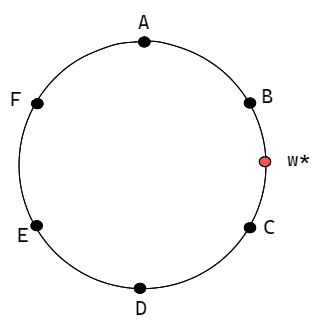

class: middle, center


```{r setup, include=FALSE}
knitr::opts_chunk$set(echo = FALSE, 
                      fig.align='center',fig.height=3, fig.width=7,
                      message=FALSE, warning=FALSE, dpi=600 )

xaringanExtra::use_xaringan_extra(c("tile_view", "tachyons"))

Sys.setenv(CHROMOTE_CHROME = "C:/Program Files (x86)/Microsoft/Edge/Application/msedge.exe")
Sys.setenv(PAGEDOWN_CHROME = "C:/Program Files (x86)/Microsoft/Edge/Application/msedge.exe")

# knitr::opts_chunk$set(
#   comment = "#>", echo = FALSE, fig.width = 6
# )  echo=FALSE, fig.align='center', fig.height=3, fig.width=7, message=FALSE, warning=FALSE, dpi=600
# echo=FALSE, fig.align='center', fig.height=3, fig.width=7, 
```


```{r carga-datos, include=FALSE}
library(tidyverse)
library(lubridate)
source(here::here("R","funcion05_balancear-panel.R"), encoding = "UTF-8")
'%ni%' <- Negate('%in%')
library(did)
library(ggtext)
library(tidyquant)
'%ni%' <- Negate('%in%')

tema_grafica <- theme_bw() + 
  theme(
    panel.spacing.x = unit(0.8, "cm"),
    legend.background = element_rect(fill = "grey85", colour = "black", size = 0.5),
    legend.title = element_text(face = "bold", size = 10),
    legend.text = element_text(colour = "black"),
    legend.key = element_rect(colour = "black", size = 0.5),
    axis.title = element_text(face = "bold"),
    legend.position = "right")
 
f_labels <- data.frame(producto = c("G90", "DIESEL"), label = c("", "Venta de Pecsa"))


data_total_semanal <- readRDS(file = here::here("data", "processed", "data-final-regresiones_semanal.rds")) %>% 
  mutate(semana_cont = if_else(año == 2017, semana, semana + 53))

data_total_mensual <- readRDS(file = here::here("data", "processed", "data-final-regresiones.rds"))

formato_comun <- list(
  ylim(10, 13),
  # geom_vline(
  #   xintercept = dmy("15/01/2018"),
  #   linetype = "dashed",
  #   size = 0.5, color = "grey55"
  # ),
  geom_rect(data = data.frame(xmin = dmy("01-01-2018"),
                              xmax = dmy("01-02-2018"),
                              ymin = -Inf,
                              ymax = Inf),
            aes(xmin = xmin, xmax = xmax, ymin = ymin, ymax = ymax),
            fill = "grey", alpha = 0.5),
  geom_text(
    x = dmy("01/02/2018"), y = -Inf, vjust = -0.9,
    hjust = -0.1, aes(label = label), data = f_labels,
    color = "grey55", fontface = "bold"
  )
  # scale_color_brewer(palette = "Set1")
)

#' Lista de grifos que son vecinos a estación de PECSA 
#' 

data_total <- data_total_mensual

lista_vecinos <- data_total %>% 
  filter(vecino_pecsa_thiessen_did == 1) %>%
  distinct(codigo_de_osinergmin) %>% 
  pull()

lista_vecinos_primax <- data_total %>% 
  filter(vecino_primax_thiessen == 1) %>%
  distinct(codigo_de_osinergmin) %>% 
  pull()

lista_vecinos_km <- data_total %>% 
filter(vecino_pecsa_dist_did == 1) %>%
  distinct(codigo_de_osinergmin) %>% 
  pull()

distritos_con_pecsa <- data_total %>% 
  distinct(distrito, tipo_bandera) %>% 
  filter(tipo_bandera == "PROPIA PECSA") %>% 
  pull(distrito)

distritos_con_primax <- data_total %>% 
  distinct(distrito, tipo_bandera) %>% 
  filter(tipo_bandera == "PROPIA PRIMAX") %>% 
  pull(distrito)
```

# Marco Analítico
---
## Integración horizontal de empresas 

* Paradoja de fusión: Fusiones horizontales no necesariamente son rentables para las firmas participantes (Salant, Switzer y Reynolds, 1983).

* Sin embargo, bajo ciertas condiciones que justificaré son cercanas a la realidad del mercado de combustibles líquidos, sí se puede encontrar que las fusiones incrementan los precios. 

* Dada la naturaleza espacial del mercado minorista de combustibles líquidos, tomamos como marco de referencia del **modelo de ciudad circular de Salop**, para ilustrar las consecuencias de la fusión de firmas cercanas en los precios

---
## El modelo

Siguiendo a Levy y Reitzes(1992)

- Firmas producen bienes que son sustitutos imperfectos y compiten entre sí

- Todos los consumidores tienen demanda inelástica por el bien, y reciben una utilidad marginal de $\alpha$ por la compra del bien. Un consumidor compra de la firma que le ofrezca el bien al menor valor total.

- Las firmas están localizadas en puntos alrededor de un círculo, con los consumidores a lo largo de todo el diámetro, pudiendo potencialmente comprar de cualquier de las firmas. 

---
## El modelo

.pull-left[
El precio final  de la firma $i$ para el consumidor 
_w_ es $p^i + t[x^i(w)]^2$, 

donde $p^i$ es el precio del bien, $t$ es el costo unitario del consumidor de desviarse de su producto ideal, y $x^i(w)$ es la distancia entre la firma y el consumidor, que también se puede interpretar como el costo de consumir un producto que se desvíe del ideal para el consumidor. 
]
.pull-right[



]

---

## Caso base - Antes de la fusión

* Generalizando para $N$ firmas localizadas en un circulo, distanciadas entre sí mediante $1/N$. 

- Asumiendo firmas idénticas y firmas simétricamente distribuidas, todas alcanzan el mismo precio:
    - $$p^* = (c + t/N^2) = Z$$
    - $$\pi^* = t/N^3 - f$$
---

## Fusión de firmas vecinas

* Se asumen que no hay ganancias de eficiencias, que ambas locaciones siguen vendiendo, costos marginales se mantienen iguales  a $c$ y costos fijo $f$.


$$
\begin{aligned}
  max_{p^{i'}, p^{i'+1}} \pi^M &= \pi^{i'} + \pi^{i' + 1} \\
  &= (p^{i'} - c)(p^{i'-1} + p^{i'+1} - 2p^{i'} + 2t/N^2)/2t/N + \\&(p^{i'+1} - c)(p^{i'} + p^{i'+2} - 2p^{i'+1} + 2t/N^2)/2t/N - 2f
\end{aligned}
$$

- Resolviendo se obtiene: 
  $$p^{i'} = \frac{1}{4} (p^{i'-1} + 2p^{i+1} + Z + t/N^2) $$
  $$p^{i'+1} = \frac{1}{4} (p^{i'+2} + 2p^{i'} + Z + t/N^2) $$

---
## Fusión de firmas vecinas

* Para aprovechar la simetría del problema, cambiemos de notación, para denotar con $P^0$, siendo el precio que fijan las firmas que se fusionan, y $p^k$ representan el precio que cobra una firma a una distancia $k/N$ de la la firma más cercana fusionada. La reacción que tendrá es:  

$$
P^0 = \frac{1}{2}(p^1+Z+t/N^2)
$$

A su vez, se puede probar que la reacción de la firma $k$ puede ser expresada como:  

$$p^k = (B^{K-k}/B^K)P^0 + ((B^K - B^{K-k})/B^K)Z$$  

  * Donde $K = (N-M)/2$ $(K = (N-M+1)/2)$ si $N-M$ es par (impar)  
  * $M$ es el número de firmas que se fusionan  
  * $B^n = 4B^{n-1} -  B^{n-2}$, $B^0 = 1$, $B^{-1} = 1 (2), si $N-M$ es par (impar)  
---
## Fusión de firmas vecinas  
Se puede resolver recursivamente, se encuentran los precios de equilibrio:  
$$p^0 = Z + (B^K/L)(t/N^2)$$  
$$p^k = Z + (B^{K-k}/L)(t/N^2)$$  
con $L = 2B^K-B^{K-1}$  

Los beneficios de la firma que es parte de la fusión es:  
$$\pi^0 = [(P^0-c)^2/2t/N] - f = \frac{1}{2}[(B^K+L)^2/L^2] (t/N^3)-f$$  
---
## Fusión de firmas vecinas  

Para las firmas externas, los beneficios son:  

$$
\pi^k = [(p^k-c)^2/t/N] - f = [(B^{K-k}+L)^2 / L^2] (t/N^3) -f
$$  
Como $0 < B^0 < B^{K-1} < B^K$, se puede probar que:  


$$
\pi^1 > \pi^0 > \pi^2 > \pi^3 > ...
$$   
Antes de la fusión, cada firma maximiza independiente sus beneficios.  

Luego de la fusión, las firmas participantes internalizan el hecho que al subir los precios en una locación, incrementan los ganancias en las demás.   

???
Es decir, las firmas externas más cercanas a la fusión perciben mayores beneficios, que las firmas fusionadas, pero estas a su vez, perciben mayores beneficios que el resto, lo que limita el problema de free-rider. Es decir, una firma solo se restringiría de fusionarse, si esperase que su firma vecina lo haga antes.  

---

class: middle, center

# Metodología
---
## Datos

* Datos de precios diarios a nivel de estaciones de Osinergmin 2017-2018.

* Geolocalización de las estaciones de acuerdo a sus direcciones.

* Asignación de banderas o afiliación de cada estación.

* Se determinan vecinos utilizando definición de vecinos de Thiessen.

---
### Comparativa de precios entre estaciones propias de Primax y Pecsa, y las no vecinas para G90

```{r grafico_g90_estatico, echo=FALSE, fig.align='center', fig.height=3, fig.width=7, message=FALSE, warning=FALSE, dpi=600}
data_total_semanal %>% 
    filter(
           codigo_de_osinergmin %ni% lista_vecinos,
           fecha >= dmy("01/07/2017") & fecha <= dmy("01/11/2018")) %>% 
    mutate(producto = fct_relevel(producto,c("G90","DIESEL")),
           pecsa_no = case_when(
             tipo_bandera == "PROPIA PECSA" ~ "PECSA",
             tipo_bandera == "PROPIA PRIMAX" ~ "PRIMAX",
             TRUE ~ "NO VECINOS")) %>% 
    filter(producto == "G90") %>% 
    group_by(fecha, producto, pecsa_no) %>% 
    summarise(precio_promedio = mean(precio_de_venta), .groups = "drop") %>% 
    ggplot() +
    geom_line(aes(x = fecha, y = precio_promedio, color = pecsa_no),
              size = 1) +
    labs(x = "Fecha", 
         y = "Precio promedio", 
         color = "Estaciones",
         title = "Precios promedio de Gasohol 90") +
    tema_grafica +
    formato_comun + 
    scale_color_manual(values=c("#2ecc71", "#e74c3c", "#f1c40f"))

```

---
### Comparativa con medias móviles

```{r}
data_total_semanal %>% 
    filter(
           codigo_de_osinergmin %ni% lista_vecinos,
           fecha >= dmy("01/07/2017") & fecha <= dmy("01/11/2018")) %>% 
    mutate(producto = fct_relevel(producto,c("G90","DIESEL")),
           pecsa_no = case_when(
             tipo_bandera == "PROPIA PECSA" ~ "PECSA",
             tipo_bandera == "PROPIA PRIMAX" ~ "PRIMAX",
             TRUE ~ "NO VECINOS")) %>% 
    filter(producto == "G90") %>% 
    group_by(fecha, pecsa_no) %>% 
    summarise(precio_promedio = mean(precio_de_venta), .groups = "drop") %>% 
    group_by(pecsa_no) %>% 
    tq_mutate(
        # tq_mutate args
        select     = precio_promedio,
        mutate_fun = rollapply, 
        # rollapply args
        width      = 4,
        align      = "right",
        FUN        = mean,
        # mean args
        na.rm      = TRUE,
        # tq_mutate args
        col_rename = "media_movil"
    ) %>% 
    ggplot() +
    geom_line(aes(x = fecha, y = media_movil, color = pecsa_no),
              size = 1) +
    labs(x = "Fecha", 
         y = "Precio promedio", 
         color = "Estaciones",
         title = "Precios promedio de Gasohol 90") +
    tema_grafica +
    formato_comun + 
    scale_color_manual(values=c("#2ecc71", "#e74c3c", "#f1c40f"))
```

---

### Gráfica de los vecinos versus Primax y Pecsa para ver si hay un tracking

```{r}
data_total_semanal %>% 
    filter(
           fecha >= dmy("01/07/2017") & fecha <= dmy("01/11/2018")) %>% 
    mutate(producto = fct_relevel(producto,c("G90","DIESEL")),
           pecsa_no = case_when(
             tipo_bandera == "PROPIA PECSA" ~ "PECSA",
             tipo_bandera == "PROPIA PRIMAX" ~ "PRIMAX",
             codigo_de_osinergmin %in% lista_vecinos  ~ "VECINO",
             TRUE ~ "NO VECINOS")) %>% 
    filter(producto == "G90", pecsa_no %ni% c("NO VECINOS","PECSA")) %>% 
    group_by(fecha, pecsa_no) %>% 
    summarise(precio_promedio = mean(precio_de_venta), .groups = "drop") %>% 
    group_by(pecsa_no) %>% 
    tq_mutate(
        # tq_mutate args
        select     = precio_promedio,
        mutate_fun = rollapply, 
        # rollapply args
        width      = 4,
        align      = "right",
        FUN        = mean,
        # mean args
        na.rm      = TRUE,
        # tq_mutate args
        col_rename = "media_movil"
    ) %>% 
    ggplot() +
    geom_line(aes(x = fecha, y = media_movil, color = pecsa_no),
              size = 1) +
    labs(x = "Fecha", 
         y = "Precio promedio", 
         color = "Estaciones",
         title = "Precios promedio de Gasohol 90") +
    tema_grafica +
    formato_comun 
    # scale_color_manual(values=c("#2ecc71", "#e74c3c", "#f1c40f"))
```

```{r}
data_total_semanal %>% 
    filter(
           fecha >= dmy("01/07/2017") & fecha <= dmy("01/11/2018")) %>% 
    mutate(producto = fct_relevel(producto,c("G90","DIESEL")),
           pecsa_no = case_when(
             tipo_bandera == "PROPIA PECSA" ~ "PECSA",
             tipo_bandera == "PROPIA PRIMAX" ~ "PRIMAX",
             codigo_de_osinergmin %in% lista_vecinos  ~ "VECINO",
             TRUE ~ "NO VECINOS")) %>% 
    filter(producto == "G90", pecsa_no %ni% c("PRIMAX","PECSA")) %>% 
    group_by(fecha, pecsa_no) %>% 
    summarise(precio_promedio = mean(precio_de_venta), .groups = "drop") %>% 
    group_by(pecsa_no) %>% 
    tq_mutate(
        # tq_mutate args
        select     = precio_promedio,
        mutate_fun = rollapply, 
        # rollapply args
        width      = 4,
        align      = "right",
        FUN        = mean,
        # mean args
        na.rm      = TRUE,
        # tq_mutate args
        col_rename = "media_movil"
    ) %>% 
    ggplot() +
    geom_line(aes(x = fecha, y = media_movil, color = pecsa_no),
              size = 1) +
    labs(x = "Fecha", 
         y = "Precio promedio", 
         color = "Estaciones",
         title = "Precios promedio de Gasohol 90") +
    tema_grafica +
    formato_comun 
    # scale_color_manual(values=c("#2ecc71", "#e74c3c", "#f1c40f"))
```

```{r}
data_total_semanal %>% 
    filter(
           fecha >= dmy("01/07/2017") & fecha <= dmy("01/11/2018")) %>% 
    mutate(producto = fct_relevel(producto,c("G90","DIESEL")),
           pecsa_no = case_when(
             tipo_bandera == "PROPIA PECSA" ~ "PECSA",
             tipo_bandera == "PROPIA PRIMAX" ~ "PRIMAX",
             codigo_de_osinergmin %in% lista_vecinos  ~ "VECINO",
             TRUE ~ "NO VECINOS")) %>% 
    filter(producto == "G90", pecsa_no %ni% c("NO VECINOS","PECSA")) %>% 
    group_by(fecha, producto, pecsa_no) %>% 
    summarise(precio_promedio = mean(precio_de_venta), .groups = "drop") %>% 
    ggplot() +
    geom_line(aes(x = fecha, y = precio_promedio, color = pecsa_no),
              size = 1) +
    labs(x = "Fecha", 
         y = "Precio promedio", 
         color = "Estaciones",
         title = "Precios promedio de Gasohol 90") +
    tema_grafica +
    formato_comun 
    # scale_color_manual(values=c("#2ecc71", "#e74c3c", "#f1c40f"))
```

---

### Comparativa de precios entre estaciones propias de Primax y Pecsa, y las no vecinas.

```{r grafico_diesel_estatico, echo=FALSE, fig.align='center', message=FALSE, warning=FALSE, dpi=600, fig.height=3,fig.width=7}
data_total_semanal %>% 
    filter(
           codigo_de_osinergmin %ni% lista_vecinos,
           fecha >= dmy("01/07/2017") & fecha <= dmy("01/11/2018")) %>% 
    mutate(producto = fct_relevel(producto,c("G90","DIESEL")),
           pecsa_no = case_when(
             tipo_bandera == "PROPIA PECSA" ~ "PECSA",
             tipo_bandera == "PROPIA PRIMAX" ~ "PRIMAX",
             TRUE ~ "NO VECINOS")) %>% 
    filter(producto == "DIESEL") %>% 
    group_by(fecha, producto, pecsa_no) %>% 
    summarise(precio_promedio = mean(precio_de_venta), .groups = "drop") %>% 
    ggplot() +
    geom_line(aes(x = fecha, y = precio_promedio, color = pecsa_no),
              size = 1) +
    labs(x = "Fecha", 
         y = "Precio promedio", 
         color = "Estaciones",
         title = "Precios promedio de Diésel DB5") +
    tema_grafica +
    formato_comun  +
    scale_color_manual(values=c("#2ecc71", "#e74c3c", "#f1c40f"))

```

---
## Estrategia empírica

* El objetivo es determinar si la consolidación de Primax como principal minorista de combustibles, trajo como consecuencia mayores precios en las estaciones bajo su control, y las estaciones vecinas.

* Diseño de diferencias-en-diferencias. Similiar a Hastings (2004)

* La estrategia de identificación se basa en que la competencia de cada estación es local, por lo que una zona donde no se encuentran estaciones de Pecsa ni Primax, no vería impactada por mayores precios. De esta manera, nuestro grupo de control son la estaciones que no están cercanas a las estaciones involucradas en la consolidación.

---
## Estrategia empírica

* Se georeferenciaron las estaciones de Lima Metropolitana, a partir de las direcciones de la base de datos de Osinergmin.

* Se identificaron las estaciones de las razones sociales asociadas a Pecsa y Primax.

* Se identificaron los vecinos de cada estación, utilizando como definición de vecindad los polígonos de Thiessen <sup>1</sup>.

* Todas las estaciones de Primax y Pecsa, en Febrero de 2018 reciben el tratamiento, en tanto que las estaciones **no vecinas** forman el grupo de control.


.footnote[
[1] Se probó con definición de vecindad por distancia (5 km).
]
<!-- Acá puedo poner las tablas comparando, y un mapa final de Lima, coloreado, cuales 
serían los mercados-->
---
## Estrategia empírica

* La ecuación a estimar para el estudio del evento es:

$$p_{it} = \alpha_i + \lambda_t + \sum_{\tau=-q}^{-1}\gamma_\tau D_{i\tau} + \sum_{\tau=0}^{m}\delta_\tau D_{i\tau} + \epsilon_{it}$$

Donde:

  * $D_{it}$: 1 para las estaciones de Pecsa (o Primax) a partir de $t=0$.
  
  * $\alpha_i$ Efecto fijo de la estación
  
  * $\lambda_t$: Efecto fijo de tiempo, que recoge tendencias comunes en precios para todas las estaciones, como el cambio en los precios de mayoristas.

Esta especificación considera $q$ adelantos o efectos anticipatorios, y $m$ efectos post-tratamiento.

???
Ventajas: 
* Nos permite testear y ver las pre-tendencias. 
* Podemos ver si el efecto es inmediato, si se reduce, si es persistente

---
class: middle, center

# Resultados
---
## Estudio de eventos para estaciones de Pecsa - G90


```{r functions_did, message=FALSE, warning=FALSE, include=FALSE}

plot_did <- function(did_obj, aggte_ef, mes_trat = 14) {
  min_value <- aggte_ef$overall.att-1.96*aggte_ef$overall.se
  if (min_value >= -0.004) {
    signi <-  "**"
  } else {
    signi <- ""
  }
  leadslags_plot <- tibble(
    sd = did_obj$se,
    mean = did_obj$att,
    label = did_obj$t-mes_trat
  )
    
  leadslags_plot %>%
    ggplot(aes(x = label, y = mean,
               ymin = mean-1.96*sd, 
               ymax = mean+1.96*sd)) +
    geom_hline(yintercept = aggte_ef$overall.att, color = "red", size = 1.5, alpha = 0.5) +
    geom_point() +
    geom_errorbar(width = 0.2) +
    theme_minimal() +
    xlab("Meses antes y después de la adqusición") +
    ylab("Variación en precio (soles)") +
    geom_hline(yintercept = 0,
               linetype = "dashed") +
    geom_vline(xintercept = 0,
               linetype = "dashed") +
    annotate(geom='richtext', x=0, y=aggte_ef$overall.att + 0.1, 
             label= paste0("Coeficiente DD = ",sprintf("%.2f", aggte_ef$overall.att),
                           "<b>",signi,"</b>",
                           "<br>(s.e. = ", sprintf("%.2f", aggte_ef$overall.se), ")")
             ) 
}

reg_did <- function(df, producto, band, vecino = FALSE, mes_trat = 14) {
  df_producto <- df %>% 
    filter(producto == !!producto) %>% 
    mutate(mes = (year(fecha)-2017)*12 + month(fecha)) %>% 
    select(codigo_de_osinergmin, fecha, producto, mes, año, precio_de_venta, 
           bandera, tipo_bandera, distrito)
  
  if (band == "PROPIA PECSA" & vecino == FALSE) {
    data_reg <- df_producto %>% 
    mutate(
         fecha_trat = if_else(tipo_bandera == "PROPIA PECSA", mes_trat, 0),
         ) %>% 
    filter(tipo_bandera != "PROPIA PRIMAX",
        tipo_bandera == "PROPIA PECSA" | codigo_de_osinergmin %ni% lista_vecinos,
        mes >= 1
        )
  } else if (band == "PROPIA PRIMAX" & vecino == FALSE) {
      data_reg <- df_producto %>% 
      mutate(
         fecha_trat = if_else(tipo_bandera == "PROPIA PRIMAX", mes_trat, 0)) %>% 
      filter(tipo_bandera != "PROPIA PECSA",
             # tipo_bandera == "PROPIA PRIMAX" | distrito %ni% distritos_con_primax,
             tipo_bandera == "PROPIA PRIMAX" | codigo_de_osinergmin %ni% lista_vecinos_primax,
             mes >= 1
        ) 
  } else if (band == "PROPIA PECSA" & vecino == TRUE) {
    data_reg <- df_producto %>% 
      mutate(
         vecina = if_else(codigo_de_osinergmin %in% lista_vecinos,
                          "vecina",
                          "no vecina"),
         fecha_trat = if_else(vecina == "vecina", mes_trat, 0)
         ) %>%
      filter(tipo_bandera != "PROPIA PECSA",
             tipo_bandera != "PROPIA PRIMAX")
  } else if (band == "PROPIA PRIMAX" & vecino == TRUE) {
      data_reg <- df_producto %>%
        mutate(
         vecina = if_else(distrito %in% distritos_con_primax,
                          "vecina",
                          "no vecina"),
         fecha_trat = if_else(vecina == "vecina", mes_trat, 0)
         ) %>%
        filter(tipo_bandera != "PROPIA PECSA",
             tipo_bandera != "PROPIA PRIMAX")
  }
  
  if (vecino == FALSE) {
    cov <- as.formula(paste0("~codigo_de_osinergmin","+ bandera" ))
  } else {
    cov <- as.formula("~codigo_de_osinergmin")
  }
  
  producto_did <- att_gt(yname = "precio_de_venta",
                         gname = "fecha_trat",
                         idname = "codigo_de_osinergmin",
                         tname = "mes",
                         xformla = ~bandera,
                         data = data_reg,
                         est_method = "dr",
                         anticipation = 0,
                         bstrap = T,
                         biters = 10000,
                         clustervars = "codigo_de_osinergmin",
                         cband = F,
                        )

  aggte_ef <- aggte(producto_did)
  
  list("event study" = producto_did, "agregado" = aggte_ef)

}
# Definimos mes de tratamiento o 13 o 14
mesventa <- 13
```

```{r g90-reg-pecsa}

pecsa_g90 <- reg_did(df = data_total_mensual,
                     producto = "G90", 
                     band = "PROPIA PECSA",
                     mes_trat = mesventa)

plot_did(pecsa_g90$`event study`, pecsa_g90$agregado, mes_trat = mesventa)


```


---

## Estudio de eventos para estaciones de Pecsa - Diésel

```{r diesel_reg_pecsa}

pecsa_diesel <- reg_did(
  df = data_total_mensual,
  producto = "DIESEL",
  band = "PROPIA PECSA",
  mes_trat = 14
)

plot_did(pecsa_diesel$`event study`, pecsa_diesel$agregado, mes_trat = mesventa)

```

---
## Estudio de eventos para estaciones de Primax - G90

```{r g90-reg-primax}
primax_g90 <- reg_did(
  df = data_total_mensual,
  producto = "G90",
  band = "PROPIA PRIMAX",
  mes_trat = mesventa
)

plot_did(primax_g90$`event study`, primax_g90$agregado, mes_trat = mesventa)

```


---

## Estudio de eventos para estaciones de Primax - Diésel

```{r diesel_reg_primax}
primax_diesel <- reg_did(
  df = data_total_mensual,
  producto = "DIESEL",
  band = "PROPIA PRIMAX",
  mes_trat = mesventa
)


plot_did(primax_diesel$`event study`, primax_diesel$agregado, mes_trat = mesventa)
```

---

## Vecinos

Bajo una especificación similar, se evalúa si las estaciones vecinas Primax o Pecsa también 
muestran incremento de precios luego del evento.

### Estaciones vecinas a Pecsa
```{r vecinos_pecsa_g90}
# set.seed(23169)

vecino_pecsa <- reg_did(
  df = data_total_mensual,
  producto = "G90",
  band = "PROPIA PECSA",
  vecino = TRUE,
  mes_trat = mesventa
)

plot_did(vecino_pecsa$`event study`, vecino_pecsa$agregado, mes_trat = mesventa)
```

---

### Estaciones vecinas a Primax

```{r vecinos_primax_g90}
vecino_primax <- reg_did(
  df = data_total_mensual,
  producto = "G90",
  band = "PROPIA PRIMAX",
  vecino = TRUE,
  mes_trat = mesventa
)

plot_did(vecino_primax$`event study`, vecino_primax$agregado, mes_trat = mesventa)


```

---

